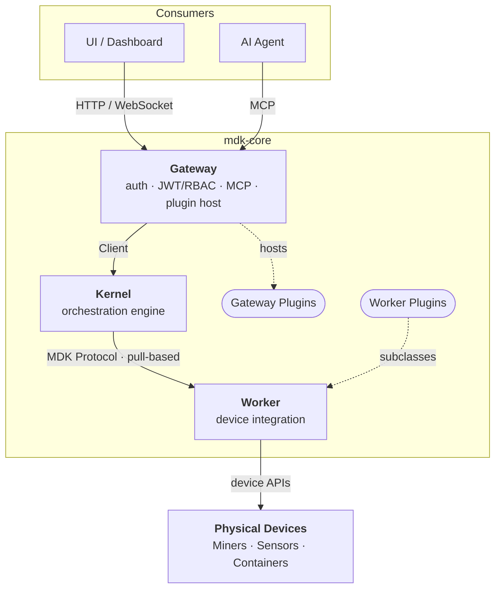

# MDK — Documentation Hierarchy & Standards

> **Version:** 2.1.0  |  **Date:** 2026-06-24  |  **Status:** In Review
>
> Foundational conventions for MDK documentation: canonical naming, the platform package hierarchy, and the site information architecture.

---

## 1. Canonical Component Naming

> **One naming decision remains open** — the `mdk-addons` tier name. See §5. All component names below are confirmed.


| Retired Name | Canonical Name | Package                 |
| ------------ | -------------- | ----------------------- |
| ORK          | **Kernel**     | `@tetherto/mdk-kernel`  |
| App Node     | **Gateway**    | `@tetherto/mdk-gateway` |
| MDK Client   | **Client**     | `@tetherto/mdk-client`  |
| Worker Base  | **Worker**     | `@tetherto/mdk-worker`  |


---

## 2. Platform Package Hierarchy

The single source of truth for component structure. **Everyone must use this exact terminology and hierarchy.**

```
MDK Platform
│
├── mdk-core          [Built by Tether — invariant foundation]
│   ├── Kernel        @tetherto/mdk-kernel    — orchestration engine
│   ├── Gateway       @tetherto/mdk-gateway   — authenticated API boundary
│   ├── Client        @tetherto/mdk-client    — transport SDK (HRPC / IPC)
│   └── Worker        @tetherto/mdk-worker    — base for device integrations
│
├── mdk-addons ⚠️     [Built by Tether reference + Community]  (tier name open — see §5)
│   ├── Worker Plugins    @<org>/mdk-worker-<device>   — subclass Worker + mdk-contract.json
│   └── Gateway Plugins   @<org>/mdk-plugin-<feature>  — controllers + mdk-plugin.json
│
└── mdk-ui-devkit     [Built by Tether — optional frontend layer]
    ├── UI Core            @tetherto/mdk-ui-core        
    ├── React Adapter      @tetherto/mdk-react-adapter  
    ├── React Components   @tetherto/mdk-react-devkit   
    └── Fonts              @tetherto/mdk-fonts          
```

### 2.1 Architecture diagram (canonical)




### 2.2 Component descriptions


| Tier          | Component            | Package                        | Description                                                                                                                              |
| ------------- | -------------------- | ------------------------------ | ---------------------------------------------------------------------------------------------------------------------------------------- |
| mdk-core      | **Kernel**           | `@tetherto/mdk-kernel`         | Orchestration engine: device registry, command routing, telemetry, health monitoring. Pull-only; trusts nothing but whitelisted clients. |
| mdk-core      | **Gateway**          | `@tetherto/mdk-gateway`        | The only authenticated entry point. JWT/RBAC, REST/WebSocket/MCP, hosts Gateway Plugins. Reaches the Kernel via Client.                  |
| mdk-core      | **Client**           | `@tetherto/mdk-client`         | Transport SDK over HRPC/IPC; multi-language (Node.js, Python, Go). Usable standalone without a Gateway.                                  |
| mdk-core      | **Worker**           | `@tetherto/mdk-worker`         | Base for device integrations. Provides MDK Protocol plumbing; implement `onTelemetryPull` / `onCommand`.                                 |
| mdk-addons ⚠️ | **Worker Plugin**    | `@<org>/mdk-worker-<device>`   | Subclasses Worker, ships an `mdk-contract.json`. Integrates a physical device or external service.                                       |
| mdk-addons ⚠️ | **Gateway Plugin**   | `@<org>/mdk-plugin-<feature>`  | Plain-JS controllers + `mdk-plugin.json`; loaded into the Gateway at boot. Adds custom aggregated HTTP/WS endpoints.                     |
| mdk-ui-devkit | **UI Core**          | `@tetherto/mdk-ui-core`        | Headless state + API client; framework-agnostic. Telemetry buffering, optimistic UI, stale detection.                                    |
| mdk-ui-devkit | **React Adapter**    | `@tetherto/mdk-react-adapter`  | React hooks (`useTelemetry`, `useCommand`) over UI Core.                                                                                 |
| mdk-ui-devkit | **React Components** ⚠️ | `@tetherto/mdk-react-devkit` ⚠️ | Radix-based component library; 3-tier CSS customization, no Tailwind dependency. Name pending — see §4.3.                             |
| mdk-ui-devkit | **Fonts**            | `@tetherto/mdk-fonts`          | Shared typeface bundle for MDK UI surfaces.                                                                                              |


---

## 3. Site Information Architecture

The MDK docs site uses the **[Diátaxis](https://diataxis.fr/)** framework. Tutorials collapse into a single **Quickstart**; Explanation is surfaced as **Understanding MDK**; agentic content gets its own chapter.

```
📖 Introduction
   1.  What is MDK?
   2.  Quickstart  (one golden path, end-to-end)

🛠️ Guides
   1.  Deploy MDK
       1.1  Single-process mode
       1.2  Multi-process mode
       1.3  Multi-site deployment (parallel Kernels)  → U.5
       1.4  Harden your deployment                    → U.7
   2.  Build a Worker Plugin                          → U.3.4, U.4.1
       2.1  Author an mdk-contract.json               → R.1.4
   3.  Build a Gateway Plugin                         → U.3.2, U.4.2
       3.1  Aggregate across workers & sites          → U.5
   4.  Build a Dashboard
       4.1  Use the UI Devkit                         → U.6
       4.2  Use Components in Dashboard Shell         → U.6.1
       4.2  Customize UI components (3-tier CSS)      → R.2

💡 Understanding MDK  (U.*)
   U.1  Architecture overview
   U.2  The MDK Protocol
   U.3  mdk-core
        U.3.1  Kernel
        U.3.2  Gateway
        U.3.3  Client
        U.3.4  Worker
   U.4  mdk-addons
        U.4.1  Worker Plugins
        U.4.2  Gateway Plugins
   U.5  Scaling model (multi-site)
   U.6  mdk-ui-devkit                                     → R.2
        U.6.1  Dashboard shell
        U.6.2  React Components
   U.7  Security  (auth · JWT/RBAC · whitelisting · etc)
   U.8  Storage model (Hypercore / Hyperbee)
        U.8.1  Worker & Gateway Plugin storage

🤖 Agentic MDK  (A.*)
   A.1  Overview (Developer Skill & Operator Agent)
   A.2  MDK Developer Skill
   A.3  Operator Agent
   A.4  MCP endpoint & tool derivation
   A.5  Connect an AI agent                           → U.3.2

📚 Reference  (R.*)
   R.1  mdk-core
        R.1.1  Kernel — API
        R.1.2  Gateway — API · mdk-plugin.json schema · error codes
        R.1.3  Client — API
        R.1.4  Worker — API · mdk-contract.json schema · error codes
   R.2  mdk-ui-devkit
        R.2.1  Dashboard shell
        R.2.2  UI Core — API
        R.2.3  React Adapter — API
        R.2.4  React Components — component catalogue
        R.2.5  Fonts
   R.3  MDK Protocol — envelope
   R.4  Glossary
```


### 3.1 Design notes

- **N1 — UI Devkit adapters in Reference only**
`@tetherto/mdk-ui-core` and `@tetherto/mdk-react-adapter` live exclusively in **Reference (R.2)**. They are abstracted implementation details relevant only to specific use cases. The Understanding MDK page for mdk-ui-devkit (U.6) contains a brief conceptual overview and links to R.2.

- **N2 — Fonts in Reference only**
`@tetherto/mdk-fonts` is an optional dependency; developers may bring their own typeface. Documented only in **Reference (R.2.5)**. No dedicated Understanding MDK page — a single line in U.6 noting its existence with a link to R.2.5 is sufficient.

- **N3 — Vue, Svelte, and WC adapters out of scope**
Additional framework adapters (Vue, Svelte, Web Components) are not on the current roadmap. Do not create or stub pages for them. The only mention belongs in the **UI Core reference page (R.2.2)**: a single sentence noting that UI Core is framework-agnostic and additional framework support will be added in the future.
---

## 4. Decisions

### 4.1 Open — mdk-addons tier name

> **Status: ⚠️ Pending** — decision needed from Gio / Ankit.

The name "mdk-addons" is informal and does not signal the tier's importance as the primary extensibility mechanism.


| Candidate                  | Assessment                                                                                                                                       |
| -------------------------- | ------------------------------------------------------------------------------------------------------------------------------------------------ |
| **mdk-extensions** ⭐       | Established pattern — VS Code, Firefox, Chrome all use "extensions". Both Worker Plugins and Gateway Plugins extend mdk-core. Widely understood. |
| **mdk-plugins**            | Consistent with internal terminology (Worker Plugins, Gateway Plugins). Risk: could be read as a single plugin package rather than a tier.       |
| **mdk-addons** *(current)* | Common but informal; slightly undersells the tier.                                                                                               |


### 4.2 Open — Client name

> **Status: ⚠️ Pending** — decision needed from Gio / Ankit.

"Client" is workable scoped by the package name `@tetherto/mdk-client`, but standalone it is generic. Kernel, Gateway, and Worker all communicate their role; Client does not convey that it is a **transport SDK** speaking the MDK Protocol over HRPC/IPC.


| Candidate              | Assessment                                                                                 |
| ---------------------- | ------------------------------------------------------------------------------------------ |
| **Client** *(current)* | Generic but scoped by the package name. Confirmed by Gio.                                  |
| **Connector**          | "Connect to the Kernel." More evocative; consistent with the boundary metaphor of Gateway. |


### 4.3 Open — React Components package name

> **Status: ⚠️ Pending** — decision needed from Gio / Ankit.

`@tetherto/mdk-react-devkit` / "React Components" is unclear. "Devkit" reads as a developer toolkit, not a component library. The name should communicate "ready-to-use React UI components" the way **Material Components** does — someone reading it for the first time should immediately know what's inside.

| Candidate | Assessment |
|---|---|
| **MDK React Components** / `@tetherto/mdk-react-components` ⭐ | Clearest. Directly mirrors the "Material Components" pattern. No ambiguity. |
| **MDK React UI** / `@tetherto/mdk-react-ui` | Clean and short; "UI" is widely understood but slightly generic. |
| **React Components** / `@tetherto/mdk-react-devkit` *(current)* | "Devkit" is ambiguous — does not signal a component library. |

### 4.4 Closed — Client and Gateway cannot be merged

> **Status: ✅ Resolved** — raised by Gio; decision made they must remain separate (2026-06-22).

- **Client** is a *library* — a multi-language transport SDK embeddable in any custom backend, no Gateway required.
- **Gateway** is a *deployable server* — the authenticated boundary (JWT/RBAC, MCP, plugin host) that uses Client internally.

They serve different roles: Client is a dependency; Gateway is an application. Merging would force every custom backend to carry the full auth/MCP surface and would block multi-language Client support.