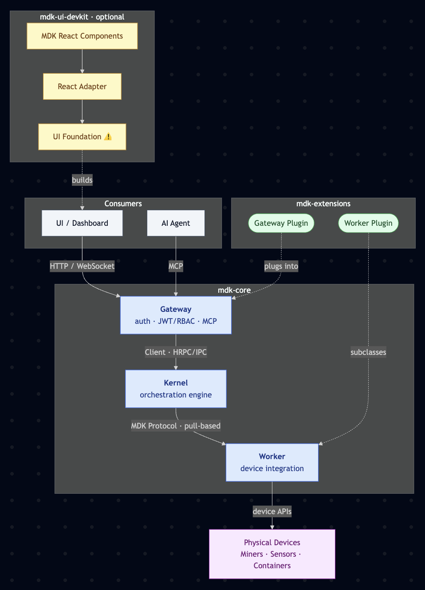
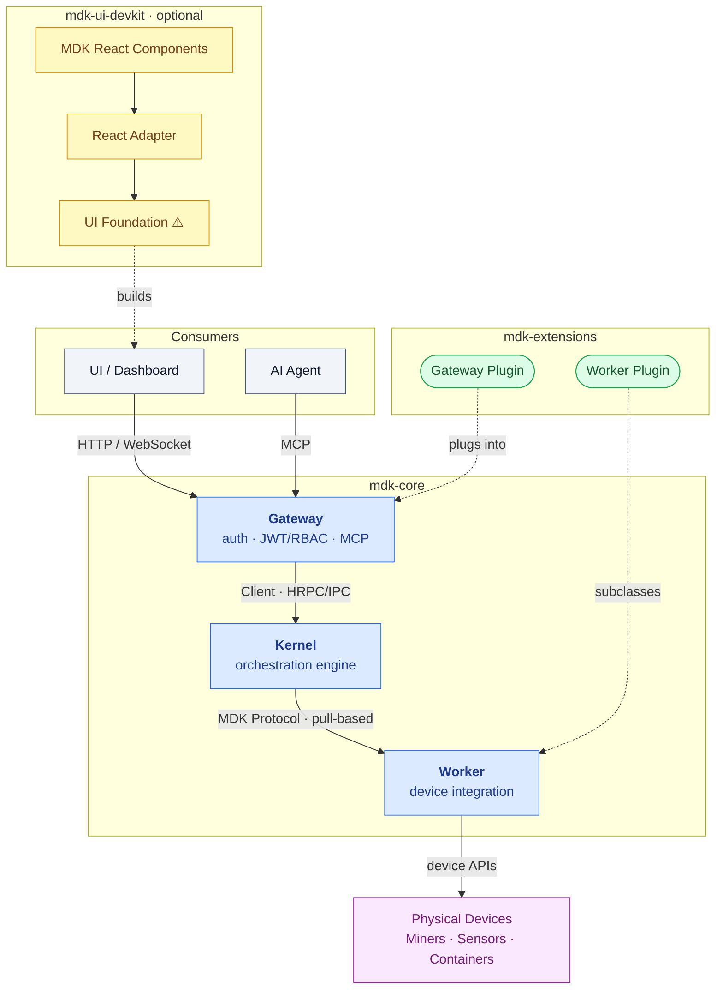

# MDK — Documentation Hierarchy & Standards

> **Version:** 2.1.0  |  **Date:** 2026-06-24  |  **Status:** In Review
>
> Foundational conventions for MDK documentation: canonical naming, the platform package hierarchy, and the site information architecture.

---

## 1. Canonical Component Naming

> **One naming decision remains open** — the `UI Core` package name (`@tetherto/mdk-ui-core`). See §4.5. All other component names are confirmed.


| Retired Name | Canonical Name | Package                 |
| ------------ | -------------- | ----------------------- |
| ORK          | **Kernel**     | `@tetherto/mdk-kernel`  |
| App Node     | **Gateway**    | `@tetherto/mdk-gateway` |
| MDK Client   | **Client**     | `@tetherto/mdk-client`  |
| Worker Base  | **Worker**     | `@tetherto/mdk-worker`  |


---

## 2. Platform Package Hierarchy

The single source of truth for component structure. **Everyone must use this exact terminology and hierarchy.**

```
MDK Platform
│
├── mdk-core          [Built by Tether — invariant foundation]
│   ├── Kernel        @tetherto/mdk-kernel    — orchestration engine
│   ├── Gateway       @tetherto/mdk-gateway   — authenticated API boundary
│   ├── Client        @tetherto/mdk-client    — transport SDK (HRPC / IPC)
│   └── Worker        @tetherto/mdk-worker    — base for device integrations
│
├── mdk-extensions    [Built by Tether reference + Community]
│   ├── Worker Plugins    @<org>/mdk-worker-<device>        — subclass Worker + mdk-contract.json
│   └── Gateway Plugins   @<org>/mdk-plugin-<feature>       — controllers + mdk-plugin.json
│
└── mdk-ui-devkit     [Built by Tether — optional frontend layer]
    ├── UI Core ⚠️         @tetherto/mdk-ui-core             — name pending (see §4.5)
    ├── React Adapter      @tetherto/mdk-react-adapter
    ├── React Components   @tetherto/mdk-react-components
    └── Fonts              @tetherto/mdk-fonts          
```

### 2.1 Architecture diagram (canonical)



<details>
<summary>Mermaid source (for regeneration — PNG above is canonical)</summary>



</details>


### 2.2 Component descriptions


| Tier           | Component                | Package                          | Description                                                                                                                              |
| -------------- | ------------------------ | -------------------------------- | ---------------------------------------------------------------------------------------------------------------------------------------- |
| mdk-core       | **Kernel**               | `@tetherto/mdk-kernel`           | Orchestration engine: device registry, command routing, telemetry, health monitoring. Pull-only; trusts nothing but whitelisted clients. |
| mdk-core       | **Gateway**              | `@tetherto/mdk-gateway`          | The only authenticated entry point. JWT/RBAC, REST/WebSocket/MCP, hosts Gateway Plugins. Reaches the Kernel via Client.                  |
| mdk-core       | **Client**               | `@tetherto/mdk-client`           | Transport SDK over HRPC/IPC; multi-language (Node.js, Python, Go). Usable standalone without a Gateway.                                  |
| mdk-core       | **Worker**               | `@tetherto/mdk-worker`           | Base for device integrations. Provides MDK Protocol plumbing; implement `onTelemetryPull` / `onCommand`.                                 |
| mdk-extensions | **Worker Plugin**        | `@<org>/mdk-worker-<device>`     | Subclasses Worker, ships an `mdk-contract.json`. Integrates a physical device or external service.                                       |
| mdk-extensions | **Gateway Plugin**       | `@<org>/mdk-plugin-<feature>`    | Plain-JS controllers + `mdk-plugin.json`; loaded into the Gateway at boot. Adds custom HTTP/WS endpoints.                                |
| mdk-ui-devkit  | **UI Core** ⚠️           | `@tetherto/mdk-ui-core`          | Headless state + API client; framework-agnostic. Telemetry buffering, optimistic UI, stale detection. Name pending — see §4.5.           |
| mdk-ui-devkit  | **React Adapter**        | `@tetherto/mdk-react-adapter`    | React hooks (`useTelemetry`, `useCommand`) over UI Core.                                                                                 |
| mdk-ui-devkit  | **MDK React Components** | `@tetherto/mdk-react-components` | Radix-based component library; 3-tier CSS customization, no Tailwind dependency.                                                         |
| mdk-ui-devkit  | **Fonts**                | `@tetherto/mdk-fonts`            | Shared typeface bundle for MDK UI surfaces.                                                                                              |


---

## 3. Site Information Architecture

The MDK docs site uses the **[Diátaxis](https://diataxis.fr/)** framework. Tutorials collapse into a single **Quickstart**; Explanation is surfaced as **Understanding MDK**; agentic content gets its own chapter.

```
📖 Introduction
   1.  What is MDK?
   2.  Quickstart  (one golden path, end-to-end)

🛠️ Guides
   1.  Deploy MDK
       1.1  Single-process mode
       1.2  Multi-process mode
       1.3  Multi-kernel deployment                    → U.5
       1.4  Harden your deployment                    → U.7
   2.  Build a Worker Plugin                          → U.3.4, U.4.1
       2.1  Author an mdk-contract.json               → R.1.4
   3.  Build a Gateway Plugin                         → U.3.2, U.4.2
       3.1  Aggregate across workers & sites          → U.5
   4.  Build a Dashboard
       4.1  Use the UI Devkit                         → U.6
       4.2  Use Components in Dashboard Shell         → U.6.1
       4.2  Customize UI components (3-tier CSS)      → R.2

💡 Understanding MDK  (U.*)
   U.1  Architecture overview
   U.2  The MDK Protocol
   U.3  mdk-core
        U.3.1  Kernel
        U.3.2  Gateway
        U.3.3  Client
        U.3.4  Worker
   U.4  mdk-extensions
        U.4.1  Worker Plugins
        U.4.2  Gateway Plugins
   U.5  Scaling model (multi-kernel)
   U.6  mdk-ui-devkit                                     → R.2
        U.6.1  Dashboard shell
        U.6.2  React Components
   U.7  Security  (auth · JWT/RBAC · whitelisting · etc)
   U.8  Storage model (Hypercore / Hyperbee)
        U.8.1  Worker & Gateway Plugin storage

🤖 MDK for Agents  (A.*)
   A.1  Overview (Developer Skill & Operator Agent)
   A.2  MDK Developer Skill
   A.3  Operator Agent
   A.4  MCP endpoint & tool derivation
   A.5  Connect an AI agent                           → U.3.2

📚 Reference  (R.*)
   R.1  mdk-core
        R.1.1  Kernel — API
        R.1.2  Gateway — API · mdk-plugin.json schema · error codes
        R.1.3  Client — API
        R.1.4  Worker — API · mdk-contract.json schema · error codes
   R.2  mdk-ui-devkit
        R.2.1  Dashboard shell
        R.2.2  UI Core — API
        R.2.3  React Adapter — API
        R.2.4  React Components — component catalogue
        R.2.5  Fonts
   R.3  MDK Protocol — envelope
   R.4  Glossary
```

### 3.1 Design notes

- **N1 — UI Devkit adapters in Reference only**
`@tetherto/mdk-ui-core` (UI Core — name pending §4.5) and `@tetherto/mdk-react-adapter` live exclusively in **Reference (R.2)**. They are abstracted implementation details relevant only to specific use cases. The Understanding MDK page for mdk-ui-devkit (U.6) contains a brief conceptual overview and links to R.2.
- **N2 — Fonts in Reference only**
`@tetherto/mdk-fonts` is an optional dependency; developers may bring their own typeface. Documented only in **Reference (R.2.5)**. No dedicated Understanding MDK page — a single line in U.6 noting its existence with a link to R.2.5 is sufficient.
- **N3 — Vue, Svelte, and WC adapters out of scope**
Additional framework adapters (Vue, Svelte, Web Components) are not on the current roadmap. Do not create or stub pages for them. The only mention belongs in the **UI Core reference page (R.2.2)**: a single sentence noting that UI Core is framework-agnostic and additional framework support will be added in the future.

---

## 4. Decisions

### 4.1 Closed — mdk-addons tier name → mdk-extensions

> **Status: ✅ Resolved** — 2026-06-25.

**Decision:** rename `mdk-addons` to `**mdk-extensions`**. Matches the established pattern used by VS Code, Firefox, and Chrome; clearly signals that both Worker Plugins and Gateway Plugins *extend* mdk-core.

### 4.2 Closed — Client name stays as Client

> **Status: ✅ Resolved** — 2026-06-25.

**Decision:** keep `**Client*`* / `@tetherto/mdk-client`. Scoped unambiguously by the package name; no rename needed.

### 4.3 Closed — React Components package name → mdk-react-components

> **Status: ✅ Resolved** — 2026-06-25.

**Decision:** rename `@tetherto/mdk-react-devkit` to `**@tetherto/mdk-react-components`**, display name **MDK React Components**. Directly mirrors the Material Components pattern — the name alone tells you what's inside.

### 4.4 Closed — Client and Gateway cannot be merged

> **Status: ✅ Resolved** — raised by Gio; decision made they must remain separate (2026-06-22).

- **Client** is a *library* — a multi-language transport SDK embeddable in any custom backend, no Gateway required.
- **Gateway** is a *deployable server* — the authenticated boundary (JWT/RBAC, MCP, plugin host) that uses Client internally.

They serve different roles: Client is a dependency; Gateway is an application. Merging would force every custom backend to carry the full auth/MCP surface and would block multi-language Client support.

### 4.5 Open — UI Core name

> **Status: ⚠️ Pending** — Decision needed from team.

`@tetherto/mdk-ui-core` / "UI Core" risks confusion with the **mdk-core** tier. A reader may assume `mdk-ui-core` is part of mdk-core, when it belongs to `mdk-ui-devkit`.


| Candidate                                           | Assessment                                                                                    |
| --------------------------------------------------- | --------------------------------------------------------------------------------------------- |
| **UI Foundation** / `@tetherto/mdk-ui-foundation` ⭐ | Clear: it is the base layer that all framework adapters build on. No overlap with "mdk-core". |
| **UI Engine** / `@tetherto/mdk-ui-engine`           | Captures the active state-management role; slightly more technical.                           |
| **UI Runtime** / `@tetherto/mdk-ui-runtime`         | Accurate — it manages live telemetry state — but "runtime" may feel heavy for a UI library.   |
| **UI Core** / `@tetherto/mdk-ui-core` *(current)*   | Short, but "core" clashes with the mdk-core tier name.                                        |


