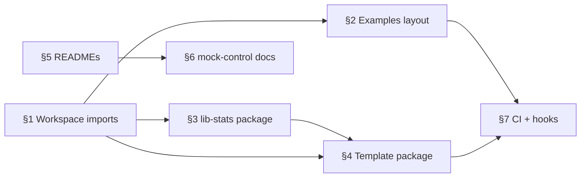

# MDK Private Monorepo (`mdk-prv`) — Architecture Review & Action Plan

> **Version:** 0.1.0 &nbsp;|&nbsp; **Date:** 2026-05-27 &nbsp;|&nbsp; **Status:** Action items for engineering  
> **Audience:** Developers working in `mdk-prv`  
> **Related:** [`mdk-be/docs/mdk-libraries.md`](../../mdk-be/docs/mdk-libraries.md) (canonical package index — must stay in sync with this repo)

This document captures a structured review of the `mdk-prv` monorepo: what is wrong today, what “good” looks like, and how to execute each change without breaking publish or CI.

---

## Executive summary

The monorepo is functionally rich (ORK, App Node, many reference workers, cross-package demos) but several structural choices make it hard to **publish**, **extend**, and **onboard**:

| # | Theme | Severity |
|---|--------|----------|
| 1 | Cross-package imports use long `../../../` paths instead of workspace package names | High |
| 2 | Examples are scattered; cross-package demos live in the wrong places | High |
| 3 | `lib-stats` lives under `packages/core/` but is worker + App Node shared logic | Medium |
| 4 | Alert/stats **templates** are duplicated per vertical instead of one shared package | Medium |
| 5 | Most packages lack a `README.md` | Medium |
| 6 | Supporting items (lint everywhere, pre-commit, CI audit, `mock-control-service` clarity) | Medium |

Work through **§1 (workspaces)** first — it unblocks clean extraction of `lib-stats` and templates.

---

## Current layout (relevant paths)

```text
mdk-prv/
├── package.json                    # workspaces: packages/core, packages/core/*, packages/workers/...
├── packages/
│   ├── core/
│   │   ├── app-node/               # @tetherto/mdk-app-node (no lib-stats usage today)
│   │   ├── client/                 # @tetherto/mdk-client
│   │   ├── examples/               # ⚠️ large cross-package demos (mdk-e2e, mdk-site, …)
│   │   ├── lib-stats/              # ⚠️ not a publishable package; deep-linked via ../../../
│   │   ├── mdk/                    # @tetherto/mdk bootstrap helpers
│   │   ├── mock-control-service/   # @tetherto/mdk-mock-control-service
│   │   └── ork/
│   │       └── examples/           # ⚠️ imports workers via ../../../workers/...
│   └── workers/
│       ├── base/lib/templates/     # shared stats/alerts specs (partial)
│       ├── miners/base/lib/templates/
│       ├── containers/*/lib/templates/
│       ├── power-meter/*/lib/templates/
│       └── temperature/*/lib/templates/
└── examples/core/site/             # workspace entry (separate from packages/core/examples)
```

**Symptom:** grep for `../../../../../core/lib-stats` or `../../../../core/mock-control-service` shows workers reaching into `packages/core/` by filesystem path, not by `@tetherto/...` name.

---

## 1. Use npm workspaces + package names (not `../../../`)

### Problem

Today, many packages import siblings or cousins via relative filesystem paths, for example:

```js
// packages/workers/miners/whatsminer/lib/templates/stats.js
const { getVal } = require('../../../../../core/lib-stats/utils')

// packages/workers/miners/whatsminer/mock/mock-control-agent.js
const MockControlAgent = require('../../../../core/mock-control-service/mock-control-agent')

// packages/core/ork/examples/telemetry-flow.js
const { WM_M56S } = require('../../../workers/miners/whatsminer')
```

This works in a monorepo checkout but:

- Breaks the mental model of “each folder is a real NPM package.”
- Makes refactors painful (path depth changes when folders move).
- Does not match how published consumers import (`require('@tetherto/mdk-worker-base')`).
- Hides missing `dependencies` in `package.json` until publish time.

### Target state

1. Every publishable unit has its own `package.json` with a scoped name (`@tetherto/...`).
2. Cross-package imports use **only** those names:

   ```js
   const { getVal } = require('@tetherto/mdk-lib-stats/utils')
   const { WM_M56S } = require('@tetherto/mdk-worker-whatsminer')
   const MockControlAgent = require('@tetherto/mdk-mock-control-service')
   ```

3. Root `package.json` `workspaces` includes every package path (already partially done).
4. Each package lists workspace deps in `dependencies` with `"*"` or `"workspace:*"` (npm 7+).

### How it works (no extra build step)

On `npm install` at the repo root, npm workspaces symlink local packages into `node_modules/@tetherto/...`. Node resolves `require('@tetherto/foo')` the same way in development and after publish (registry installs real versions).

### Action items

- [ ] Audit all `require('..')` chains that escape the current package directory (exclude intra-package `../../lib/...` within tests).
- [ ] Add missing packages to `workspaces` in root `package.json` (e.g. future `packages/lib/stats`).
- [ ] Add explicit `dependencies` in each consumer `package.json`.
- [ ] Replace relative cross-package imports with scoped names (mechanical PR, can be split by vertical: miners, containers, power-meter, core).
- [ ] Document the rule in `CONTRIBUTING.md`: *“No `require` path may cross package boundaries without a `@tetherto/` name.”*

### Acceptance criteria

- `rg "require\(['\"]\.\./\.\./\.\./(core|workers)" packages/` returns zero matches for production code (tests may use local paths within the same package).
- `npm test` / `npm run lint` pass at root and per workspace.
- A fresh clone + `npm install` + running one ORK example works without path hacks.

---

## 2. Reorganize examples (two tiers)

Examples today are split awkwardly:

| Location | What lives there | Issue |
|----------|------------------|--------|
| `packages/core/examples/` | E2E, full site, per-device client demos, minerpools | Good content, but **not** tied to a single publishable package; mixes many workers + ORK |
| `packages/core/ork/examples/` | `telemetry-flow.js`, `ork-shell.js`, … | Cross-imports `../../../workers/...` and `../../mdk` |
| `packages/core/mdk/` | Bootstrap package — **not** an examples folder | Naming confusion with “mdk examples” |
| `examples/core/site/` | Separate workspace app | OK as top-level app; document relationship |

### 2.1 Tier A — Top-level runnable apps (`examples/` or `apps/`)

**Purpose:** Cross-package, “show the whole system” demos that intentionally wire ORK + multiple workers + mocks.

**Target:**

```text
mdk-prv/
├── examples/                        # or apps/ — pick one convention and stick to it
│   ├── e2e/                         # from packages/core/examples/mdk-e2e/
│   ├── site/                        # from packages/core/examples/mdk-site/ + examples/core/site
│   └── README.md                    # index: ports, prerequisites, how to run
```

**Rules:**

- Each example is its own workspace package with `package.json` declaring deps on `@tetherto/mdk-ork`, `@tetherto/mdk`, worker packages, etc.
- No `../../../workers` — only scoped imports.
- `packages/core/examples/README.md` content moves to `examples/README.md` (or stays as a redirect).

**Action items:**

- [ ] Create `examples/e2e/package.json`, `examples/site/package.json` (names TBD).
- [ ] Move `packages/core/examples/mdk-e2e/` → `examples/e2e/`.
- [ ] Move `packages/core/examples/mdk-site/` → `examples/site/`.
- [ ] Update root `workspaces` and CI paths that reference old locations.
- [ ] Delete empty `packages/core/examples/` after migration (or keep only a stub README pointing to `examples/`).

### 2.2 Tier B — Per-package `examples/` (copy-paste snippets)

**Purpose:** Minimal scripts that exercise **one** publishable package; linked from that package’s `README.md`.

**Target:**

```text
packages/core/ork/examples/          # ORK-only: telemetry-flow, ork-shell (no worker imports OR worker via @tetherto/...)
packages/core/client/examples/       # client-only connection samples
packages/core/app-node/examples/     # optional: local gateway smoke test
packages/workers/miners/whatsminer/examples/   # single-worker + mock server
... (every reference worker package)
```

**Rules:**

- Each file should be runnable with `node examples/foo.js` from the package root (or documented from repo root with `-C`).
- Imports only from that package’s public API (`main` / documented exports) plus declared workspace deps.
- Prefer **no** mock hardware on ports that collide — document ports in package README.

**Action items:**

- [ ] Move single-worker scripts from `packages/core/examples/miners|containers|...` into the matching worker package `examples/`.
- [ ] Move `packages/core/examples/ork/mdk.client.ork.js` → `packages/core/ork/examples/`.
- [ ] Move `packages/core/examples/minerpools/` → `packages/workers/minerpools/ocean/examples/` (or base).
- [ ] Add “Examples” section to each package README linking to these files.
- [ ] Fix `packages/core/ork/examples/*.js` to use workspace imports after §1.

### Acceptance criteria

- Clear distinction in docs: **Tier A = full stack**, **Tier B = one package**.
- `packages/core/examples/` no longer contains long-lived cross-package demos (only redirect or removed).
- CI runs at least one Tier A and one Tier B example in smoke job.

---

## 3. Extract `lib-stats` out of `packages/core/`

### Problem

`packages/core/lib-stats/` is shared infrastructure:

- Used by `packages/workers/base` (`thing.manager.js`, `stats.service.js`).
- Used by many worker `lib/templates/stats.js` files via deep relative paths.
- **Not** used by `app-node` today, but **should** be available to App Node aggregation plugins ([`hld-app-node-plugins.md`](../../mdk-be/docs/hld-app-node-plugins.md)).

It is not a standalone NPM package (no `package.json`), which forces `../../../core/lib-stats` imports and couples stats logic to “core” in name only.

### Target state

```text
packages/lib/stats/                  # @tetherto/mdk-lib-stats (name TBD — align with mdk-libraries.md)
├── package.json
├── README.md
├── index.js                         # applyStats, tallyStats, defaults
├── utils.js                         # getVal, groupBy, ...
└── ops/                             # stat operation implementations
```

**Dependency direction:**

```text
@tetherto/mdk-lib-stats  ←  @tetherto/mdk-worker-base
                         ←  device workers (templates)
                         ←  @tetherto/mdk-app-node (plugins / aggregators)
```

`lib-stats` must **not** depend on ORK, App Node, or workers.

### Action items

- [ ] Add `packages/lib/stats/package.json` (`@tetherto/mdk-lib-stats`).
- [ ] Move files from `packages/core/lib-stats/` → `packages/lib/stats/`.
- [ ] Register workspace path in root `package.json`.
- [ ] Update all imports to `require('@tetherto/mdk-lib-stats')` / `.../utils`.
- [ ] Add `mdk-lib-stats` to `mdk-be/docs/mdk-libraries.md` package index.
- [ ] Document usage for App Node plugin authors (rollup helpers, timeframes).

### Acceptance criteria

- `packages/core/lib-stats/` removed.
- Workers and base tests pass.
- App Node can add a devDependency on `@tetherto/mdk-lib-stats` without pulling ORK.

---

## 4. Consolidate worker templates into one package

### Problem

Alert and stats **template specs** are spread across:

- `packages/workers/base/lib/templates/`
- `packages/workers/miners/base/lib/templates/`
- `packages/workers/containers/*/lib/templates/`
- `packages/workers/power-meter/*/lib/templates/`
- `packages/workers/temperature/*/lib/templates/`

Device packages often re-export or thin-wrap the same patterns:

```js
const libStats = require('../../../base/lib/templates/stats')
const { groupBy } = require('../../../../../core/lib-stats/utils')
```

This duplicates structure and encourages more `../../../` chains.

### Target state

One shared package (name aligned with Device-Lib terminology in HLD):

```text
packages/lib/worker-templates/       # @tetherto/mdk-worker-templates (name TBD)
├── package.json
├── README.md
├── stats/
│   ├── default.js
│   └── index.js
├── alerts/
│   ├── default.js
│   └── index.js
└── utils/                           # template-local helpers only
```

Per-device workers **override or extend** specs in their own package only when the device truly differs; otherwise they import from `@tetherto/mdk-worker-templates`.

### Action items

- [ ] Inventory `SPECS` / `CONF` objects across all `lib/templates/*.js` files.
- [ ] Merge true duplicates into `mdk-worker-templates`.
- [ ] Keep device-specific deltas in `packages/workers/<vertical>/<device>/lib/templates/` as thin layers.
- [ ] Update tests under `packages/workers/*/tests/unit/templates*.js`.
- [ ] Depends on §1 (workspace imports) and §3 (`mdk-lib-stats` for `groupBy` / ops).

### Acceptance criteria

- No worker imports another vertical’s `base/lib/templates` via filesystem `../../../`.
- Single README explains how to add a new device stats/alerts spec.

---

## 5. Add a `README.md` to every publishable package

### Problem

Only `packages/core/examples/README.md` exists under `packages/`. New contributors cannot tell what each folder owns, how to test it, or how it publishes.

### Target state

Every workspace package includes at minimum:

```markdown
# @tetherto/mdk-…

## What this package does
(one paragraph)

## Install / workspace
npm install from monorepo root

## API surface
main exports or link to index.js

## Examples
link to examples/ scripts

## Tests
npm test

## Related packages
bulleted list of @tetherto deps
```

### Action items

- [ ] Generate a checklist from `npm query .workspace` or the table in `mdk-libraries.md`.
- [ ] Prioritize: `ork`, `client`, `app-node`, `mdk`, `worker-base`, `mock-control-service`, then each reference worker.
- [ ] Add README template to `CONTRIBUTING.md`.

### Acceptance criteria

- Every path listed in root `workspaces` has a `README.md` at its root.
- `mdk-libraries.md` links to each README (optional follow-up).

---

## 6. Clarify `mock-control-service`

### What it is today

`packages/core/mock-control-service/` (`@tetherto/mdk-mock-control-service`) provides a **Fastify-based mock control plane** used in development and tests so workers can exercise write/command paths without real hardware. Worker packages import `mock-control-agent.js` via long relative paths in their `mock/` folders.

### Recommendation

- Treat it as a **dev/test utility package**, not part of the production App Node/ORK runtime.
- After §1: workers use `require('@tetherto/mdk-mock-control-service')` only from `mock/` and tests.
- Document in package README: when to run it, ports, relationship to worker mock servers (e.g. Whatsminer `mock/server.js`).

### Action items

- [ ] Write `packages/core/mock-control-service/README.md` (purpose, API, example).
- [ ] Consider moving under `packages/lib/mock-control-service/` or `packages/tools/` if it should not sit beside ORK — **decision needed**.
- [ ] Ensure it is not bundled into production worker releases (`files` field already limits publish surface).

---

## 7. Supporting hygiene (from broader review)

These items were noted alongside the structural work above:

| Item | Intent |
|------|--------|
| **Sync `mdk-libraries.md` with `mdk-prv`** | Package index in `mdk-be` must match real folders and NPM names after moves. |
| **Review `.github/` CI** | Workflows likely reference old paths (`packages/core/examples`, `core.yaml`, `ui.yaml`); update after renames. |
| **Lint in every package** | Root has `standard`; ensure each workspace defines `npm run lint` and CI runs `npm run lint --workspaces`. |
| **Pre-commit hooks** | Husky + lint-staged (or similar) to block broken Standard/style before push. |

---

## Suggested execution order



1. **§1** — workspace imports (unblocks everything else).  
2. **§3** — extract `mdk-lib-stats`.  
3. **§2** — move examples (Tier A + Tier B).  
4. **§4** — consolidate templates.  
5. **§5 / §6** — documentation pass.  
6. **§7** — CI, lint, pre-commit, sync `mdk-libraries.md`.

---

## Open decisions (need owner sign-off)

| # | Question | Options |
|---|----------|---------|
| 1 | Top-level demos folder name | `examples/` vs `apps/` (HLD uses `apps/` for shell; avoid two meanings) |
| 2 | Published name for lib-stats | `@tetherto/mdk-lib-stats` vs `@tetherto/mdk-stats` |
| 3 | Template package name | `@tetherto/mdk-worker-templates` vs fold into `mdk-worker-base` |
| 4 | Keep `packages/core/mdk` name | Bootstrap package — document clearly vs rename to `@tetherto/mdk-bootstrap` |

---

## References

- [`mdk-be/docs/mdk-libraries.md`](../../mdk-be/docs/mdk-libraries.md) — package index & monorepo map (keep in sync).
- [`mdk-be/docs/hld-app-node-plugins.md`](../../mdk-be/docs/hld-app-node-plugins.md) — future App Node plugins consuming `mdk-lib-stats`.
- [`packages/core/examples/README.md`](../packages/core/examples/README.md) — current example runbook (migrate with §2).
- Root [`package.json`](../package.json) — workspace definitions.

---

## Tracking

When starting a PR, reference the section number (e.g. `mdk-prv: §1 workspace imports — miners vertical`) so review threads map back to this doc.
