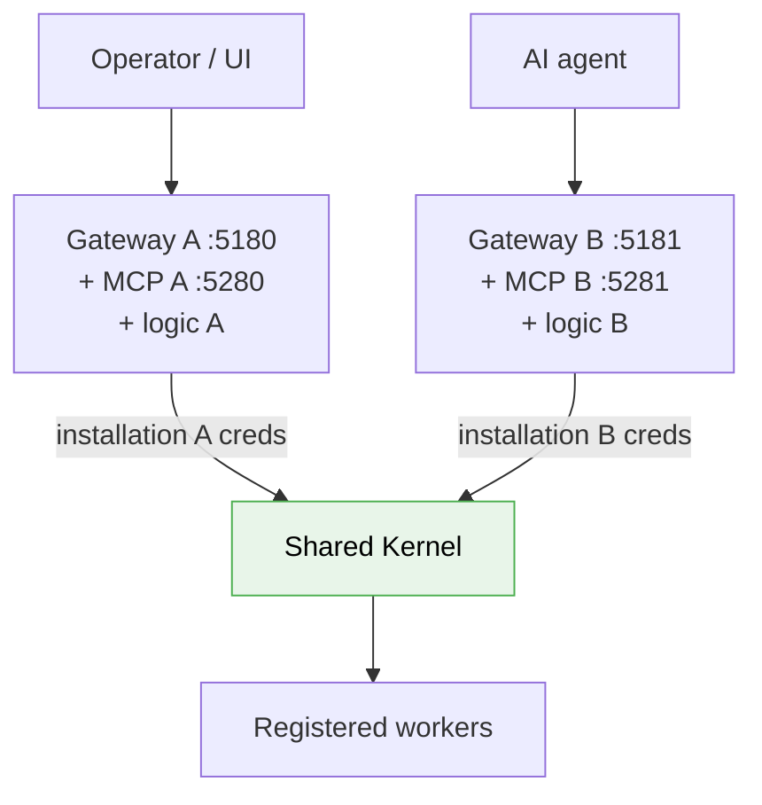
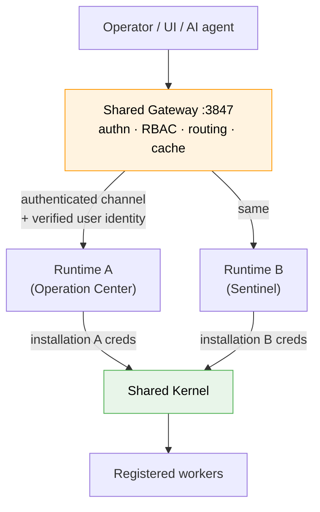
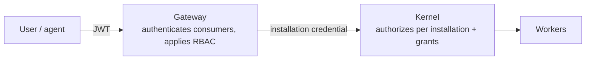

# MDK Apps — Gateway Topology and App Isolation (HLD)

> **Version:** 0.3.0  |  **Date:** 2026-09-19  |  **Status:** Draft
>
> An app must run outside the Gateway process and reach the Kernel through its own credential.
> Two topologies achieve that. This document compares them, covers what each means for MCP and
> public API surfaces, and specifies the identity model both share.

---

## 1. Problem

An app today is a Gateway plugin: its controllers are `require` into the Gateway process and mounted as Fastify routes. Three properties follow, and all three defeat the principle of *"an app cannot exceed what the operator approved"*.

**Every plugin is handed the Gateway's own Kernel key.** `buildPluginContext` exposes
`config.kernelKey` and `config.kernelBootstrap`, and the contract expects a plugin to build a client from them.

The credential every app receives is identical and carries whatever the Gateway may do. There is
nothing per-app to scope, revoke or audit.

**Process isolation does not exist.** Each plugin gets "one private module registry", which
separates module *caches* — same process, same heap, same credentials in reach. A tidiness boundary,
not a security one.

**The MCP surface has no authorization and cannot inherit any.** `@tetherto/mdk-mcp` is a standalone process that reads the same plugin directories off disk, converts routes into tools and calls the handlers directly.

---

## 2. Option A — one Gateway per app

The standard Gateway runtime deployed once per app, each dialling the shared Kernel as its own
installation (§6).

Nothing is mounted into a shared privileged process, so an app Gateway may run programmatic
handlers, and a crash, overload or revocation affects one app only — including its ingress.

**Up to three processes per app.** Every server-side component is duplicated per app:

1. **Gateway** — HTTP routes and consumer auth. It can also serve the `ui/` bundle as static files,
  so a UI adds no process.
2. **MCP server** — only if the app is agent-reachable. MCP is a standalone server today, not a
  Gateway capability, so each app runs its own, holding that installation's credential.
3. **Background logic** — only if the app ships `src/` (`process.start` in `mdk-app.json`), e.g.
  Sentinel's 30-second timer, which calls its own Gateway over HTTP. Can be merged with Gateway.

A plain dashboard runs one; an agent-reachable app with a background timer runs three. The three can
share one process, since they sit inside one trust boundary, but each app still embeds its own
Gateway and MCP stack — the duplication moves rather than disappears.

**Cost.** Auth is enforced in N places, on N possibly-different Gateway versions, and every
agent-reachable app adds an MCP surface to secure (§4).

---

## 3. Option B — one Gateway, per-app runtime processes

One shared Gateway owns authentication, RBAC and routing and executes no app code. Each app runs as
a supervised runtime process with its own credential; the Gateway forwards authorized requests to it
over an authenticated local channel. This is the Kubernetes API-aggregation shape.

Three rules make it sound; without them it is today's situation with extra steps:

1. **The runtime holds its own Kernel credential and dials the Kernel directly.** A Gateway holding
  all N credentials would be a multi-tenant vault — worse than Option A.
2. **The forwarding channel is authenticated both ways.** Forwarded identity is only evidence if the
  runtime can verify *which* peer asserted it.
3. **The runtime refuses anything not from the Gateway**, so its socket is not a bypass of the
  enforcement tiers in §6.

**Cost.** A shared ingress failure domain, contradicting `mdk-apps-proposal.md` §3's *"a Gateway
failure should affect its own app only"* — but for ingress only: each runtime holds its own Kernel
connection, so background logic keeps running while the front door is down. Per-app rate limiting
becomes mandatory, and stream routes that take over the raw response need real proxying.

The app contract survives the switch: the handler boundary already passes plain serializable data,
and the route table already comes from the manifest rather than from code.

---

## 4. MCP and public API surfaces

This is where the options differ most, because MCP today is a separate unauthenticated process
(§1), and the agent path is the one `hld.md` §4.2 insists must face the same checks as a human.

### Under Option A

| Surface                      | Behaviour                                                                                                                                                   |
| ---------------------------- | ----------------------------------------------------------------------------------------------------------------------------------------------------------- |
| **HTTP**                     | One port per app. A reverse proxy can present one hostname but is **not** an authorization boundary — each Gateway still authenticates every request itself |
| **MCP**                      | One MCP process per app, each holding that installation's credential. Auth must be built into each; today they have none beyond a loopback bind             |
| **Agent UX**                 | An agent needing two apps configures two MCP servers and reconciles two tool sets                                                                           |
| **TLS / CORS / rate limits** | Configured N times, or in a proxy that cannot be trusted for authz                                                                                          |

The load-bearing risk is N MCP surfaces each independently responsible for enforcement that does not
exist yet. The RBAC HLD already calls MCP the most likely implementation hole; this multiplies it by
the number of installed apps.

### Under Option B

| Surface                      | Behaviour                                                                                                                                                                           |
| ---------------------------- | ----------------------------------------------------------------------------------------------------------------------------------------------------------------------------------- |
| **HTTP**                     | One port, routes namespaced per app from App ID — derived from each installed manifest, never from the code                                                                         |
| **MCP**                      | One endpoint. Tools derived from installed manifests and namespaced by App ID; a tool call takes the **same** authn → RBAC path as the equivalent HTTP route before being forwarded |
| **Agent UX**                 | One MCP server; an agent sees the union of tools its identity permits, filtered by the same RBAC that governs HTTP                                                                  |
| **TLS / CORS / rate limits** | Configured once, at a boundary that genuinely is the authorization boundary                                                                                                         |

App ID namespacing also removes collisions between apps that name a route or tool the same.

One correction to record: `mdk-apps-proposal.md` §3 says route generation should follow how MCP
"derives its tool list at runtime" from worker contracts. It does not — both existing sources read
plugin manifests, and the contract-driven path is explicitly not wired up. That is net-new work
under either option.

---

## 5. Recommendation

|                                          | A — Gateway per app    | B — shared Gateway, per-app runtimes        |
| ---------------------------------------- | ---------------------- | ------------------------------------------- |
| Trust boundary correct                   | yes                    | yes                                         |
| Auth enforcement points                  | N                      | 1                                           |
| MCP surfaces to secure                   | N (none secured today) | 1                                           |
| Public entry point is the authz boundary | no                     | yes                                         |
| Gateway versions to support              | one per app            | one per instance                            |
| Ingress failure domain                   | per app                | shared (app logic unaffected)               |
| Processes per app                        | up to 3                | 1 runtime                                   |
| New machinery required                   | little                 | supervisor, channel auth, stream forwarding |

**Target Option B; Option A is acceptable for v1.0 only while every installed app is first-party.**
Option A's isolation is real, but it scales the one thing that must not be duplicated —
enforcement — across the MCP surface that currently has none. Option B builds it once.

The trigger to move is whichever comes first: **third-party apps becoming installable**, or **agent
access becoming a product requirement**.

The migration stays free while two rules hold from day one:

1. **Handlers never receive Kernel credentials or in-process Gateway internals** — only a services
  interface whose implementation could be a local call or an IPC call.
2. **The manifest, not code loading, is the source of truth for the route table.**

Rule 2 already holds. Rule 1 is the one violated today, by `config.kernelKey`.

Under either option, process separation alone is not isolation: CPU, memory and Kernel request
limits are what make a misbehaving app survivable, and direct worker access stays denied at the
network level rather than only at the Kernel's authorization layer.

---

## 6. Identity — common to both options

| Term                | Meaning                                                                             | Lifetime                                          |
| ------------------- | ----------------------------------------------------------------------------------- | ------------------------------------------------- |
| **App ID**          | Immutable package identity, `io.tether.sentinel`                                    | Ships in `mdk-app.json`                           |
| **Installation ID** | This app's install on this instance — an incarnation marker, not a multiplicity one | Generated at install, discarded on remove         |
| **Credential**      | The installation's own Kernel credential                                            | Provisioned at install, **never** in the artifact |
| **Grants**          | Operator-approved capabilities and device scope                                     | Stored and enforced by the Kernel                 |

Requested capabilities in a manifest are **requests, not grants**. Approval binds to action, target
and parameters — there is no "trusted app" flag. Revocation invalidates live sessions, not only
future connections.

### One installation per app per instance

**An App ID may be installed at most once on an instance.** A second `add` fails and directs the
operator to the upgrade path; running an app twice means running two instances.

This makes App ID the primary key, so the route prefix, MCP tool namespace, assigned port, status
row and audit records all derive from it with no disambiguator. Installation ID still exists so that
remove-then-reinstall cannot inherit the removed identity's credential or grants.

### Two enforcement tiers

The Kernel never sees an end user — only an installation asking for a device and a capability.
Because it cannot verify a user identity asserted by an app, a user-ID header is not evidence of
authorization: operator-initiated writes need verifiable operator context, background writes run
under the app's automation policy.

---

