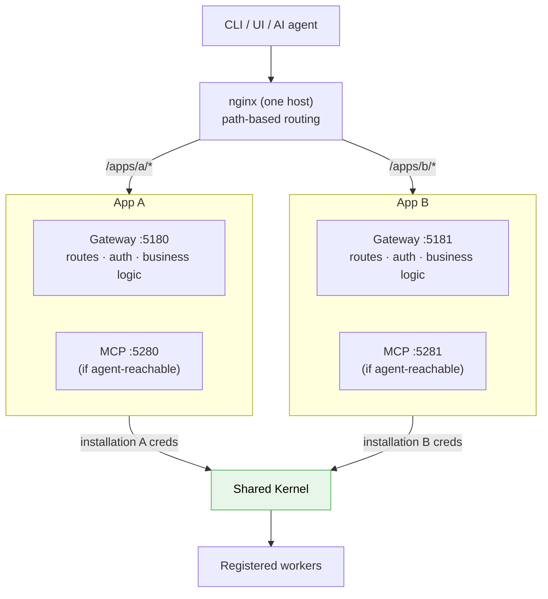
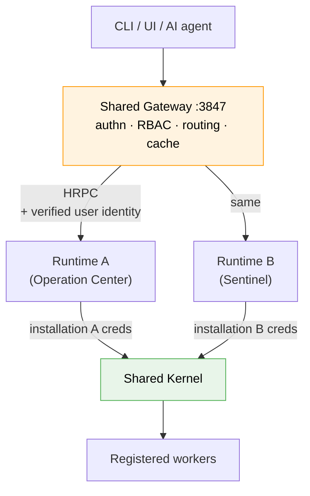

# MDK Apps — Gateway Topology and App Isolation (HLD)

> **Version:** 0.3.0  |  **Date:** 2026-09-19  |  **Status:** Draft

---

## 1. Problem

An app today is a Gateway plugin: its controllers are `require` into the Gateway process and mounted as Fastify routes. Three properties follow, and all three defeat the principle of *"an app cannot exceed what the operator approved"*.

**Every plugin is handed the Gateway's own Kernel key.** `buildPluginContext` exposes
`config.kernelKey` and the contract expects a plugin to build a client from them for all Apps.

The credential every app receives is identical and carries whatever the Gateway may do. There is
nothing per-app to scope, revoke or audit.

**Process isolation does not exist.** Each plugin gets same process, same heap, same credentials. No security boundary.

Two candidate architectures address this: one Gateway per app (§2), and one shared Gateway with
per-app runtime processes (§3). We choose Option B, for the reasons in §4.

---

## 2. Option A — one Gateway per app

The standard Gateway runtime is deployed once per app, and each Gateway connects to the shared
Kernel with its own installation credential.

**One host for all apps.** The UI and AI agents need a single host that reaches every app, so one
nginx sits in front of all the Gateways and routes each request by path prefix to the app that owns
it: to its Gateway, or to its MCP server for agent traffic. 

```mermaid
flowchart TD
  C["CLI / UI / AI agent"] --> N["nginx (one host)<br/>path-based routing"]

  subgraph appA["App A"]
    GA["Gateway :5180<br/>routes · auth · business logic"]
    MA["MCP :5280<br/>(if agent-reachable)"]
  end

  subgraph appB["App B"]
    GB["Gateway :5181<br/>routes · auth · business logic"]
    MB["MCP :5281<br/>(if agent-reachable)"]
  end

  N -->|"/apps/a/*"| appA
  N -->|"/apps/b/*"| appB
  appA -->|"installation A creds"| K["Shared Kernel"]
  appB -->|"installation B creds"| K
  K --> W["Registered workers"]

  style K fill:#e8f5e9,stroke:#4caf50,color:#000
```

**Two processes per app**, behind the **one shared nginx process**:

1. **Gateway** — HTTP routes, consumer auth and the app's business logic. Business logic code runs inside the Gateway.
2. **MCP server** — MCP is a standalone server today, so each app runs its own, holding that installation's credential.

**Pros**

- **Strong isolation** — each app has its own process and Kernel credential.
- **Failures stay per app** — a Gateway crash affects only its own app; the shared nginx runs no app
code.
- **Little new machinery** — reuses the existing Gateway runtime; nginx only adds path routing.

**Cons**

- **No single view of all apps** — without a shared Gateway, there is no one place to see every installed app.
- **Manual nginx setup** — users must deploy nginx and manage its config themselves, which makes the out-of-the-box experience harder.
- **Auth enforced N times** — nginx only routes, so every Gateway must authenticate and apply RBAC itself, even if all of them use a shared MDK auth library.
- **Fragmented agent UX** — an agent configures one MCP server per app, each with its own tool set.
- **Business logic shares the Gateway's process** — the Gateway is a complex process, so any crash or restart stops the whole app, business logic included.

---

## 3. Option B — one Gateway, per-app runtime processes

One shared Gateway owns authentication, RBAC and routing and executes no app code. Each app runs as a simple supervised runtime process with its own credential. The Gateway forwards authorized requests to each runtime over **HRPC, which is secure by default**: every stream is encrypted, and both ends are authenticated by their key pairs.

```mermaid
flowchart TD
  U["CLI / UI / AI agent"] --> G["Shared Gateway :3847<br/>authn · RBAC · routing · cache"]
  G -->|"HRPC<br/>+ verified user identity"| RA["Runtime A<br/>(Operation Center)"]
  G -->|"same"| RB["Runtime B<br/>(Sentinel)"]
  RA -->|"installation A creds"| K["Shared Kernel"]
  RB -->|"installation B creds"| K
  K --> W["Registered workers"]

  style G fill:#fff3e0,stroke:#ff9800,color:#000
  style K fill:#e8f5e9,stroke:#4caf50,color:#000
```

Three rules make it sound; without them it is today's situation with extra steps:

1. **The runtime holds its own Kernel credential and connects to the Kernel directly.**
2. **The forwarding channel is authenticated both ways.** HRPC gives this by default: each end
  proves its key pair, so the runtime can verify *which* peer asserted a forwarded identity.
3. **The runtime refuses anything not from the Gateway.** It accepts HRPC calls only from the
  Gateway's key.

**Pros**

- **One enforcement point** — the Gateway is both the single host and the authorization boundary;
auth, TLS, CORS and rate limits live in one place, on one version.
- **One MCP endpoint** — tools are namespaced by App ID and take the same authn → RBAC path as
HTTP; an agent configures one server.
- **Isolation kept** — each runtime has its own process and Kernel credential; the Gateway runs no
app code.
- **Central access logs** — the Gateway logs every request at the ingress, giving one source of user telemetry.
- **Secure channel by default** — Gateway-to-runtime traffic runs over HRPC, so encryption and mutual authentication come built in.
- **App logic survives a Gateway outage** — each runtime keeps its own Kernel connection, so
background work continues while the front door is down.
- **Easy to scale horizontally** — the Gateway is mostly stateless, so it scales out by adding more instances as traffic grows.
- **Apps move over unchanged** — handlers already pass plain serializable data, and the route table
already comes from the manifest rather than from code.

**Cons**

- **Shared ingress failure domain** — while the Gateway is down, no app is reachable.
- **New machinery** — the app runtime is fairly simple, but it is one more library for the MDK team to maintain.

> **Note — auth for users, apps and agents**
>
> - RBAC auth for users and apps is a library that plugs into the Gateway's Fastify router.
> - Each app gets one **service account**, and its identity token is issued to that account.
> - Incoming credentials (mostly JWTs) are verified at the shared Gateway for users, and at the Kernel for app service accounts.
> - Agents calling the MCP server go through the same library and mechanism.
> - How this works internally is covered in a separate HLD (§5).

---

## 4. Decision

**We choose Option B: one shared Gateway, with each app in its own runtime process.**

- **Auth is enforced once** — authentication, RBAC, TLS, CORS and rate limits live in the shared Gateway, not in every app's Gateway.
- **Agents get one MCP endpoint** — one server and one tool set, checked by the same RBAC as HTTP.
- **Simpler for users** — one host with no nginx to set up, and one place to see every app and its access logs.
- **Isolation is kept** — each app runs in its own process with its own Kernel credential, and the Gateway reaches it over HRPC, which is secure by default.
- **Resilient and scalable** — app logic keeps running if the Gateway goes down, and the mostly stateless Gateway scales horizontally.

The trade-offs we accept: the Gateway is a shared ingress point, and the app runtime is one more library for the MDK team to maintain.

---

## 5. Related HLDs

This HLD settles the Gateway topology. The HLDs below build on it:

- **RBAC auth for users and apps** — the auth library from the §3 note: user JWTs verified at the Gateway, one service account per app verified by the Kernel, and the same path for agents on MCP. It extends the existing Gateway auth HLD, `[hld-gateway-auth-rbac.md](./hld-gateway-auth-rbac.md)`, from users to apps.
- **App packaging** — an app's runtime code, manifest and UI shipped as one easy-to-install package.
- **Process sandboxing and production bootstrap** — how app runtimes are started and supervised in production, with per-app CPU, memory and Kernel request limits.
- **MCP progressive disclosure** — keeping the single MCP endpoint usable as the number of apps, and so of tools, grows.

Beyond apps, more HLDs will follow on the release process, alert mechanisms, type definitions for the JS libraries and more.