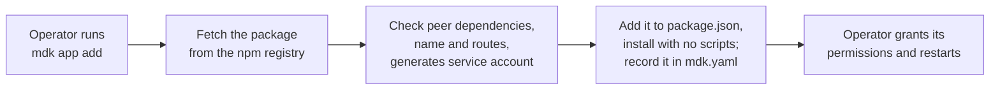

# MDK Apps — App Packaging (HLD)

> **Version:** 0.1.0  |  **Date:** 2026-09-28  |  **Status:** In Review

---

## 1. Problem

An app today is not one thing. Its parts ship separately and are wired together by hand on each
site.

- **The Gateway plugin is a directory installed with npm.** It holds `mdk-plugin.json` and the
controllers, is installed with `npm install` or a `file:` link, and is listed under
`spec.gateway.plugins` in `mdk.yaml`.
- **The UI is a standalone component that calls the Gateway plugin's APIs.** It is imported into
the shell's code by hand, so adding an app's UI means editing and rebuilding the shell.

**Nothing makes it an app.** There is no app identity, no app manifest and no artifact.

This HLD defines one package that holds an app's Gateway plugin, background logic and UI, and the
CLI commands that build and install it.

---

## 2. Ground rules

1. **One standard.** Dashboards, watchers, reporting tools and agents all ship in the same shape,
  including our reference apps.
2. **Install from a known, immutable source.** Apps install from an npm registry the company
  already trusts, at an exact version, with no build step and no install scripts on the site box.
3. **Build once, install anywhere.** The package is identical on every instance. Everything
  specific to one instance (installation ID, keys, credentials, config values, installed name) is
  created at install time and never ships with the app.
4. **Requests are not grants.** An app states the Kernel access it needs; only the operator can
  grant it.
5. **A trusted source proves where an app came from, not that it is safe.**
6. **Plugins move over unchanged.** An existing Gateway plugin becomes an app's backend without
  source changes.

Out of scope: upgrading, rolling back and removing an installed app; production supervision and
resource limits (process sandboxing HLD); the Kernel permission vocabulary and its enforcement
(RBAC for apps HLD); and the public app index.

---

## 3. What a package holds, and who runs each part

The package follows the topology chosen in [hld-app-gateway.md](./hld-app-gateway.md) §4: one
shared Gateway that runs no app code, and one runtime process per app. The Gateway only reads the
package; the app's code runs in its runtime and, for the UI, in the browser.


| Part         | In the package           | Used by               | How                                                                  |
| ------------ | ------------------------ | --------------------- | -------------------------------------------------------------------- |
| App manifest | `mdk-app.yaml`           | CLI, Gateway, runtime | Identity, version, display name, permission requests, default config |
| Route table  | `plugin/mdk-plugin.json` | **Gateway**, MCP      | Read, never executed: routing, RBAC vocabulary, MCP tools            |
| UI module    | `ui/`                    | **UI shell**, browser | Loaded at runtime by the `mdk-shell`                                 |


---

## 4. Options for the artifact

### 4.1 npm package, installed with npm

The app is an ordinary npm package, published to the company's registry or to npmjs.
`mdk app add @tetherto/mdk-app-sentinel@0.2.0` installs it through npm on the site box.

**Pros**

- **A source the company already trusts** — installs go through the registry the company runs or
has approved, inside its security boundary, so its access control, vulnerability scanning and audit
apply to the app and to every dependency.
- **Nothing new to build or learn** — developers publish with `npm publish`, and plugins already
install this way.
- **Proof of origin, where available** — npmjs can record which code repository and which
automated build produced a package (`npm publish --provenance`), so anyone can check where it came
from.

**Cons**

- **Needs registry access at install** — offline sites need a registry mirror.

### 4.2 Signed app bundle

`mdk app pack` produces one file, `<id>-<version>.mdkapp`: a gzip tarball holding the entire source code of the app, file checksums and a signature. `mdk app add` verifies and unpacks it. 

**Pros**

- **Works offline** — one self-contained file, with nothing to reach at install.
- **Verifiable without a registry** — the signature and checksums travel with the file.
- **Independent of the supervisor** — it works whether production picks containers or systemd.

**Cons**

- **A new channel for security teams** — a tarball or zip from outside the company's registry is  
what many security teams refuse, and it needs its own review before they allow it.

### 4.3 Container image per app

Each app is an OCI image; install is pull and run.

**Pros**

- **Mature tooling** — registries, layer caching and signing (cosign) exist.
- **Isolation included** — if production runs apps in containers.

**Cons**

- **Decides the supervisor early** — containers versus hardened systemd is still open
- **Heavy on a site box** — a container runtime plus one image per app, before footprint has been  
measured.

---

## 5. Decision

**We choose the npm package for v1.0, and will support the signed bundle later.** npm keeps apps
on a known source inside the company's security boundary; a tarball or zip from outside it is
riskier, and some companies will not allow it.

---

## 6. The package

### 6.1 Layout

```text
@tetherto/mdk-app-sentinel@0.2.0     npm package
├── package.json                     name, version, files, dependencies, peerDependencies
├── mdk-app.yaml                     app manifest (§6.2)
├── plugin/
│   ├── mdk-plugin.json              route table, unchanged format
│   └── controllers/
└── ui/                              the app's UI, built, with its index (§6.3)
```

### 6.2 `mdk-app.yaml`

```yaml
id: io.tether.sentinel                 # immutable identity, reverse DNS
version: 0.2.0                         # semver, equal to package.json
displayName: Sentinel
permissions:                           # requests, shown at install, never grants
  - apiGroups: [kernel]
    resources: [devices, telemetry]
    verbs: [get, list, watch]
```

- `id` — the app's permanent, unique name, in reverse-DNS form. It stays the same across versions.
- `version` — the app's version, in semver. It must match `version` in `package.json`.
- `displayName` — the name people see in the shell's sidebar and in the CLI.
- `permissions` — the Kernel access the app asks for, in the rule shape of  
[hld-gateway-auth-rbac.md](./hld-gateway-auth-rbac.md) §4. The operator sees it at install and  
decides what to grant.

### 6.3 The UI module

The app's UI is built into `ui/`, with an index file as its entry point. Each time the UI shell
loads, it reads the index of every installed app and adds that app's pages and panels, so
installing an app needs no change to the shell. `@tetherto/mdk-ui-agent`, the agent app's UI, is
the reference for how an app UI is written.

---

## 7. Install: `mdk app add`

Install reads the five keys of `mdk-app.yaml` (§6.2):

- `id` — the default installed name.
- `version` — the exact version, pinned in the project's `package.json`.
- `displayName` — shown to the operator, and in the shell's sidebar.
- `permissions` — shown to the operator, who grants them in `mdk.yaml`; install grants nothing.
- `config` — the defaults the app runs with, unless the operator overrides them in `mdk.yaml`.

### 7.1 Flow




What the operator sees:

```text
$ mdk app add @tetherto/mdk-app-sentinel@0.2.0
✔ Fetched     @tetherto/mdk-app-sentinel@0.2.0 from registry.acme.internal
✔ Compatible  peer dependencies match this instance (mdk 1.2.0)
✔ Installs    Sentinel (io.tether.sentinel 0.2.0) as "sentinel"
✔ Serves      4 routes under /apps/sentinel/ and 4 MCP tools
✔ Adds        its UI to the shell
✔ Installed   23 dependencies, no install scripts run
✔ Permission  grant its permissions in spec.rbac, then restart the stack: mdk run
```

### 7.2 What install writes, and what the operator adds

Install writes two files in the project, side by side:

- `package.json` — the app as a dependency, at its exact version. A plain `npm install` in the
project therefore restores every app and all its dependencies, on this machine or a new one.
- `mdk.yaml` — the app entry, beside the plugins and policy it already holds. The operator adds
the rest:

```yaml
  apps:
    - name: sentinel                         # written by install; operator-owned handle
      package: "@tetherto/mdk-app-sentinel"  # written by install
      serviceAccount: app:sentinel 
      config:                                # added by the operator, only to override a default
        driftThresholdPct: 10
  rbac:                                      # added by the operator, to grant the app's permissions
    roles:
      - name: app-sentinel
        rules:
          - apiGroups: [kernel]
            resources: [devices, telemetry]
            verbs: [get, list, watch]
    bindings:
      - role: app-sentinel
        subjects: [{ kind: ServiceAccount, name: app:sentinel }]
```

---

## 8. CLI surface


| Command                                                   | Who                  | Does                                                                                                                     |
| --------------------------------------------------------- | -------------------- | ------------------------------------------------------------------------------------------------------------------------ |
| `mdk create app <name>`                                   | Developer            | Scaffold `mdk-app.yaml`, a `package.json` ready to publish, `plugin/` (today's plugin template) and `ui/` with its index |
| `mdk run app <name>`                                      | Developer, operator  | Start one app's runtime alone, like `mdk run worker <name>`                                                              |
| `mdk app validate <path>`                                 | Developer, CI, index | Check the package before `npm publish`                                                                                   |
| `mdk app add <package>`                                   | Operator             | Install from the registry (§7)                                                                                           |
| `mdk get apps` · `mdk describe app <name>` · `mdk status` | Operator             | Installed apps, versions, grants and state                                                                               |


---

