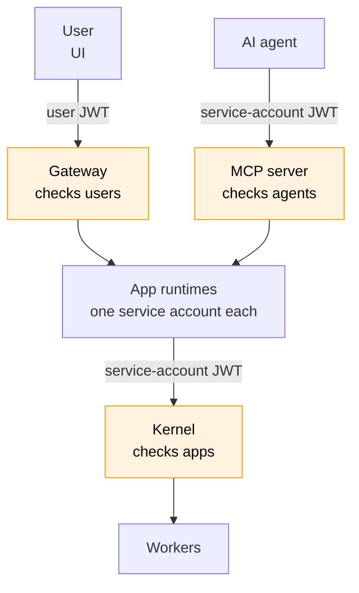
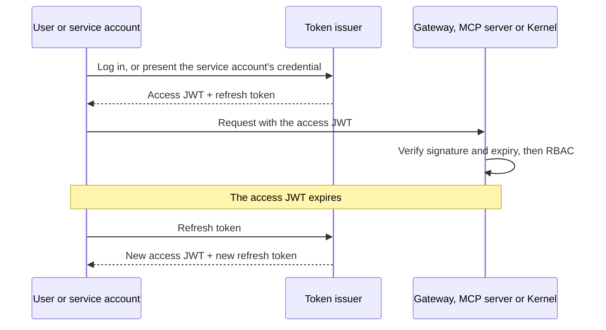

# MDK Gateway — Authentication & RBAC (HLD)

> **Version:** 0.4.0  |  **Date:** 2026-10-01  |  **Status:** Draft

---

## 1. Problem

The Gateway is the platform's authenticated boundary for users. 

Apps do not pass through the Gateway on their way to devices. Each runs in its own runtime and calls the Kernel directly, with its own service account. AI agents do not use the Gateway either: they call the MCP server, a front door of its own.

So this design owes a check at every way in: the Gateway for users, the MCP server for agents, and the Kernel for apps.

---

## 2. Principles

1. `mdk.yaml` **is the only place policy is authored.** One declarative file, version-controlled, loaded into Hyperbee at boot.
2. **There is no superadmin.** No bypass claim, no break-glass identity. Full access is an ordinary role holding wildcards, and it only exists if `mdk.yaml` binds it.
3. **Operators never edit** `mdk-plugin.json` **or** `mdk-contract.json`**.** Those ship inside a package and belong to its author. The operator's entire lever is `spec.rbac` in `mdk.yaml`.
4. **Plugins take no part in authorization.** A package declares no permissions, requests none, and grants none. Installing it makes its routes governable; the vocabulary is derived by the Gateway and the Kernel.
5. **Fail closed.** No matching rule means denied. Absence of policy is denial, never allowance.

---

## 3. Where authorization runs

Users, AI agents and apps come in by different paths, and each is checked where it enters:

- **Users**, in the UI, send their requests to the Gateway. Each request is checked as it enters the Gateway.
- **AI agents** send their tool calls to the MCP server, which works like the Gateway: each call is checked as it enters the MCP server, then routed to the app the tool belongs to. An agent authenticates with its own service account.
- **Apps** each run in their own runtime and call the Kernel directly, with their own service account. Each call is checked as it enters the Kernel.

All three checks evaluate the same `spec.rbac` from `mdk.yaml`, and every caller authenticates with a JWT (§5).




---

## 4. Policy in `mdk.yaml`

`mdk.yaml` already carries the installed Gateway Plugins, apps and workers ([hld-mdk-cli.md §5.3](./hld-mdk-cli.md), [hld-app-packaging.md §7.2](./hld-app-packaging.md)). Policy lives beside them, so the file that says *what is installed* is the file that says *who may use it*:

```yaml
apiVersion: mdk/v1
kind: Stack
metadata:
  name: my-stack
spec:
  gateway:
    port: 3847

  apps:
    - name: ops-center                          # written by install; operator-owned handle
      package: "@org/mdk-app-ops-center"        # written by install
      serviceAccount: app:ops-center            # written by install; the identity its runtime calls the Kernel with
    - name: antminer-tuner
      package: "@org/mdk-app-antminer-tuner"
      serviceAccount: app:antminer-tuner
    - name: sentinel
      package: "@tetherto/mdk-app-sentinel"
      serviceAccount: app:sentinel
      config:                                   # added by the operator, only to override a default
        driftThresholdPct: 10

  workers:
    - name: antminer-a
      package: "@tetherto/mdk-worker-antminer"
    - name: antminer-b
      package: "@tetherto/mdk-worker-antminer"
    - name: avalon-a
      package: "@tetherto/mdk-worker-avalon"

  rbac:
    enforcement: deny                   # deny (default) 

    roles:
      - name: viewer                    # reads every route, including ones installed later
        rules:
          - resources: ["*"]
            verbs: [get, list]

      - name: fleet-operator
        rules:
          - resources: [ops-center/miners, ops-center/miners/command]
            verbs: [get, list, create]

      - name: rack3-tech
        rules:
          - resources: [ops-center/miners/command]
            verbs: [create]
            resourceNames: ["rack-3-*"]

      # devices, checked at the Kernel
      - name: all-miners-rw             # every miner: antminer-a, antminer-b, avalon-a
        rules:
          - resources: [devices]
            verbs: [read, write]
            resourceNames: ["miner/*"]

      - name: all-antminers-rw          # antminer-a and antminer-b, not avalon-a
        rules:
          - resources: [devices]
            verbs: [read, write]
            resourceNames: ["miner/antminer/*"]

      - name: antminer-a-rw             # antminer-a only; antminer-b gets nothing
        rules:
          - resources: [devices]
            verbs: [read, write]
            resourceNames: ["miner/antminer/antminer-a/*"]

      - name: admin                     # not special — just wildcards
        rules:
          - resources: ["*"]
            verbs: ["*"]

    bindings:
      - role: admin
        subjects: [{ kind: User, name: ankit@example.com }]
      - role: viewer
        subjects: [{ kind: User, name: ops-team@example.com }]
      - role: fleet-operator            # an AI agent, checked at the MCP server
        subjects: [{ kind: ServiceAccount, name: operator-agent }]
      - role: all-miners-rw
        subjects: [{ kind: ServiceAccount, name: app:ops-center }]
      - role: all-antminers-rw
        subjects: [{ kind: ServiceAccount, name: app:antminer-tuner }]
      - role: antminer-a-rw
        subjects: [{ kind: ServiceAccount, name: app:sentinel }]
```


| Field                   | Meaning                                                                                                                                                                                                                                                                                                |
| ----------------------- | ------------------------------------------------------------------------------------------------------------------------------------------------------------------------------------------------------------------------------------------------------------------------------------------------------ |
| `enforcement`           | `deny` — an unmatched request is refused (`403` at the Gateway)                                                                                                                                                                                                                                        |
| `apps[].serviceAccount` | The service account the app's runtime authenticates as, `app:<name>`. Written by install; a binding grants it Kernel access.                                                                                                                                                                           |
| `roles[].rules`         | Rules, each with `resources`, `verbs` and optional `resourceNames` (instance scoping, wildcards allowed). An app route's resource starts with its plugin's or app's name; at the Kernel the resource is `devices`, each named `family/brand/worker/device`, as in `miner/antminer/antminer-a/AM-001`. |
| `bindings[].subjects`   | `User` (JWT `sub`/email), `Group` (JWT `groups`/OAuth org), `ServiceAccount` (an app's `app:<name>`, or an AI agent such as the Operator Agent).                                                                                                                                                       |


---

## 5. Authentication: JWT with refresh tokens

Users and service accounts both send a short-lived access JWT with every request, and use a refresh token to get a new one when it expires.




