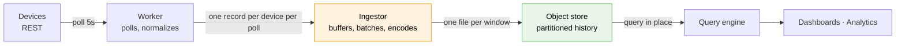

# IoT Telemetry Ingestion & Warehouse (HLD)

> **Version:** 0.3.0  |  **Date:** 2026-09-22  |  **Status:** Draft — options under evaluation, nothing selected

---

## 1. Problem

Retain telemetry from a fleet of REST-polled devices and make it queryable, with minimal
infrastructure to operate and at the lowest cost the requirements allow.


|                    |                                                |
| ------------------ | ---------------------------------------------- |
| Devices            | ~500                                           |
| Metrics per device | ~10                                            |
| Poll interval      | 5 s                                            |
| Device interface   | REST, polled by software we already run        |
| Constraints        | Minimal DevOps, low cost, historical analytics |


**Volume.** 100 readings/s → ~8.64 M/day → ~259 M/month. Each reading carries all 10 metrics, so
the same data sent one-metric-per-message would be ~2.6 B messages/month.

---


## 2. Architecture

Four roles in a line. No broker, no stream, no managed warehouse. The roles below are the shape we
are working to; **what implements the ingestor is the open decision**, and the candidates are in §4.




| Component        | Responsibility                                                                                                                                 |
| ---------------- | ---------------------------------------------------------------------------------------------------------------------------------------------- |
| **Worker**       | Polls each device on its cadence, tolerates slow and dead devices, emits **one normalized record per device per poll** with all metrics inline |
| **Ingestor**     | Receives records, buffers them durably, accumulates a time window, writes one compressed columnar file per window                              |
| **Object store** | Append-only history partitioned by time; the single source of truth                                                                            |
| **Query engine** | Reads files in place — no load step, no database to keep in sync                                                                               |


### 2.2 Layout and format

Partitioned by time so queries prune to the files they need:

```
s3://telemetry/date=2026-09-22/hour=17/telemetry-17-00.parquet
```

Schema is wide — one column per metric — while the ~10 metrics are stable across the fleet. A
narrow `(timestamp, device_id, metric_name, metric_value)` model is only worth it if metrics become
device-specific or highly dynamic.

---


## 3. The shared tail — store, format, query

Every option in §4 except SiteWise lands in the same place, so this part is common cost rather than
a differentiator:


| Role         | Candidate      | Cost / month                                       | Complexity |
| ------------ | -------------- | -------------------------------------------------- | ---------- |
| Object store | S3             | ~$0.30 at first, ~$3 after a year's accumulation   | Very low   |
| Format       | Parquet        | ~10 GB/mo, vs ~65 GB/mo as raw JSON                | Very low   |
| Query engine | DuckDB over S3 | $0 — existing compute; egress free under 100 GB/mo | Low        |


**Parquet over CSV.** Columnar, compressed, typed, and prunable by column and partition — it makes  
storage and scan cost a fraction of CSV's and is read natively by DuckDB, Athena, Trino, and Spark.  
CSV is worth keeping only as a debugging or interchange side-output.

---


## 4. Options for the ingestor

Nothing here is selected. Costs are on top of §3 unless noted.


| Option                                            | Cost / month                                                                    | DevOps  | What it buys                                                       | What it costs us                                                                                   |
| ------------------------------------------------- | ------------------------------------------------------------------------------- | ------- | ------------------------------------------------------------------ | -------------------------------------------------------------------------------------------------- |
| **Build the ingestor**                            | **~$0** — runs on existing compute                                              | Low–Med | Full control, no per-message metering, cheapest by a wide margin   | The buffering, retry, and monitoring are ours to write and operate                                 |
| **Managed delivery stream** (Firehose)            | **$36**, or ~$3 if we pack ~20 readings per record                              | Low     | Managed buffering and delivery; no collector to run                | Producer code. The cheap number needs batching in the poller — which is most of an ingestor anyway |
| **Managed MQTT ingest** (IoT Core + Basic Ingest) | **$78**                                                                         | Low     | Managed endpoint, device identity, cloud-side real-time, IoT rules | Poller must publish MQTT                                                                           |
| **IoT platform** (SiteWise)                       | **$115** floor, **$330+** with near-real-time ingestion, growing with retention | Low     | Asset models, device hierarchy, SiteWise Monitor, IoT-native APIs  | Replaces §3 rather than adding to it; its own store and pricing model                              |
| **Self-managed streaming** (Kafka / MSK)          | **$210–550**                                                                    | High    | A general event backbone for many consumers                        | Cluster operations. No free tier                                                                   |


