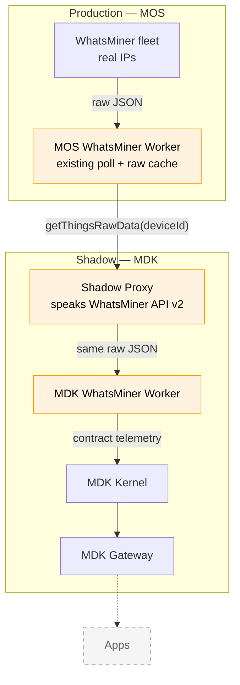

# IVHM Shadow Site — MDK Twin of Production MOS (HLD)

> **Version:** 0.1.0  |  **Date:** 2026-09-24  |  **Status:** Draft

---

## 1. Why

Ivinhema (IVHM) runs in production on MOS. The shadow site is a replica stack on MDK, fed by the
same devices through MOS.

| Goal                        | What it gives us                                                 |
| --------------------------- | ---------------------------------------------------------------- |
| **Run in parallel**         | MDK and new apps run beside production MOS, with no impact on it |
| **Validate & benchmark**    | See how MDK runs on a real site, with real devices               |
| **Build apps on real data** | Build and test Sentinel and new apps on live device data         |

**Ground rule: only MOS talks to devices.** The shadow reuses what MOS already polls, so device load
stays at 1×.

---

## 2. Architecture



Orange is what we build; everything else is deployed as-is.

### Action Item: 

| Component | Change | Role |
| --- | --- | --- |
| **MOS WhatsMiner Worker** | Changed | Keeps the latest raw response from its existing poll; serves it over one new RPC method |
| **Shadow Proxy** | New | Stands in for the miners; answers the MDK Worker with the responses MOS captured |
| **MDK WhatsMiner Worker** | New | Maps the WhatsMiner API directly to the MDK contract; device addresses point at the proxy |


---


## 3. MDK Worker — WhatsMiner

A new worker, built from the WhatsMiner API doc rather than copied from the MOS worker. The existing
`whatsminer-mdk-worker` is such a copy, so it isn't reused.

It follows the MDK standard: `mdk-contract.json` plus one handler per entry. Each handler calls one
API command and returns its fields.

**Examples**

| WhatsMiner API | Response fields | MDK contract |
| --- | --- | --- |
| `summary` | `MHS av`, `Power` | telemetry `hashrate_avg` (TH/s), `power` (W) |
| `summary` | `Fan Speed In`, `Fan Speed Out` | telemetry `fan_speed_in`, `fan_speed_out` (RPM) |
| `edevs` | `DEVS[].Chip Temp Max` | telemetry `chip_temp_max` (°C), one value per hashboard |

**Contract excerpt**

```jsonc
// mdk-contract.json
{
  "metadata": { "provider": "microbt", "deviceFamily": "miner", "brand": "Whatsminer" },
  "capabilities": {
    "telemetry": [
      { "name": "hashrate_avg", "unit": "TH/s", "type": "number", "handler": "src/telemetry/hashrate-avg.js",
        "description": "Average hashrate, from summary → MHS av." },
      { "name": "fan_speed_in", "unit": "RPM", "type": "number", "handler": "src/telemetry/fan-speed-in.js",
        "description": "Inlet fan speed, from summary → Fan Speed In." },
      { "name": "chip_temp_max", "unit": "C", "type": "array", "handler": "src/telemetry/chip-temp-max.js",
        "description": "Max chip temperature per hashboard, from edevs → DEVS[].Chip Temp Max." }
    ]
  }
}
```

---

## 4. Shadow Proxy

One small TCP server for all miners. It speaks WhatsMiner API v2, but serves MOS's captured
responses instead of a simulated state.

- **Finds the miner by `deviceId`.** Every request carries the MDK `deviceId`, e.g.
  `{ "cmd": "summary", "deviceId": "WM-M56S-0042" }`. The proxy calls `getThingsRawData(deviceId)`
  over Hyperswarm RPC on the MOS rack worker that owns the miner,
  and gets back that miner's raw data.
- **Only the MDK Worker can call it.** Every request must carry a credential that only the MDK Worker
  holds. The mechanism can be:
  - **API key** in each request: simplest, but readable on the wire, so loopback only.
  - **HMAC-signed request** with a timestamp: the key never leaves the worker; replays are limited
    to a short window.
  - **mTLS** between the worker and the proxy: also encrypts responses; needs certificates.


---

## 5. MOS Worker change

Two small additions to the WhatsMiner rack worker, behind a config flag that is off by default.

| Part | What it does |
| --- | --- |
| **Capture** | During the existing poll, keeps the latest response of each of reads per miner |
| **Serve** | One new read-only RPC method, `getThingsRawData(deviceId)`, returns that miner's latest raw responses |

