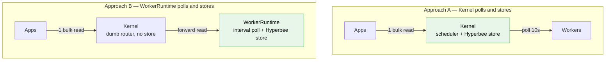
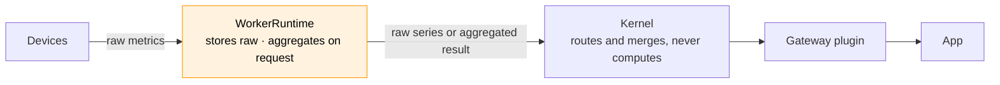

# MDK — Bulk Telemetry Without Duplicate Polling (HLD)

> **Version:** 0.2.0  |  **Date:** 2026-09-17  |  **Status:** Draft

---

## 1. Problem

*"Adding an app must never start a second hardware polling loop."* 

Today every consumer that wants more than one device re-derives the fleet itself, and then queries the device one-by-one


| Consumer       | How it gets fleet data                                                | Cost per HTTP request to Device |
| -------------- | --------------------------------------------------------------------- | ------------------------------- |
| `site-monitor` | `listWorkers()` → one `pullTelemetry(deviceId, 'metrics')` per device | N device round-trips            |


### One polling loops already exist

- The Kernel's Scheduler fires `telemetry.pull` on `telemetryPullMs` (default 10000) into  
`TelemetryCollector.pullAll()`, which fans out one `pull()` per device across every READY worker. The only consumer is the in-process `_subscribers` map, unreachable over HRPC.
- A `metrics` pull carrying a `deviceId` resolves to `_collectMetrics()`,  
which calls the plugin's telemetry handlers **against the live device**.

---


## 2. The two approaches




|                         | **A — Kernel polls and stores** | **B —** WorkerRuntime **polls and stores**  |
| ----------------------- | ------------------------------- | ------------------------------------------- |
| Who polls devices       | Kernel, on its existing cadence | WorkerRuntime, configured for each instance |
| Who stores              | Kernel, in a Hyperbee sub-db    | WorkerRuntime, in the Hyperbee store        |
| Kernel's role on a read | Answer from its own store       | Fan out to the selected workers and merge   |


---


## 3. Approach A — polling and storage in the Kernel

The Kernel keeps its scheduler pull and writes each one to a  
stateful store. Reads are answered from that store without touching a worker.

**Pros:**

- **Serves a down worker's last reading.** Devices stay readable after their worker goes down.

**Cons:**

- **Storage does not shard.** One Hyperbee holds the whole fleet, growing with device count rather  
than with worker count, while every worker's own store sits idle.
- **Storage write amplification.** A put per device per cadence grows the core continuously
- **Kernel downtime stops collection.** An outage is a hole in ALL the data, not only a pause in reads.
- **Two stores of the same truth.** Kernel holds latest, but worker is source of truth
- **One cadence for all worker polling.** `telemetryPullMs` governs the whole fleet; No granular control on cadence.

---


## 4. Approach B — polling and storage in the WorkerRuntime, Kernel routes

`WorkerRuntime` is **the only way a worker is created and run** — every worker package boots one,
hosting N same-type devices behind a single HRPC channel to the Kernel. 

**What the runtime gains:**

1. **An interval collector.** On its own cadence the runtime walks `this._devices` and calls the
  plugin's telemetry handlers.
2. **A write to the store.** Each result is persisted as `{ data, ts }` keyed by device, so the
  latest values survives a restart and is readable without touching hardware. Time series of the data is stored with the timestamp.
3. **A read served from the store** instead of calling `devices`. A fleet read then costs **zero device round-trips**.

**Cons:**

- **A dead worker takes its data with it.** The Kernel has nothing to serve for it, not even the  
last good reading.

---


## 5. Recommendation — Approach B

**The WorkerRuntime polls and stores; the Kernel routes.**

---


## 6. Design considerations

### Worker Failure

Replicating data at the worker level could introduce some potential anti-patterns:

* Requests would always need to go through the kernel to access device data.
* A large amount of data would be replicated for a scenario that may occur only occasionally.
* The gateway would become stateful, while the kernel and worker already maintain state.

We can revisit this approach later if worker downtime becomes a frequent or significant issue.

### Polling interval

Making frequency a parameter of the read means the Worker Runtime will only return data captured in the requested frequency window. The worker itself continues to poll at its configured baseline and always polls at that interval.

**The default belongs to the vendor.** The worker author sets `telemetryPollIntervalMs` in the
package's own `mdk-contract.json`, because they are the only party who knows what the device tolerates — the
antminer package ships `60000` today. An operator who wants a different rate overrides it per worker
instance in `mdk.yaml`, under `spec.workers[].config`, which is already the opaque per-worker block
the CLI hands to the worker at boot:

```yaml
spec:
  workers:
    - name: antminer-a
      package: "@tetherto/mdk-worker-antminer"
      port: 4100
      config:
        telemetryPollIntervalMs: 10000    # vendor default is 60000
```

The override is per instance, so two workers of the same package on one site can poll at different
rates.

---


## 7. Aggregation

**The runtime stores raw per-device metrics. A plugin either asks the runtime to aggregate them
(§7.1) or requests the raw time series; the Kernel routes and merges either way, and computes
nothing itself.**




### 7.1 Aggregating on the WorkerRuntime

A plugin that does not need per-device values can hand the runtime an aggregation spec and get back a
single result instead of N device readings. The op set and spec shape are the same as `moria-lib-stats`:

| | Ops |
|---|---|
| Scalar | `sum`, `avg`, `cnt` |
| Grouped | `group`, `group_sum`, `group_avg`, `group_max`, `group_cnt`, `group_multiple_stats` |
| Structural | `arr_concat`, `obj_concat`, `nested_obj_concat`, `array_obj_calc` |

There is no `min`, `percentile`, `median`, etc — those do not exist in the
library today and would have to be added later on.

**Which ops apply is decided by the metric's declared type.** `mdk-contract.json` types every metric
as `number`, `string` or `boolean`, and the runtime only accepts ops that type can support:

| Declared type | Ops available |
|---|---|
| `number` | everything above — `sum`, `avg`, `group_sum`, `group_avg`, `group_max` and the rest |
| `string` | counting and last-value only: `cnt`, `group_cnt`, `group`. There is no sum of a firmware version |
| `boolean` | same as `string` — `cnt`, `group_cnt`, `group`, counted by filtering on the value |

Asking for `avg` on a `string` metric is a spec error, rejected when the op spec is validated rather
than returning a silently wrong number at read time.

**How a plugin calls it:**

```js
const { workers } = await mdkClient.listWorkers({ type: 'miner' })

const agg = await mdkClient.pullAggregate({
  workers: workers.map(w => w.workerId),
  ops: {
    hashrate_total: { op: 'sum',       src: 'metrics.hashrate_rt' },
    hashrate_avg:   { op: 'avg',       src: 'metrics.hashrate_rt' },
    online_cnt:     { op: 'cnt',       filter: { src: 'metrics.status', eq: 'mining' } },
    by_container:   { op: 'group_sum', src: 'metrics.hashrate_rt', group: 'info.container' }
  }
})

return { hashrate: agg.ops.hashrate_total, avgPerMiner: agg.ops.hashrate_avg, byContainer: agg.ops.by_container }
```

---


## 8. The call path and its names

**How a plugin calls it**, controllers stay `async function (req)`(*potentially*):

```js
const { workers } = await mdkClient.listWorkers({ type: 'miner' })

const snap = await mdkClient.pullSnapshot({
  workers: workers.map(w => w.workerId),
  metrics: ['hashrate_rt']
})

const vals = Object.values(snap.devices).map(d => d.metrics.hashrate_rt?.value).filter(Number.isFinite)

return { hashrate: vals.reduce((a, b) => a + b, 0), reporting: vals.length, snapshotTs: snap.snapshotTs }
```

**Reading at a coarser granularity.** The runtime polls on its configured interval, but a plugin
rarely wants every point it holds. `granularity` downsamples the stored series on the way out — one
point per bucket instead of everything:

```js
// Worker polls every 5s. A chart wants one point per minute over the last hour.
const series = await mdkClient.pullSnapshot({
  workers: workers.map(w => w.workerId),
  metrics: ['hashrate_rt'],
  granularity: '1m',
  from: Date.now() - 3600_000
})
```

---

