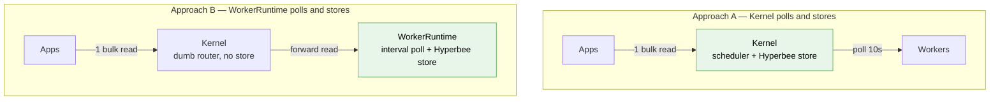
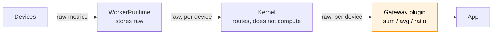

# MDK — Bulk Telemetry Without Duplicate Polling (HLD)

> **Version:** 0.2.0  |  **Date:** 2026-09-17  |  **Status:** Draft

---

## 1. Problem

*"Adding an app must never start a second hardware polling loop."* 

Today every consumer that wants more than one device re-derives the fleet itself, and then queries the device one-by-one


| Consumer       | How it gets fleet data                                                | Cost per HTTP request to Device |
| -------------- | --------------------------------------------------------------------- | ------------------------------- |
| `site-monitor` | `listWorkers()` → one `pullTelemetry(deviceId, 'metrics')` per device | N device round-trips            |


### One polling loops already exist

- The Kernel's Scheduler fires `telemetry.pull` on `telemetryPullMs` (default 10000) into  
`TelemetryCollector.pullAll()`, which fans out one `pull()` per device across every READY worker. The only consumer is the in-process `_subscribers` map, unreachable over HRPC.
- A `metrics` pull carrying a `deviceId` resolves to `_collectMetrics()`,  
which calls the plugin's telemetry handlers **against the live device**.

---


## 2. The two approaches




|                         | **A — Kernel polls and stores** | **B —** WorkerRuntime **polls and stores**  |
| ----------------------- | ------------------------------- | ------------------------------------------- |
| Who polls devices       | Kernel, on its existing cadence | WorkerRuntime, configured for each instance |
| Who stores              | Kernel, in a Hyperbee sub-db    | WorkerRuntime, in the Hyperbee store        |
| Kernel's role on a read | Answer from its own store       | Fan out to the selected workers and merge   |


---


## 3. Approach A — polling and storage in the Kernel

The Kernel keeps its scheduler pull and writes each one to a  
stateful store. Reads are answered from that store without touching a worker.

**Pros:**

- **Serves a down worker's last reading.** Devices stay readable after their worker goes down.

**Cons:**

- **Storage does not shard.** One Hyperbee holds the whole fleet, growing with device count rather  
than with worker count, while every worker's own store sits idle.
- **Storage write amplification.** A put per device per cadence grows the core continuously
- **Kernel downtime stops collection.** An outage is a hole in ALL the data, not only a pause in reads.
- **Two stores of the same truth.** Kernel holds latest, but worker is source of truth
- **One cadence for all worker polling.** `telemetryPullMs` governs the whole fleet; No granular control on cadence.

---


## 4. Approach B — polling and storage in the WorkerRuntime, Kernel routes

`WorkerRuntime` is **the only way a worker is created and run** — every worker package boots one,
hosting N same-type devices behind a single HRPC channel to the Kernel. 

**What the runtime gains:**

1. **An interval collector.** On its own cadence the runtime walks `this._devices` and calls the
  plugin's telemetry handlers.
2. **A write to the store.** Each result is persisted as `{ data, ts }` keyed by device, so the
  latest values survives a restart and is readable without touching hardware. Time series of the data is stored with the timestamp.
3. **A read served from the store** instead of calling `devices`. A fleet read then costs **zero device round-trips**.

**Cons:**

- **A dead worker takes its data with it.** The Kernel has nothing to serve for it, not even the  
last good reading.

---


## 5. Recommendation — Approach B

**The WorkerRuntime polls and stores; the Kernel routes.**

---


## 6. Design considerations

### Worker Failure

Replicating data at the worker level could introduce some potential anti-patterns:

* Requests would always need to go through the kernel to access device data.
* A large amount of data would be replicated for a scenario that may occur only occasionally.
* The gateway would become stateful, while the kernel and worker already maintain state.

We can revisit this approach later if worker downtime becomes a frequent or significant issue.

### Demand Signal

Per-worker frequency configuration is already how deployments tune this. mdk.yaml sets `telemetryPollIntervalMs` at the worker level and overrides the default set by the worker author.

The floor serves a dual purpose: it acts as both the minimum polling interval and the anti-abuse guard.

Making frequency a parameter of the read means the Worker Runtime will only return data captured in the requested frequency window. The worker itself continues to poll at its configured baseline and always polls at that interval.

---


## 7. Aggregation belongs to the Gateway plugin

**The runtime stores raw per-device metrics, the Kernel moves them unchanged, and every sum,
average, ratio and efficiency figure is computed in the Gateway plugin.**




**Why not in WorkerRuntime:**

- **Partial aggregation is arithmetically wrong.** A worker sees only its own devices. Sums survive being added up per worker; averages, percentiles and ratios do not. Aggregating at the worker silently produces wrong numbers for everything but sums.
- **Aggregation is app semantics.** A dashboard and a monthly report may legitimately use different  
device selections and freshness windows over the same metrics. Fixing the formula below the plugin  
forces one definition on everyone, and gives the Kernel opinions about what "site hashrate" means.


---


## 8. The call path and its names

**How a plugin calls it**, controllers stay `async function (req)`(*potentially*):

```js
const { workers } = await mdkClient.listWorkers({ type: 'miner' })

const snap = await mdkClient.pullSnapshot({
  workers: workers.map(w => w.workerId),
  metrics: ['hashrate_rt']
})

const vals = Object.values(snap.devices).map(d => d.metrics.hashrate_rt?.value).filter(Number.isFinite)

return { hashrate: vals.reduce((a, b) => a + b, 0), reporting: vals.length, snapshotTs: snap.snapshotTs }
```

**Response** — per-device values keyed by metric, plus which workers answered:

```js
{
  snapshotTs: 1789500000000,
  devices: {
    'AM-001': { workerId: 'antminer-1', metrics: { hashrate_rt: { value: 94.2, ts: 1789499997000 } } }
  },
  workers: {
    'antminer-1': { ok: true,  ts: 1789499997000 },
    'av-2':       { ok: false, error: 'ERR_TIMEOUT' }   // its devices are absent, not zero
  }
}
```

---

