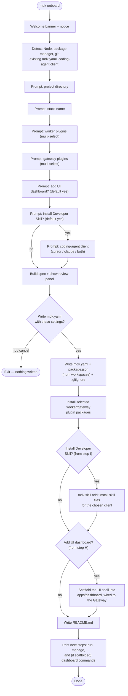

# MDK CLI — High-Level Design

> **Version:** 0.1.0  |  **Date:** 2026-07-16  |  **Status:** Draft
>
> The `mdk` command-line tool — the single, professional entry point a developer uses to **onboard into MDK, bootstrap a project, scaffold backend components, run and manage the stack, and discover Gateway capabilities**. Its north star is an onboarding experience that requires almost no MDK-specific domain knowledge up front.

---

## 1. Overview & Problem Statement

### 1.1 What `mdk` is

`mdk` is the official command-line interface for building on the MDK platform. It is the one tool a developer installs first and reaches for at every step of the lifecycle: from an empty directory, to a running stack, to a published Worker Plugin or Gateway Plugin.

It serves two audiences equally (see §6):

- **Humans** get a guided, low-friction onboarding wizard and readable, well-structured output.
- **Coding agents** (Cursor, Claude Code, Codex, Cline) get deterministic, non-interactive, machine-readable behavior driven by a published command manifest.


### 1.2 The problem it solves

Today, standing up and extending MDK means stitching together bespoke launchers and tribal knowledge: a newcomer must read several docs before they can run anything, and there is no uniform way to scaffold a compliant Worker or Gateway Plugin, validate an `mdk-contract.json`, start the stack in the right order, or wire a coding agent into the repo. `mdk` collapses all of that into one consistent, self-verifying tool.

### 1.3 Scope

`mdk` covers the full **backend + operations** lifecycle. Explicitly **in scope**: onboarding, project bootstrap (including the optional UI dashboard — the MDK Vite/React UI shell), backend scaffolding (Worker Plugins and Gateway Plugins), running and managing the stack, contract/plugin validation, Gateway capability discovery, multi-Gateway context management, and coding-agent enablement.

---


## 2. Design Principles & Standards

`mdk` is not designed from taste alone. It adheres to established open-source CLI standards so that it behaves the way experienced operators and agents already expect. Where those standards leave a choice, we borrow the resolved answer from the two best-in-class references the team named: **kubectl** and **OpenClaw**.

### 2.1 Grounding standards


| Standard                                                                              | What we take from it                                                                                                                                                                                    |
| ------------------------------------------------------------------------------------- | ------------------------------------------------------------------------------------------------------------------------------------------------------------------------------------------------------- |
| **[Command Line Interface Guidelines (clig.dev)](https://clig.dev/)**                 | Human-first defaults, machine-readable on request; helpful errors that suggest the fix; `--help` everywhere; confirm before destructive actions;                                                        |
| **[12-Factor CLI Apps](https://medium.com/@jdxcode/12-factor-cli-apps-dd3c227a0e46)** | Great `--help`; flags over prompts for scriptability; config precedence (flags > env > config); structured output; exit codes as an API; be a good pipeline citizen (stdout = data, stderr = messages). |
| **POSIX / GNU option syntax**                                                         | Short (`-o`) and long (`--output`) flags; `--` to end option parsing; `-` for stdin/stdout; kebab-case flag names.                                                                                      |
| `[NO_COLOR](https://no-color.org/)`                                                   | Disable all color when `NO_COLOR` is set or output is not a TTY.                                                                                                                                        |
| **Semantic exit codes**                                                               | Distinct, documented codes (§3.3) so scripts and agents can branch on failure class.                                                                                                                    |
| **OpenCLI-style manifest**                                                            | A published, versioned, machine-readable description of the whole command surface (`mdk manifest`) so agents discover capabilities in one read — the "OpenAPI for CLIs" idea.                           |


### 2.2 Inspiration — kubectl & OpenClaw

Two tools shape `mdk`'s ergonomics: **kubectl** gives us a consistent, scriptable resource grammar; **OpenClaw**'s `[onboard wizard](https://docs.openclaw.ai/start/wizard)` gives us the guided setup model.


| Source   | Idea                                                                                               | In `mdk`                                                                                          |
| -------- | -------------------------------------------------------------------------------------------------- | --------------------------------------------------------------------------------------------------- |
| kubectl  | `VERB NOUN` grammar; `-o json \| yaml`                                                             | `mdk create worker`, `mdk get workers`, `-o json \| yaml` on every read command                    |
| kubectl  | Declarative `apply -f`; kubeconfig contexts                                                        | `mdk apply -f mdk.yaml` and `mdk context` are the design target (§3.2 Groups C/E) — not built yet  |
| OpenClaw | Guided **detect → verify (real check) → configure**; one guided flow with sane defaults pre-filled | `mdk onboard`                                                                                      |
| OpenClaw | Real state check; re-run is safe (verify, never silent wipe)                                       | `mdk status` checks env + all components; re-running `onboard` always confirms before overwriting  |
| OpenClaw | Skills-install as an onboarding step                                                               | The MDK Developer Skill install part of `onboard`                                                  |


---


## 3. Command Surface


### 3.1 Global flags & conventions

Every command inherits these:


| Flag                        | Purpose                                                                            |
| --------------------------- | ---------------------------------------------------------------------------------- |
| `-o, --output <fmt>`        | Output format for machine-readable data: `table` (default on TTY), `json`, `yaml`. |
| `-v, --verbose` / `--debug` | Increase log detail; `--debug` prints stack traces for non-`ERR_*` failures.       |
| `--version`, `-h, --help`   | Standard. `--help` is available on every (sub)command.                             |


**Pipeline discipline (12-factor):** machine data is written to **stdout**; human progress/log/error messages go to **stderr**. This lets `mdk get workers -o json | jq …` work cleanly.

### 3.2 Command groups

Tables below mark implemented commands with ✅. Unmarked commands are either wired up as no-op **(stub)** — they exist, print a "not implemented" notice, and exit `0` — or, where noted, **not yet registered** at all (they do not appear in `--help` today).


#### Group A — Onboarding & project lifecycle


| Command          | Purpose                                                                                                                                                                                                                       |
| ---------------- | ------------------------------------------------------------------------------------------------------------------------------------------------------------------------------------------------------------------------------ |
| `mdk onboard` ✅ | • The single guided wizard (§4) and the one entry point for setup. • Flow: detect, answer prompts, review, write `mdk.yaml`, install the chosen plugins/skill/dashboard, print the exact commands to run the stack (§4.2). |


#### Group B — Scaffold


| Command                       | Purpose                                                                                                                                                                                                                                                    |
| ------------------------------ | ---------------------------------------------------------------------------------------------------------------------------------------------------------------------------------------------------------------------------------------------------------- |
| `mdk create worker <name>` ✅  | • Scaffold a Worker Plugin package from the bundled template into `workers/<name>`. • Ships an example `mdk-contract.json` with a `handler` per command/telemetry entry, matching handler stubs, and a mock device server. • Adds the worker to `mdk.yaml` under `spec.workers` (with a seed device) unless `--no-stack-entry`.                                                                                                       |
| `mdk create plugin <name>` ✅  | • Scaffold a Gateway Plugin into `plugins/<name>`. • `mdk-plugin.json` manifest plus a plain-JS controller stub. • Adds it to `mdk.yaml` under `spec.gateway.plugins` unless `--no-stack-entry`.                                                                                                                                                    |
| `mdk create dashboard [name]` ✅ | • Scaffold the MDK **Vite/React UI shell** (the same template `onboard`'s UI-dashboard step offers) into `apps/dashboard` (or `apps/<name>`). • Copied locally when run inside the MDK monorepo, otherwise fetched from GitHub. • Wires `VITE_GATEWAY_URL` to this stack's Gateway port. • The `mdk-ui-component` skill (not the CLI) carries the component registry it builds from (§5.5). |


#### Group C — Run & manage (kubectl-like)


| Command                          | Purpose                                                                                                                                                                                                                                                                                                                                                                                |
| -------------------------------- | -------------------------------------------------------------------------------------------------------------------------------------------------------------------------------------------------------------------------------------------------------------------------------------------------------------------------------------------------------------------------------------- |
| `mdk run [target] [name]` ✅      | • Start the stack from the spec (`mdk.yaml`, §5.3). • No target (or `mdk run all`) boots the Kernel, Gateway, and every worker together in one process. • Any component can also be run on its own instead, one per terminal — `mdk run kernel`, `mdk run gateway`, `mdk run worker <name>`, `mdk run dashboard` — purely a choice of which command(s) you type; nothing in `mdk.yaml` picks one over the other. • `mdk onboard` prints the exact commands at the end (§4.2). |
| `mdk eject`                      | • Materialize the spec (`mdk.yaml`) into a standalone, plain Node.js project (default `eject/`) that runs the stack with **no `mdk` CLI at runtime** — `node index.js` and you're up. • Safe to re-run: regenerates from the current `mdk.yaml` every time. • Flags: `--dir <path>`, `--out <path>` (default `eject/`), `--force`, `--no-install`. *(design target — not implemented yet, see §5.6)* |
| `mdk get <resource>`             | • List live resources from the Kernel/Gateway: `workers` (instances), `devices` (registered deviceIds + owning instance), `plugins`, `contexts`. • Read-only; honors `-o`. *(stub)*                                                                                                                                                                                                    |
| `mdk describe <resource> <name>` | • Detailed view including declared capabilities, `mdk-contract.json`, and registration state. *(stub)*                                                                                                                                                                                                                                                                                 |
| `mdk logs <target>`              | • Stream logs for a service or worker. • Flags: `-f/--follow`, `--since`, `--tail <n>`. *(stub)*                                                                                                                                                                                                                                                                                        |
| `mdk status` ✅                   | • One-shot check of the current environment **and** every component. • Environment: Node 20+, package manager, `mdk.yaml` validity, declared packages resolvable. • Stack: which layers (Kernel/Gateway/workers) are up, worker/device counts, per-component liveness/readiness (maps to the Kernel Health Monitor, `[hld.md](./hld.md)` §4.3.1), and aggregate health. • Read-only: reports, never repairs. |
| `mdk apply -f <file>`            | • **Not yet implemented — no command registered.** Planned: declarative, idempotent reconcile from the spec (`mdk.yaml`, §5.3); diff desired vs running; restart only the worker instances whose config changed (§5.4). Today, an `mdk.yaml` edit means stopping and re-running `mdk run` by hand.                                                                                    |
| `mdk diff -f <file>`             | • **Not yet implemented — no command registered.** Planned: preview what `apply` would change (which instances restart because their config changed) without touching the running stack.                                                                                                                                                                                              |


#### Group D — Discover (Gateway capability)


| Command        | Purpose                                                                                                                                                                                                                                        |
| -------------- | ---------------------------------------------------------------------------------------------------------------------------------------------------------------------------------------------------------------------------------------------- |
| `mdk discover` | • Query the Gateway MCP for live capabilities. • Write `site-profile.json` (schema per `[hld-mdk-developer-skill-v2.md](./hld-mdk-developer-skill-v2.md)` §5.1). • Flags: `--gateway <url>` (default `http://127.0.0.1:3847`), `--out <path>`. *(stub — flags are wired, the query/write is not)* |


#### Group E — Contexts (multiple Gateways)


| Command       | Purpose                                                                                                                                                                                                                          |
| ------------- | -------------------------------------------------------------------------------------------------------------------------------------------------------------------------------------------------------------------------------- |
| `mdk context` | • **Not yet implemented — no command registered.** Planned as the only way to point the CLI at a Gateway: `set <name> --gateway <url>` to add or update an endpoint; `use <name>` to switch; `list`; `current`; `remove <name>`; stored in CLI config (§5.2), analogous to kubeconfig. Today, commands that need a Gateway URL take it inline (e.g. `mdk discover --gateway <url>`). |


#### Group F — Agent enablement


| Command            | Purpose                                                                                                                                                                                                                                        |
| ------------------ | ---------------------------------------------------------------------------------------------------------------------------------------------------------------------------------------------------------------------------------------------- |
| `mdk skill add` ✅  | • Install the MDK Developer Skill suite for the target coding-agent client, via `@tetherto/mdk-skill`'s programmatic API. • Flags: `--client` (`cursor`, `claude`, `all`), `--dir <path>`. • Writing/merging `AGENTS.md` and registering the Gateway MCP are not part of this yet — see `mdk mcp register` below. |
| `mdk mcp register` | • Register the Gateway MCP endpoint in the client config (`.cursor/mcp.json` / `.mcp.json`). • Does not touch skills. *(stub)*                                                                                                                |


#### Group G — Meta & agent discovery


| Command                             | Purpose                                                                            |
| ------------------------------------ | ----------------------------------------------------------------------------------- |
| `mdk manifest` (alias `mdk json-help`) | • Emit the machine-readable command manifest (§6.2). *(stub)*                    |
| `mdk version` ✅                     | • Version, commit, and the MDK release line it targets.                            |


### 3.3 Output formats & exit codes

**Output.** `table` (default, human) renders aligned columns; `wide` adds columns; `json`/`yaml` emit stable, documented shapes. Structured outputs are the agent contract and are versioned alongside the manifest.

**Exit codes** are part of the public API:


| Code  | Meaning                                                                      |
| ----- | ---------------------------------------------------------------------------- |
| `0`   | Success                                                                      |
| `1`   | Generic runtime error                                                        |
| `2`   | Usage / argument error (bad flag, missing required arg)                      |
| `3`   | Validation failed (`ERR_CONTRACT_INVALID`, `ERR_PLUGIN_MANIFEST_INVALID`, …) |
| `4`   | Precondition not met (`ERR_ENV`, `ERR_ORK_REQUIRED`, port in use, …)         |
| `5`   | Connectivity failure (Gateway/Kernel unreachable)                            |
| `130` | Interrupted (SIGINT)                                                         |


Every error carries an `ERR_*` code (§3.3) so scripts can branch precisely.

---


## 4. Onboarding Experience — the core ask

The single most important goal of `mdk` is that a developer who has never read an MDK Architecture or Documentation can reach a running, agent-enabled stack in minutes. `mdk onboard` is where that happens.

### 4.1 Goals

- **Minimal prior knowledge.** Every step explains itself in one line and picks a sensible default.
- **Correct by construction.** Onboarding writes a valid `mdk.yaml` and hands you the exact commands to run the stack — no guesswork, no hidden state.
- **Leave the developer agent-ready.** By the end, the coding agent in the repo has the MDK Developer Skill installed, so subsequent work is natural-language driven. Writing/merging `AGENTS.md` and registering the Gateway MCP are the next layer on top (`mdk mcp register`, §3.2 Group F) and not part of `onboard` yet.
- **Nothing happens without a final confirmation.** Every prompt before it only shapes an in-memory spec; canceling at any point, or declining the review step, leaves the project untouched.


### 4.2 The guided flow

`mdk onboard` is one linear pass, top to bottom — there is no branching back to an earlier prompt. The only real decision points are the two opt-outs (UI dashboard, Developer Skill) and the final review/confirm gate.



Ports (Gateway `3847` / Kernel `3848` / workers `3850+`) are **not** a prompt — they are fixed defaults written straight into `mdk.yaml`, a one-line edit later if they ever collide with something. Every other step below maps 1:1 onto the diagram:

1. **Welcome.** Show the MDK banner and a one-line notice of what will happen; nothing is written yet.
2. **Detect the environment.** Node version (needs ≥ 20), package manager (npm/pnpm/yarn/bun, from the lockfile present), whether this is a git repo, whether `mdk.yaml` already exists here, and the coding-agent client already in the repo (`.cursor` / `.claude` / `.codex` / `.cline`, or none). Shown as an informational panel — nothing here is a running-Kernel/Gateway check.
3. **Project.** Two prompts: *project directory* (default: current dir) and *stack name* (default: `my-stack`).
4. **Plugins.** Two multi-selects, each pre-filled empty: *worker plugins* to install (from the CLI's built-in catalog — one real bundled worker today, the rest marked "not published yet") and *Gateway plugins* to install (same catalog pattern). Picking a worker that only ships inside the MDK source checkout gets a warning that it will 404 outside a monorepo checkout.
5. **Developer experience.** *Add the UI dashboard?* (default: yes) and *Install the MDK Developer Skill?* (default: yes); choosing to install the skill adds one more prompt, *coding-agent client* (`cursor` / `claude` / both), pre-filled from the client detected in step 2 when it's `cursor` or `claude`.
6. **Review.** A summary panel — stack name, ports, chosen workers/plugins, dashboard yes/no, Developer Skill yes/no + client, and the `mdk.yaml` path (flagged if it will be overwritten) — followed by one confirmation prompt (default: yes). Canceling, or answering no, exits immediately with **no files changed**.
7. **Write the project files.** `mdk.yaml` (§5.3), a root `package.json` declaring `workers/*` and `plugins/*` as npm workspaces, and a `.gitignore` covering `.mdk/` runtime state and `node_modules/`.
8. **Install plugin packages.** `npm install` the chosen registry packages (and `file:`-link any bundled worker) so they resolve from the project's `node_modules` before the stack ever runs. Best-effort — a failed install is a warning, not a hard stop, since the spec is already valid.
9. **Install the skill (if chosen in step 5).** Run the same installer behind `mdk skill add` for the selected client. *(Today this installs the skill files only — see the Group F note in §3.2 for what's not wired up yet.)*
10. **Scaffold the UI dashboard (if chosen in step 5).** Copy the MDK Vite/React UI shell into `apps/dashboard`, pointed at this stack's Gateway port via `VITE_GATEWAY_URL`.
11. **Write `README.md`.** Documents the emitted project layout and the commands from step 12, written last since it needs to know whether a dashboard exists.
12. **Print next steps.** The spec file to review, the command to start the stack (`mdk run`) plus the per-component alternative (`mdk run kernel` / `mdk run gateway` / `mdk run worker <name>`, per Group C / §3.2), `mdk status` and `mdk create worker` to keep managing the project, and — only if a dashboard was scaffolded — `cd` into it and `npm run dev`.

---

## 5. CLI Internal Architecture

### 5.1 Package & tech stack

- **Package:** `@tetherto/mdk-cli`, living in the `mdk-prv` monorepo at `packages/cli/`. The `mdk` command is exposed through the package.json `bin` field (`{ "mdk": "dist/index.js" }`) pointing at a built entry script with a `#!/usr/bin/env node` shebang.
- **Runtime:** Node.js (≥ 20), **TypeScript**, ESM.
- **Framework:** 
  - **Commander.js** for the command tree, argument/flag parsing, and help; 
  - `@clack/prompts` for the interactive onboarding and wizard steps.


### 5.2 Configuration resolution *(design target — not implemented yet)*

Design intent: env (`MDK_*`) → global config (`~/.mdk/`) holds named Gateway contexts plus the active one (like kubeconfig), and stores **references** to secrets (e.g. `${MDK_GATEWAY_TOKEN}`), never plaintext.

**Today**, the CLI has no global (`~/.mdk/`) config store and no `MDK_*` env resolution — this is the same gap as `mdk context` (§3.2 Group E) not being built yet. The only state on disk today is per-project: `.mdk/` under the project directory, written by `mdk run` (runtime state — Kernel/Gateway stores, worker databases, discovery keys; distinct from the global config described above).

### 5.3 Stack spec (`mdk.yaml`) — workers, instances & plugin config

- The stack is described declaratively in one file (`mdk.yaml`), and it captures only the **logical** stack — components, ports, plugins, workers. How those components are wrapped in OS processes is not part of the spec at all: `mdk run` boots them together, `mdk run kernel` / `mdk run gateway` / `mdk run worker <name>` boot them apart, and switching between the two is just which command(s) you type, with no spec change.
- Each Worker Plugin and each Gateway plugin carries a `config` block. The CLI treats `config` as **opaque and plugin-defined**: the *plugin developer* decides which keys it accepts and the CLI passes it through to the runtime unchanged. `config` holds only what the worker or plugin itself needs to operate — intervals, batch sizes, thresholds, log levels, feature flags — never device details like IPs or tokens. The keys below are just what these particular plugins happen to accept; another plugin might take a polling interval, a batch size, or nothing at all.

```yaml
apiVersion: mdk/v1
kind: Stack
metadata:
  name: my-stack
spec:
  kernel:
    port: 3848
  gateway:
    port: 3847
    plugins:
      - package: "@org/mdk-plugin-summary"
        config:
          refreshIntervalMs: 5000
  workers:
    - name: miners-a
      package: "@org/mdk-worker-miner"
      port: 3850
      config:
        pollIntervalMs: 2000
        batchSize: 50
        logLevel: info
    - name: miners-b
      package: "@org/mdk-worker-miner"
      port: 3852
      config:
        pollIntervalMs: 5000
        batchSize: 100
        logLevel: warn
```

> **Drift note:** each worker instance still carries a `port` field, seeded by `mdk onboard`/`mdk create worker` — but nothing in `mdk run` reads it today (a worker's actual listen port, when it has one, comes from its own `config`). It's vestigial from an earlier design and worth either wiring up or removing from the schema.


### 5.4 Reconciliation — `apply` & restart-on-edit *(design target — `mdk apply`/`mdk diff` are not implemented yet, §3.2 Group C)*

A worker's `config` is **fixed at the runtime's construction**. Today, picking up a `mdk.yaml` edit means stopping and re-running `mdk run` by hand; the design intent below is what `mdk apply` closes the gap on once built — a kubectl-style live experience through **declarative reconciliation**:

- `mdk apply -f mdk.yaml` diffs the desired spec against what's running and acts **only on what changed**, at worker-instance granularity.
- **Every change is a config edit.** To change an instance's behavior, edit its `config` in `mdk.yaml` and run `mdk apply`. That one instance restarts — its channel to the Kernel drops briefly and re-registers,  keeping the blip small and the Kernel refreshing its registry (and the Gateway MCP) on re-registration.
- **Adding capacity as a *new* instance causes no disruption** to existing instances, so the low-impact path for growth is "add another instance" rather than "grow an existing one."
- `mdk diff -f` previews the blast radius (which instances restart) before anything happens.

Blast radius is therefore always a single worker instance, never the whole stack, and the flow is identical whether a human edits `mdk.yaml` by hand or an agent runs `mdk apply`.

### 5.5 UI component registry

Both `mdk onboard` (UI dashboard step) and `mdk create dashboard` scaffold the MDK Vite/React UI shell. To make that dashboard buildable by a coding agent, `@tetherto/mdk-react-devkit` publishes a **component registry** — `ui-registry.json`, the machine-readable catalog of every available UI component (name, path, description, `tier`/`agent-ready`, category, props).

- **Location.** It ships with the `mdk-ui-component` skill (`packages/mdk-skill/src/skills/mdk-ui-component/references/ui-registry.json`), not the CLI — the CLI itself has no registry file of its own.
- **Who uses it.** The `mdk-ui-component` skill reads it to know which components exist and how to bind them into the scaffolded dashboard — the skill selects from this catalog rather than inventing component names or props.
- **Versioning.** The registry carries its own `version` and `packageVersion`, so the dashboard and skill can pin to a known component set and it can be regenerated from the devkit.

### 5.6 Eject — a portable, CLI-independent copy of the stack *(design target — `mdk eject` is not implemented yet)*

**Why.** `mdk run` boots the stack by calling the Kernel/Worker/Gateway runtime APIs from inside the CLI — the boot logic itself is not something the developer owns or sees. `mdk eject` is the escape hatch: it renders that same boot logic out as plain source the developer now owns, for teams that want to deploy the stack (a CI image, a systemd unit, PM2, a Kubernetes `Deployment`, …) without depending on the `mdk` CLI at runtime. 

> The idea is borrowed from `helm template` (render concrete artifacts from a declarative spec) and from Create React App's `eject` (materialize the tool's internals as code you now own).

**What it generates.** Everything below is written into `<dir>/eject/` by default (`--out <path>` to change it):

```
eject/
├── package.json        # name: <stack>-standalone; real deps, pinned to what's
├── index.js            # boots Kernel + Gateway + every worker together
│                        # (mirrors `mdk run` with no target)
├── kernel.js            # boots the Kernel alone   (mirrors `mdk run kernel`)
├── gateway.js           # boots the Gateway alone  (mirrors `mdk run gateway`)
├── workers/
│   └── <name>.js        # boots one worker instance alone
│                         # (mirrors `mdk run worker <name>`)
├── plugin/
│   └── <name>/           # local worker or plugin packages that are not
│                          # on npm, copied in
└── README.md             # what this is, how it was generated, how to run it
```

- **`package.json`** lists real npm dependencies — `@tetherto/mdk-core`, `@tetherto/mdk-worker` (and `@tetherto/mdk-client` if referenced), one entry per selected worker package, one per gateway plugin — each pinned to the version actually installed in the project's `node_modules` at eject time, so the ejected project reproduces what was running, not just what `mdk.yaml` happens to allow.
- **`index.js` / `kernel.js` / `gateway.js` / `workers/<name>.js`** call the same public runtime entry points `mdk run` uses internally (`getKernel`, `WorkerRuntime` / `loadPlugin`, `startGateway`) — just written out as literal source instead of hidden inside the CLI, so `node index.js` (or any one of the per-component scripts) needs nothing from `mdk` at runtime.

**Regeneration.** `mdk eject` is idempotent and always reflects the *current* `mdk.yaml` — re-running it regenerates every generated file listed above from scratch. 

**Once ejected**, the folder is on its own: it is not wired back into `mdk status` or `mdk run`, and further edits to `mdk.yaml` do not propagate to it automatically — re-running `mdk eject` is how you pull in the latest spec. 

---

## 6. Agent-First Design

`mdk` is built to be driven as comfortably by a coding agent as by a human — but it is deliberately **not** the channel through which runtime AI agents operate hardware.

### 6.1 CLI vs MCP — two different surfaces

The agentic-framework HLD (`[hld-agentic-framework.md](./hld-agentic-framework.md)` §3.4) draws the line clearly, and `mdk` respects it:


| Surface         | Audience                       | When                  | Auth                    | Purpose                                   |
| --------------- | ------------------------------ | --------------------- | ----------------------- | ----------------------------------------- |
| `mdk` **CLI**   | Developer + their coding agent | Build time / dev time | Local shell + config    | Scaffold, run, manage, discover           |
| **Gateway MCP** | Operator Agent (runtime)       | Run time              | Same JWT/RBAC as the UI | Query telemetry, dispatch device commands |


An LLM operating a live fleet uses **MCP**, not `mdk`. `mdk`'s job is to help *build* the system and to *wire up* that MCP endpoint..

### 6.2 The command manifest *(not implemented yet — `mdk manifest` is a stub, §3.2 Group G)*

`mdk manifest` (and the `mdk json-help` alias) is meant to walk the Commander program and emit a versioned JSON description of every command: name, description, usage, aliases, arguments (required/variadic), options (flags, defaults, whether they take a value), and nested subcommands.

Agents will read this once to discover the entire surface without spawning `--help` per command or scraping text. The manifest will carry its own `version` so agents can pin to a known shape.

### 6.3 Relationship to the Developer Skill

`mdk` and the Developer Skill suite are complementary:

- `mdk onboard` **installs** the skill (`mdk skill add`). Writing/merging `AGENTS.md` and wiring the Gateway MCP are designed as the next layer (`mdk mcp register`) but are not implemented yet — see the Group F note in §3.2.
- The skill then **teaches the agent to call** `mdk` — e.g. run `mdk discover` before designing an aggregation, `mdk create worker` to start a package.

---

## 7. Distribution & Versioning

- **Install:** zero-install via `npx @tetherto/mdk-cli …`, or `npm i -g @tetherto/mdk-cli` for the `mdk` cli. The `mdk onboard` path is the recommended first touch.
- **Versioning:** `mdk` is versioned to track the MDK release line. `mdk version` prints both the CLI version.
- **Update nudge:** `mdk` may print (never block on) a notice when a newer version targeting the same MDK line is available. *(Not implemented yet.)*
- **Analytics:** the intent is to instrument the CLI to understand user behavior and journey, to improve the system. *(Not implemented yet — no analytics code exists in the CLI today.)*

---

## 8. Open Questions

- **Runtime device add/remove.** How devices are attached to or detached from a running worker is **not decided**. Devices are intentionally **not** part of `mdk.yaml`, and there is no `add device` / `remove device` command today.

  **Potential solution:** the UI exposes forms to add/remove devices. We do not want to impose a single device structure on all workers (and thereby on plugin developers); instead, the entire device config is passed to the worker whenever it changes, and the worker handles it automatically via the Worker Runtime.

---

## 9. References

**External standards & inspirations**

- [Command Line Interface Guidelines — clig.dev](https://clig.dev/)
- [12-Factor CLI Apps](https://medium.com/@jdxcode/12-factor-cli-apps-dd3c227a0e46)
- [kubectl — command overview & conventions](https://kubernetes.io/docs/reference/kubectl/)
- [OpenClaw — CLI onboarding wizard](https://docs.openclaw.ai/start/wizard)
- [XDG Base Directory Specification](https://specifications.freedesktop.org/basedir-spec/latest/)
- [Commander.js](https://github.com/tj/commander.js) ·
- `[@clack/prompts](https://github.com/bombshell-dev/clack)`

