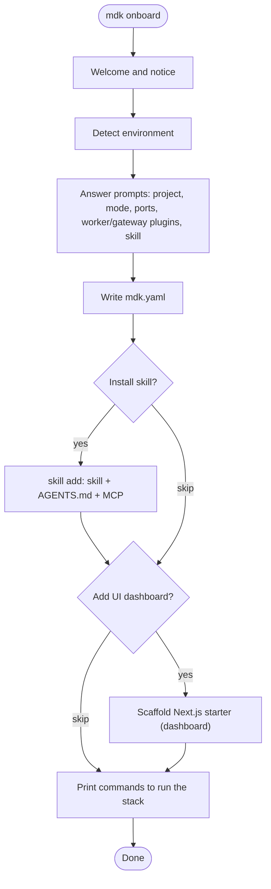

# MDK CLI — High-Level Design

> **Version:** 0.1.0  |  **Date:** 2026-07-16  |  **Status:** Draft
>
> The `mdk` command-line tool — the single, professional entry point a developer uses to **onboard into MDK, bootstrap a project, scaffold backend components, run and manage the stack, and discover Gateway capabilities**. Its north star is an onboarding experience that requires almost no MDK-specific domain knowledge up front.

---

## 1. Overview & Problem Statement

### 1.1 What `mdk` is

`mdk` is the official command-line interface for building on the MDK platform. It is the one tool a developer installs first and reaches for at every step of the lifecycle: from an empty directory, to a running stack, to a published Worker Plugin or Gateway Plugin.

It serves two audiences equally (see §6):

- **Humans** get a guided, low-friction onboarding wizard and readable, well-structured output.
- **Coding agents** (Cursor, Claude Code, Codex, Cline) get deterministic, non-interactive, machine-readable behavior driven by a published command manifest.


### 1.2 The problem it solves

Today, standing up and extending MDK means stitching together bespoke launchers and tribal knowledge: a newcomer must read several docs before they can run anything, and there is no uniform way to scaffold a compliant Worker or Gateway Plugin, validate an `mdk-contract.json`, start the stack in the right order, or wire a coding agent into the repo. `mdk` collapses all of that into one consistent, self-verifying tool.

### 1.3 Scope

`mdk` covers the full **backend + operations** lifecycle. Explicitly **in scope**: onboarding, project bootstrap (including the optional UI dashboard — an MDK Next.js starter), backend scaffolding (Worker Plugins and Gateway Plugins), running and managing the stack, contract/plugin validation, Gateway capability discovery, multi-Gateway context management, and coding-agent enablement.

---


## 2. Design Principles & Standards

`mdk` is not designed from taste alone. It adheres to established open-source CLI standards so that it behaves the way experienced operators and agents already expect. Where those standards leave a choice, we borrow the resolved answer from the two best-in-class references the team named: **kubectl** and **OpenClaw**.

### 2.1 Grounding standards


| Standard                                                                              | What we take from it                                                                                                                                                                                    |
| ------------------------------------------------------------------------------------- | ------------------------------------------------------------------------------------------------------------------------------------------------------------------------------------------------------- |
| **[Command Line Interface Guidelines (clig.dev)](https://clig.dev/)**                 | Human-first defaults, machine-readable on request; helpful errors that suggest the fix; `--help` everywhere; confirm before destructive actions;                                                        |
| **[12-Factor CLI Apps](https://medium.com/@jdxcode/12-factor-cli-apps-dd3c227a0e46)** | Great `--help`; flags over prompts for scriptability; config precedence (flags > env > config); structured output; exit codes as an API; be a good pipeline citizen (stdout = data, stderr = messages). |
| **POSIX / GNU option syntax**                                                         | Short (`-o`) and long (`--output`) flags; `--` to end option parsing; `-` for stdin/stdout; kebab-case flag names.                                                                                      |
| `[NO_COLOR](https://no-color.org/)`                                                   | Disable all color when `NO_COLOR` is set or output is not a TTY.                                                                                                                                        |
| **Semantic exit codes**                                                               | Distinct, documented codes (§3.3) so scripts and agents can branch on failure class.                                                                                                                    |
| **OpenCLI-style manifest**                                                            | A published, versioned, machine-readable description of the whole command surface (`mdk manifest`) so agents discover capabilities in one read — the "OpenAPI for CLIs" idea.                           |


### 2.2 Inspiration — kubectl & OpenClaw

Two tools shape `mdk`'s ergonomics: **kubectl** gives us a consistent, scriptable resource grammar; **OpenClaw**'s `[onboard wizard](https://docs.openclaw.ai/start/wizard)` gives us the guided setup model.


| Source   | Idea                                                                                               | In `mdk`                                                                            |
| -------- | -------------------------------------------------------------------------------------------------- | ----------------------------------------------------------------------------------- |
| kubectl  | `VERB NOUN` grammar; `-o json                                                                      | yaml                                                                                |
| kubectl  | Declarative `apply -f`; kubeconfig contexts                                                        | `mdk apply -f mdk.yaml`; contexts select the active **Gateway** the CLI connects to |
| OpenClaw | Guided **detect → verify (real check) → configure**; one guided flow with sane defaults pre-filled | `mdk onboard`                                                                       |
| OpenClaw | Real state check; re-run is safe (verify, never silent wipe)                                       | `mdk status` checks env + all components; re-running `onboard` is idempotent        |
| OpenClaw | Skills-install as an onboarding step                                                               | The MDK Developer Skill install part of `onboard`                                   |


---


## 3. Command Surface


### 3.1 Global flags & conventions

Every command inherits these:


| Flag                        | Purpose                                                                            |
| --------------------------- | ---------------------------------------------------------------------------------- |
| `-o, --output <fmt>`        | Output format for machine-readable data: `table` (default on TTY), `json`, `yaml`. |
| `-v, --verbose` / `--debug` | Increase log detail; `--debug` prints stack traces for non-`ERR_*` failures.       |
| `--version`, `-h, --help`   | Standard. `--help` is available on every (sub)command.                             |


**Pipeline discipline (12-factor):** machine data is written to **stdout**; human progress/log/error messages go to **stderr**. This lets `mdk get workers -o json | jq …` work cleanly.

### 3.2 Command groups


#### Group A — Onboarding & project lifecycle


| Command       | Purpose                                                                                                                                                                                                                                        |
| ------------- | ---------------------------------------------------------------------------------------------------------------------------------------------------------------------------------------------------------------------------------------------- |
| `mdk onboard` | • The single guided wizard (§4) and the one entry point for setup. • Flow: detect, verify, configure, optional skill install, status check. • Writes `mdk.yaml` (§5.3) from the choices made, then prints the exact commands to run the stack. |


#### Group B — Scaffold


| Command                    | Purpose                                                                                                                                                                |
| -------------------------- | ---------------------------------------------------------------------------------------------------------------------------------------------------------------------- |
| `mdk create worker <name>` | • Scaffold a Worker Plugin package. • Emits an example `mdk-contract.json` with a `handler` per command/telemetry entry. • Includes matching per-action handler stubs. |
| `mdk create plugin <name>` | • Scaffold a Gateway Plugin. • `mdk-plugin.json` manifest plus a plain-JS controller stub.                                                                             |
| `mdk create dashboard`     | • Scaffold the MDK Next.js dashboard (the same starter `onboard` offers). • Wires it to the Gateway and seeds it from the bundled component registry (§5.5) that the `mdk-ui-component` skill builds from.                                    |


#### Group C — Run & manage (kubectl-like)


| Command                          | Purpose                                                                                                                                                                                                                                                                                                                                                                                |
| -------------------------------- | -------------------------------------------------------------------------------------------------------------------------------------------------------------------------------------------------------------------------------------------------------------------------------------------------------------------------------------------------------------------------------------- |
| `mdk run [target]`               | • Start the stack from the spec (`mdk.yaml`, §5.3). •- **Single-process:** `mdk run` (alias `mdk run all`) boots the Kernel, Gateway, and every worker in one process. • - **Multi-process:** each component runs as its own process: `mdk run kernel`, `mdk run gateway`, and `mdk run worker <name>` per worker instance. • `mdk onboard` prints these exact commands at the end. |
| `mdk get <resource>`             | • List live resources from the Kernel/Gateway: `workers` (instances), `devices` (registered deviceIds + owning instance), `plugins`, `contexts`. • Read-only; honors `-o`.                                                                                                                                                                                                             |
| `mdk describe <resource> <name>` | • Detailed view including declared capabilities, `mdk-contract.json`, and registration state.                                                                                                                                                                                                                                                                                          |
| `mdk logs <target>`              | • Stream logs for a service or worker. • Flags: `-f/--follow`, `--since`, `--tail <n>`.                                                                                                                                                                                                                                                                                                |
| `mdk status`                     | • One-shot check of the current environment **and** every component. • Environment: Node 20+, package manager. • Stack: which layers (Kernel/Gateway/workers) are up, worker/device counts, per-component liveness/readiness (maps to the Kernel Health Monitor, `[hld.md](./hld.md)` §4.3.1), and aggregate health. • Read-only: reports, never repairs.                              |
| `mdk apply -f <file>`            | • Declarative, idempotent reconcile from the spec (`mdk.yaml`, §5.3). • Diff desired vs running; restart only the worker instances whose config changed (§5.4).                                                                                                                                                                                                                        |
| `mdk diff -f <file>`             | • Preview what `apply` would change (which instances restart because their config changed) without touching the running stack.                                                                                                                                                                                                                                                         |


#### Group D — Discover (Gateway capability)


| Command        | Purpose                                                                                                                                                                                                                                        |
| -------------- | ---------------------------------------------------------------------------------------------------------------------------------------------------------------------------------------------------------------------------------------------- |
| `mdk discover` | • Query the Gateway MCP for live capabilities. • Write `site-profile.json` (schema per `[hld-mdk-developer-skill-v2.md](./hld-mdk-developer-skill-v2.md)` §5.1). • Flags: `--gateway <url>` (default `http://127.0.0.1:3847`), `--out <path>`. |


#### Group E — Contexts (multiple Gateways)


| Command       | Purpose                                                                                                                                                                                                                          |
| ------------- | -------------------------------------------------------------------------------------------------------------------------------------------------------------------------------------------------------------------------------- |
| `mdk context` | • The only way to point the CLI at a Gateway. • `set <name> --gateway <url>` to add or update an endpoint. • `use <name>` to switch; `list`; `current`; `remove <name>`. • Stored in CLI config (§5.2), analogous to kubeconfig. |


#### Group F — Agent enablement


| Command            | Purpose                                                                                                                                                                                                                                        |
| ------------------ | ---------------------------------------------------------------------------------------------------------------------------------------------------------------------------------------------------------------------------------------------- |
| `mdk skill add`    | • Install the MDK Developer Skill suite (wraps `npx skills add @tetherto/mdk-skill`). • Write/merge `AGENTS.md`. • Register the Gateway MCP with the detected coding-agent client. • Flags: `--client` (`cursor`, `claude`, `codex`, `cline`). |
| `mdk mcp register` | • Register the Gateway MCP endpoint in the client config (`.cursor/mcp.json` / `.mcp.json`). • Does not touch skills.                                                                                                                          |


#### Group G — Meta & agent discovery


| Command                              | Purpose                                                 |
| ------------------------------------ | ------------------------------------------------------- |
| `mdk manifest` (alias `--json-help`) | • Emit the machine-readable command manifest (§6.2).    |
| `mdk version`                        | • Version, commit, and the MDK release line it targets. |


### 3.3 Output formats & exit codes

**Output.** `table` (default, human) renders aligned columns; `wide` adds columns; `json`/`yaml` emit stable, documented shapes. Structured outputs are the agent contract and are versioned alongside the manifest.

**Exit codes** are part of the public API:


| Code  | Meaning                                                                      |
| ----- | ---------------------------------------------------------------------------- |
| `0`   | Success                                                                      |
| `1`   | Generic runtime error                                                        |
| `2`   | Usage / argument error (bad flag, missing required arg)                      |
| `3`   | Validation failed (`ERR_CONTRACT_INVALID`, `ERR_PLUGIN_MANIFEST_INVALID`, …) |
| `4`   | Precondition not met (`ERR_ENV`, `ERR_ORK_REQUIRED`, port in use, …)         |
| `5`   | Connectivity failure (Gateway/Kernel unreachable)                            |
| `130` | Interrupted (SIGINT)                                                         |


Every error carries an `ERR_*` code (§3.3) so scripts can branch precisely.

---


## 4. Onboarding Experience — the core ask

The single most important goal of `mdk` is that a developer who has never read an MDK Architecture or Documentation can reach a running, agent-enabled stack in minutes. `mdk onboard` is where that happens.

### 4.1 Goals

- **Minimal prior knowledge.** Every step explains itself in one line and picks a sensible default.
- **Correct by construction.** Onboarding writes a valid `mdk.yaml` and hands you the exact commands to run the stack — no guesswork, no hidden state.
- **Leave the developer agent-ready.** By the end, the coding agent in the repo is fluent in MDK (skill + `AGENTS.md` + MCP), so subsequent work is natural-language driven.
- **Safe to re-run.** Re-running is a verify-and-repair pass, never a silent wipe.


### 4.2 The guided flow




1. **Welcome.** What will happen and where files are written; nothing destructive without confirmation.
2. **Detect.** Node, package manager, git, any existing MDK workspace, the coding-agent client, and a running Kernel/Gateway.
3. **Answer the prompts.** Each is pre-filled with a sensible default — press Enter to accept, or override inline:
  - **Project** — scaffold a new project or attach to the current directory. *(default: current dir)*
  - **Mode** — `single-process` or `multi-process`. *(default:* `single-process`*)*
  - **Ports** — Gateway / Kernel / worker base port. *(defaults:* `3847` */* `3848` */* `3850+`*)*
  - **Worker plugins** — multi-select from the available `@*/mdk-worker-`* packages; each pick is installed and added as a worker instance in `mdk.yaml`. *(default: none)*
  - **Gateway plugins** — multi-select from the available `@*/mdk-plugin-`* packages; each pick is installed and added under `gateway.plugins`. *(default: none)*
  - **Add the UI dashboard?** — scaffold the MDK Next.js starter project (the web dashboard) wired to the Gateway. *(default: yes; opt out to skip)*
  - **Install the MDK Developer Skill?** *(default: yes)*
   All answers are written to `mdk.yaml` (§5.3).
4. **Install the skill (if chosen).** Run `mdk skill add` — installs the skill, writes/merges `AGENTS.md`, and registers the Gateway MCP.
5. **Scaffold the UI dashboard (if chosen).** Create the MDK Next.js starter project (the web dashboard), pre-wired to the Gateway.
6. **Print the commands.** Show the exact commands to start the stack — `mdk run` for single-process, or `mdk run kernel` / `mdk run gateway` / `mdk run worker <name>` for multi-process (per Group A / §3.2) — plus `mdk create worker` and the dashboard URL.

---

## 5. CLI Internal Architecture

### 5.1 Package & tech stack

- **Package:** `@tetherto/mdk-cli`, living in the `mdk` monorepo (e.g. `packages/tooling/cli/`). The `mdk` command is exposed through the package.json `bin` field pointing at an entry script with a `#!/usr/bin/env node` 
- **Runtime:** Node.js (≥ 20), **TypeScript**, ESM.
- **Framework:** 
  - **Commander.js** for the command tree, argument/flag parsing, and help; 
  - `@clack/prompts` for the interactive onboarding and wizard steps.


### 5.2 Configuration resolution

Env (`MDK_*`) → global config (`~/.mdk/`) holds named Gateway contexts plus the active one (like kubeconfig), and stores **references** to secrets (e.g. `${MDK_GATEWAY_TOKEN}`), never plaintext. 

### 5.3 Stack spec (`mdk.yaml`) — workers, instances & plugin config

- The stack is described declaratively in one file (`mdk.yaml`). It captures the **logical** stack; `mode` selects how those components are wrapped in OS processes (single vs multi), without changing the spec's shape — so graduating from single to multi-process is a one-line change.  
- Each Worker Plugin and each Gateway plugin carries a `config` block. The CLI treats `config` as **opaque and plugin-defined**: the *plugin developer* decides which keys it accepts and the CLI passes it through to the runtime unchanged. `config` holds only what the worker or plugin itself needs to operate — intervals, batch sizes, thresholds, log levels, feature flags — never device details like IPs or tokens. The keys below are just what these particular plugins happen to accept; another plugin might take a polling interval, a batch size, or nothing at all.

```yaml
apiVersion: mdk/v1
kind: Stack
metadata:
  name: my-stack
spec:
  mode: single-process
  kernel:
    port: 3848
  gateway:
    port: 3847
    plugins:
      - package: "@org/mdk-plugin-summary"
        config:
          refreshIntervalMs: 5000
  workers:
    - name: miners-a
      package: "@org/mdk-worker-miner"
      port: 3850
      config:
        pollIntervalMs: 2000
        batchSize: 50
        logLevel: info
    - name: miners-b
      package: "@org/mdk-worker-miner"
      port: 3852
      config:
        pollIntervalMs: 5000
        batchSize: 100
        logLevel: warn
```


### 5.4 Reconciliation — `apply` & restart-on-edit

A worker's `config` is **fixed at the runtime's construction**. `mdk` still gives a kubectl-style live experience through **declarative reconciliation**:

- `mdk apply -f mdk.yaml` diffs the desired spec against what's running and acts **only on what changed**, at worker-instance granularity.
- **Every change is a config edit.** To change an instance's behavior, edit its `config` in `mdk.yaml` and run `mdk apply`. That one instance restarts — its channel to the Kernel drops briefly and re-registers,  keeping the blip small and the Kernel refreshing its registry (and the Gateway MCP) on re-registration.
- **Adding capacity as a *new* instance causes no disruption** to existing instances, so the low-impact path for growth is "add another instance" rather than "grow an existing one."
- `mdk diff -f` previews the blast radius (which instances restart) before anything happens.

Blast radius is therefore always a single worker instance, never the whole stack, and the flow is identical whether a human edits `mdk.yaml` by hand or an agent runs `mdk apply`.

### 5.5 Bundled UI component registry

Both `mdk onboard` (UI dashboard step) and `mdk create dashboard` scaffold the MDK Next.js starter. To make that dashboard buildable by a coding agent, the CLI ships a **component registry** — `registry.json`, generated from `@tetherto/mdk-react-devkit` — the machine-readable catalog of every available UI component (name, path, description, `tier`/`agent-ready`, category, props).

- **Location.** For now it lives in the CLI package folder (e.g. `cli/registry.json`); it may later be resolved from the devkit version a project pins.
- **Who uses it.** The scaffolded dashboard and the `mdk-ui-component` skill read it to know which components exist and how to bind them — the skill selects from this catalog rather than inventing component names or props.
- **Versioning.** The registry carries its own `version` and `packageVersion`, so the dashboard and skill can pin to a known component set and it can be regenerated from the devkit.

---

## 6. Agent-First Design

`mdk` is built to be driven as comfortably by a coding agent as by a human — but it is deliberately **not** the channel through which runtime AI agents operate hardware.

### 6.1 CLI vs MCP — two different surfaces

The agentic-framework HLD (`[hld-agentic-framework.md](./hld-agentic-framework.md)` §3.4) draws the line clearly, and `mdk` respects it:


| Surface         | Audience                       | When                  | Auth                    | Purpose                                   |
| --------------- | ------------------------------ | --------------------- | ----------------------- | ----------------------------------------- |
| `mdk` **CLI**   | Developer + their coding agent | Build time / dev time | Local shell + config    | Scaffold, run, manage, discover           |
| **Gateway MCP** | Operator Agent (runtime)       | Run time              | Same JWT/RBAC as the UI | Query telemetry, dispatch device commands |


An LLM operating a live fleet uses **MCP**, not `mdk`. `mdk`'s job is to help *build* the system and to *wire up* that MCP endpoint..

### 6.2 The command manifest

`mdk manifest` (and the `--json-help` alias) walks the Commander program and emits a versioned JSON description of every command: name, description, usage, aliases, arguments (required/variadic), options (flags, defaults, whether they take a value), and nested subcommands. 

Agents read this once to discover the entire surface without spawning `--help` per command or scraping text. The manifest carries its own `version` so agents can pin to a known shape.

### 6.3 Relationship to the Developer Skill

`mdk` and the Developer Skill suite are complementary:

- `mdk onboard` **installs** the skill and wires the MCP.
- The skill then **teaches the agent to call** `mdk` — e.g. run `mdk discover` before designing an aggregation, `mdk create worker` to start a package.

---

## 7. Distribution & Versioning

- **Install:** zero-install via `npx @tetherto/mdk-cli …`, or `npm i -g @tetherto/mdk-cli` for the `mdk` cli. The `mdk onboard` path is the recommended first touch.
- **Versioning:** `mdk` is versioned to track the MDK release line. `mdk version` prints both the CLI version.
- **Update nudge:** `mdk` may print (never block on) a notice when a newer version targeting the same MDK line is available.
- **Analytics:** is integrated in the CLI to understand the user behaviour and journey, to improve the system.

---

## 8. Open Questions

- **Runtime device add/remove.** How devices are attached to or detached from a running worker is **not decided**. Devices are intentionally **not** part of `mdk.yaml`, and there is no `add device` / `remove device` command today.

  **Potential solution:** the UI exposes forms to add/remove devices. We do not want to impose a single device structure on all workers (and thereby on plugin developers); instead, the entire device config is passed to the worker whenever it changes, and the worker handles it automatically via the Worker Runtime.

---

## 9. References

**External standards & inspirations**

- [Command Line Interface Guidelines — clig.dev](https://clig.dev/)
- [12-Factor CLI Apps](https://medium.com/@jdxcode/12-factor-cli-apps-dd3c227a0e46)
- [kubectl — command overview & conventions](https://kubernetes.io/docs/reference/kubectl/)
- [OpenClaw — CLI onboarding wizard](https://docs.openclaw.ai/start/wizard)
- [XDG Base Directory Specification](https://specifications.freedesktop.org/basedir-spec/latest/)
- [Commander.js](https://github.com/tj/commander.js) ·
- `[@clack/prompts](https://github.com/bombshell-dev/clack)`

