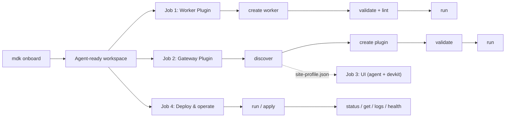
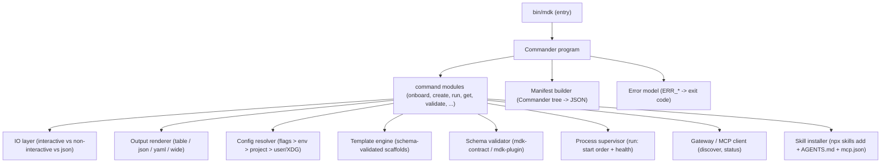
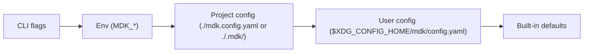

# MDK CLI — High-Level Design

> **Version:** 0.1.0  |  **Date:** 2026-07-16  |  **Status:** Draft
>
> The `mdk` command-line tool — the single, professional entry point a developer uses to **onboard into MDK, bootstrap a project, scaffold backend components, run and manage the stack, validate contracts, and discover site capabilities**. Its north star is an onboarding experience that requires almost no MDK-specific domain knowledge up front.

---

## 1. Overview & Problem Statement

### 1.1 What `mdk` is

`mdk` is the official command-line interface for building on the MDK platform. It is the one tool a developer installs first and reaches for at every step of the lifecycle: from an empty directory, to a running stack, to a published Worker Plugin or Gateway Plugin.

It serves two audiences equally (see §7):

- **Humans** get a guided, low-friction onboarding wizard and readable, well-structured output.
- **Coding agents** (Cursor, Claude Code, Codex, Cline) get deterministic, non-interactive, machine-readable behavior driven by a published command manifest.


### 1.2 The problem it solves

Today, standing up and extending MDK means stitching together bespoke launchers and tribal knowledge: a newcomer must read several docs before they can run anything, and there is no uniform way to scaffold a compliant Worker or Gateway Plugin, validate an `mdk-contract.json`, start the stack in the right order, or wire a coding agent into the repo. `mdk` collapses all of that into one consistent, self-verifying tool.

### 1.3 Scope

`mdk` covers the full **backend + operations** lifecycle. Explicitly **in scope**: onboarding, project bootstrap (including bootstrapping the ready-made UI Shell), backend scaffolding (Worker Plugins and Gateway Plugins), running and managing the stack, contract/plugin validation, site-capability discovery, multi-site context management, and coding-agent enablement.

Explicitly out of scope (and why):

- Custom frontend generation (bespoke UI components / apps). The only frontend thing `mdk` does is *bootstrap the pre-built MDK UI Shell* (the ready-made dashboard app) as part of project setup — via `mdk init --with-ui-shell`. Generating custom UI components or apps belongs to the coding agent + the `mdk-ui-component` skill and the frontend devkit, not this CLI.
- Spec-to-worker generation (`--from-spec`). Converting a vendor proto/OpenAPI/Modbus spec into a working translation layer is the job of the AI coding agent guided by the Developer Skill (see `[reviews/007.worker-firmware-generation-and-multi-device-model.md](./reviews/007.worker-firmware-generation-and-multi-device-model.md)`). `mdk create worker` produces a clean, schema-valid *starting point*; the agent fills in the device logic.
- Runtime operator actions for AI agents. Those flow through the Gateway MCP endpoint, not a shelled-out CLI (see `[hld-agentic-framework.md](./hld-agentic-framework.md)` §3.4 and §7 below).

> Note on prior art. An early `@tetherto/mdk-ui-cli` (`mdk-ui` bin) sketch existed for the UI devkit. It is treated as a discarded early experiment, not a design basis. `mdk` re-uses two good ideas from it — *agent-first output* and a *published command manifest* — but is designed fresh.

---


## 2. Design Principles & Standards

`mdk` is not designed from taste alone. It adheres to established open-source CLI standards so that it behaves the way experienced operators and agents already expect. Where those standards leave a choice, we borrow the resolved answer from the two best-in-class references the team named: **kubectl** and **OpenClaw**.

### 2.1 Grounding standards


| Standard                                                                                   | What we take from it                                                                                                                                                                                                      |
| ------------------------------------------------------------------------------------------ | ------------------------------------------------------------------------------------------------------------------------------------------------------------------------------------------------------------------------- |
| **[Command Line Interface Guidelines (clig.dev)](https://clig.dev/)**                      | Human-first defaults, machine-readable on request; helpful errors that suggest the fix; `--help` everywhere; confirm before destructive actions; respect `NO_COLOR`; never require a flag when a sensible default exists. |
| **[12-Factor CLI Apps](https://medium.com/@jdxcode/12-factor-cli-apps-dd3c227a0e46)**      | Great `--help`; flags over prompts for scriptability; config precedence (flags > env > config); structured output; exit codes as an API; be a good pipeline citizen (stdout = data, stderr = messages).                   |
| **POSIX / GNU option syntax**                                                              | Short (`-o`) and long (`--output`) flags; `--` to end option parsing; `-` for stdin/stdout; kebab-case flag names.                                                                                                        |
| **[XDG Base Directory Spec](https://specifications.freedesktop.org/basedir-spec/latest/)** | Config in `$XDG_CONFIG_HOME/mdk/` (default `~/.config/mdk/`); state in `$XDG_STATE_HOME/mdk/`; cache in `$XDG_CACHE_HOME/mdk/`. No dotfile sprawl in `$HOME`.                                                             |
| `[NO_COLOR](https://no-color.org/)`                                                        | Disable all color when `NO_COLOR` is set or output is not a TTY.                                                                                                                                                          |
| **Semantic exit codes**                                                                    | Distinct, documented codes (§3.3) so scripts and agents can branch on failure class.                                                                                                                                      |
| **OpenCLI-style manifest**                                                                 | A published, versioned, machine-readable description of the whole command surface (`mdk manifest`) so agents discover capabilities in one read — the "OpenAPI for CLIs" idea.                                             |


### 2.2 Inspiration — kubectl & OpenClaw

Two tools shape `mdk`'s ergonomics: **kubectl** gives us a consistent, scriptable resource grammar; **OpenClaw**'s `[onboard wizard](https://docs.openclaw.ai/start/wizard)` gives us the guided setup model.


| Source   | Idea                                                                                   | In `mdk`                                                                            |
| -------- | -------------------------------------------------------------------------------------- | ----------------------------------------------------------------------------------- |
| kubectl  | `VERB NOUN` grammar; `-o json                                                          | yaml                                                                                |
| kubectl  | Declarative `apply -f`; kubeconfig contexts                                            | `mdk apply -f site.yaml`; contexts select the active **site** (Kernel/Gateway pair) |
| OpenClaw | Guided **detect → verify (real check) → configure**; QuickStart vs Advanced (`--flow`) | `mdk onboard` (§4), `mdk onboard --flow quickstart                                  |
| OpenClaw | `doctor` repair pass; re-run is safe (verify/repair, never silent wipe)                | `mdk doctor`; re-running `onboard`/`init` is idempotent                             |
| OpenClaw | `--json` ≠ non-interactive; env-backed secret refs                                     | Output/interactivity split (§3.1); secret refs (§6.3)                               |
| OpenClaw | Skills-install as an onboarding step                                                   | The MDK Developer Skill install is a prompt inside `onboard` (§4.2)                 |


---


## 3. Command Surface


### 3.1 Global flags & conventions

Every command inherits these:


| Flag                        | Purpose                                                                                                                                       |
| --------------------------- | --------------------------------------------------------------------------------------------------------------------------------------------- |
| `-o, --output <table        | json                                                                                                                                          |
| `--json`                    | Shorthand for `-o json`. **Does not** imply non-interactive (per OpenClaw).                                                                   |
| `--non-interactive`         | Disable all prompts; missing required input becomes a hard error. Auto-enabled when stdin is not a TTY (CI) unless `--interactive` is forced. |
| `-y, --yes`                 | Assume "yes" for confirmations (destructive actions still require this or a prompt).                                                          |
| `-q, --quiet`               | Suppress non-essential messages (stderr). Data still goes to stdout.                                                                          |
| `-v, --verbose` / `--debug` | Increase log detail; `--debug` prints stack traces for non-`ERR_*` failures.                                                                  |
| `--no-color`                | Disable color (also honors `NO_COLOR` and non-TTY).                                                                                           |
| `--context <name>`          | Select the active site context for this invocation.                                                                                           |
| `--config <path>`           | Override config file resolution.                                                                                                              |
| `--version`, `-h, --help`   | Standard. `--help` is available on every (sub)command.                                                                                        |


**Pipeline discipline (12-factor):** machine data is written to **stdout**; human progress/log/error messages go to **stderr**. This lets `mdk get workers -o json | jq …` work cleanly.

### 3.2 Command groups


#### Group A — Onboarding & project lifecycle


| Command                            | Purpose                                                                                                                                                                                                                 |
| ---------------------------------- | ----------------------------------------------------------------------------------------------------------------------------------------------------------------------------------------------------------------------- |
| `mdk onboard`                      | The flagship guided wizard (§4). Detect → verify → configure → optional skill install → health check. Flags: `--flow` (`quickstart`/`advanced`), `--non-interactive`.                                                   |
| `mdk init` *(alias* `bootstrap`*)* | The mechanical, non-guided project scaffold that `onboard` calls. Creates the workspace, config, and a runnable topology. Flags: `--template single-process                                                             |
| `mdk doctor`                       | Environment + config validation and repair pass: Node ≥ 20, package manager, git, config validity, port availability, Kernel/Gateway reachability, skill install, MCP registration. `--fix` attempts safe auto-repairs. |
| `mdk configure`                    | Edit non-onboarding config (ports, endpoints, contexts). `--section <workspace                                                                                                                                          |


#### Group B — Scaffold (backend only)


| Command                    | Purpose                                                                                                                                                                                                                                                                    |
| -------------------------- | -------------------------------------------------------------------------------------------------------------------------------------------------------------------------------------------------------------------------------------------------------------------------- |
| `mdk create worker <name>` | Scaffold a Worker Plugin package: `mdk-contract.json` (from the closest reference template), the `Thing`/`ThingManager` wiring inherited from `@tetherto/mdk-worker`, `hardware`/`mapping` handler stubs, `package.json`, `examples/`, `README.md`. Flags: `--family miner |
| `mdk create plugin <name>` | Scaffold a Gateway Plugin: `mdk-plugin.json` manifest + plain-JS controller stub + `README.md`. Flags: `--org <scope>`, `--dir`, `--force`.                                                                                                                                |


> There is deliberately **no** `--from-spec` and **no** `create component`/`create app` (see §1.3). Templates are minimal and correct; the AI agent supplies device logic, and custom UI. The only frontend `mdk` produces is the pre-built UI Shell, bootstrapped via `mdk init --with-ui-shell` (project setup, not `create`).


#### Group C — Run & manage (kubectl-like)


| Command                          | Purpose                                                                                       |
| -------------------------------- | --------------------------------------------------------------------------------------------- |
| `mdk run`                        | Start a stack from config. `--mode single-process                                             |
| `mdk get <resource>`             | List resources: `workers`, `devices`, `plugins`, `contexts`, `sites`. Honors `-o`.            |
| `mdk describe <resource> <name>` | Detailed view including declared capabilities / `mdk-contract.json` / registration state.     |
| `mdk logs <target>`              | Stream logs for a service or worker. `-f/--follow`, `--since`, `--tail <n>`.                  |
| `mdk status`                     | One-shot stack overview: which layers are up, worker/device counts, aggregate health.         |
| `mdk health`                     | Liveness/readiness probes (maps to the Kernel's Health Monitor, `[hld.md](./hld.md)` §4.3.1). |
| `mdk apply -f <file>`            | Declarative, idempotent deployment from a site spec (`site.yaml`).                            |
| `mdk delete -f <file>`           | `mdk delete <resource> <name>`                                                                |


#### Group D — Validate


| Command               | Purpose                                                                                                                                                                                                                                          |
| --------------------- | ------------------------------------------------------------------------------------------------------------------------------------------------------------------------------------------------------------------------------------------------ |
| `mdk validate [path]` | Validate `mdk-contract.json` / `mdk-plugin.json` against the bundled JSON Schemas. Auto-detects file type; walks the package if `path` is a directory. `-o json` emits structured findings.                                                      |
| `mdk lint`            | Structural + invariant lint of a Worker/Gateway Plugin package: canonical `@tetherto/mdk-*` names only, no direct HRPC/hyperswarm imports, no `new MdkClient(...)` in plugins (per `[hld-app-node-plugins.md](./hld-app-node-plugins.md)` §5.4). |


#### Group E — Discover (site capability)


| Command        | Purpose                                                                                                                                                                                                                                                                                                                                                      |
| -------------- | ------------------------------------------------------------------------------------------------------------------------------------------------------------------------------------------------------------------------------------------------------------------------------------------------------------------------------------------------------------ |
| `mdk discover` | Query the Gateway MCP for live capabilities and write `site-profile.json` (schema per `[hld-mdk-developer-skill-v2.md](./hld-mdk-developer-skill-v2.md)` §5.1). Flags: `--gateway <url>` (default `http://127.0.0.1:3847`), `--out <path>`, `--static` (fallback: read installed `@*/mdk-worker-*` and `@*/mdk-plugin-*` packages when no stack is running). |


#### Group F — Config & contexts (multi-site)


| Command           | Purpose |
| ----------------- | ------- |
| `mdk config view  | get     |
| `mdk context list | current |


#### Group G — Agent enablement


| Command            | Purpose                                                                                                                                                                                                  |
| ------------------ | -------------------------------------------------------------------------------------------------------------------------------------------------------------------------------------------------------- |
| `mdk skill add`    | Install the MDK Developer Skill suite (wraps `npx skills add @tetherto/mdk-skill`), write/merge `AGENTS.md`, and register the Gateway MCP with the detected coding-agent client. Flags: `--client cursor |
| `mdk mcp register` | Register the Gateway MCP endpoint in the client config (`.cursor/mcp.json` / `.mcp.json`) without touching skills.                                                                                       |


#### Group H — Meta & agent discovery


| Command                                 | Purpose                                               |
| --------------------------------------- | ----------------------------------------------------- |
| `mdk manifest` *(also* `--json-help`*)* | Emit the machine-readable command manifest (§7.2).    |
| `mdk completion <bash                   | zsh                                                   |
| `mdk version`                           | Version, commit, and the MDK release line it targets. |


### 3.3 Output formats & exit codes

**Output.** `table` (default, human) renders aligned columns; `wide` adds columns; `json`/`yaml` emit stable, documented shapes. Structured outputs are the agent contract and are versioned alongside the manifest.

**Exit codes** are part of the public API:


| Code  | Meaning                                                                      |
| ----- | ---------------------------------------------------------------------------- |
| `0`   | Success                                                                      |
| `1`   | Generic runtime error                                                        |
| `2`   | Usage / argument error (bad flag, missing required arg)                      |
| `3`   | Validation failed (`ERR_CONTRACT_INVALID`, `ERR_PLUGIN_MANIFEST_INVALID`, …) |
| `4`   | Precondition not met (`ERR_ENV`, `ERR_ORK_REQUIRED`, port in use, …)         |
| `5`   | Connectivity failure (Gateway/Kernel unreachable)                            |
| `130` | Interrupted (SIGINT)                                                         |


Every error carries an `ERR_*` code (§6.6) so scripts can branch precisely.

---


## 4. Onboarding Experience — the core ask

The single most important goal of `mdk` is that a developer who has never read an MDK HLD can reach a running, agent-enabled stack in minutes. `mdk onboard` is where that happens.

### 4.1 Goals

- **Minimal prior knowledge.** Every step explains itself in one line and picks a sensible default.
- **Verify, don't assume.** Like OpenClaw's "real completion" check, onboarding proves the stack actually runs before declaring success.
- **Leave the developer agent-ready.** By the end, the coding agent in the repo is fluent in MDK (skill + `AGENTS.md` + MCP), so subsequent work is natural-language driven.
- **Safe to re-run.** Re-running is a verify-and-repair pass, never a silent wipe.


### 4.2 The guided flow

```text
mdk onboard
```

1. **Welcome & notice.** One screen: what will happen, where files are written. Nothing destructive without confirmation.
2. **Detect environment.** Node (≥ 20), package manager (npm/pnpm/yarn), git, an existing MDK workspace, the coding-agent client (Cursor / Claude Code / Codex / Cline), and any already-running Kernel/Gateway.
3. **Choose flow.** QuickStart (accept all defaults) or Advanced (expose every step). `--flow` skips this prompt.
4. **Configure workspace.** Scaffold a new project or attach to the current one; pick topology (`single-process` for first-run, `multi-process` for realistic) and ports (sensible defaults: Gateway `3847`, Kernel `3848`, workers `3850+`).
5. **Verify with a real check.** Install deps, run `mdk doctor`, then boot a single-process stack and confirm the Kernel is reachable and at least one worker registers. On failure, show the reason and offer retry / skip / open `doctor`.
6. **Prompt: install the MDK Developer Skill?** *(default: yes)* — the decision the user asked to surface here. On **yes**: detect the client, run `mdk skill add` (which runs `npx skills add @tetherto/mdk-skill`), write/merge `AGENTS.md`, and register the Gateway MCP. On **skip**: print the exact one-liner to do it later.
7. **Health check & summary.** Final `mdk status`, then a "next steps" panel: `mdk create worker`, `mdk run`, open the dashboard URL.


### 4.3 QuickStart vs Advanced


| Step          | QuickStart (defaults)                     | Advanced (full control)               |
| ------------- | ----------------------------------------- | ------------------------------------- |
| Topology      | `single-process`                          | choose single/multi-process           |
| Ports         | `3847/3848/3850+`                         | prompt each                           |
| Workspace     | current dir or `./mdk-app`                | prompt path & name                    |
| Skill install | prompt (default yes)                      | prompt + choose client + MCP toggle   |
| Verify        | boot single-process, confirm registration | same + optional multi-process dry run |


### 4.4 Non-interactive (CI & agents)

- **CI / agents:** `mdk onboard --non-interactive --flow quickstart --yes` (all decisions from flags/env; any missing required value is a hard error). Auto-detected when stdin is not a TTY.
- **Idempotent re-run:** re-running `onboard`/`init` verifies and repairs rather than wiping; if config is invalid, onboarding stops and points at `mdk doctor`.

---


## 5. Lifecycle → Developer Jobs Mapping

The Developer Skill HLD §3 defines the four jobs a developer does on MDK. `mdk` supports the backend and operations parts of all four; UI generation is delegated to the agent + devkit.


| Job (`[hld-mdk-developer-skill-v2.md](./hld-mdk-developer-skill-v2.md)` §3) | `mdk` support                                                                                                                      |
| --------------------------------------------------------------------------- | ---------------------------------------------------------------------------------------------------------------------------------- |
| 1. New Device Worker integration                                            | `mdk create worker` → `mdk validate` → `mdk lint` → `mdk run`                                                                      |
| 2. New Gateway Plugin (cross-worker aggregation)                            | `mdk discover` → `mdk create plugin` → `mdk validate` → `mdk run`                                                                  |
| 3. UI component                                                             | UI Shell bootstrap via `mdk init --with-ui-shell`; custom components are agent + devkit territory (`mdk discover` feeds the agent) |
| 4. Deployment of a working stack                                            | `mdk run` / `mdk apply -f` → `mdk status` / `mdk get` / `mdk logs` / `mdk health`                                                  |





---


## 6. CLI Internal Architecture


### 6.1 Package & tech stack

- **Package:** `@tetherto/mdk-cli`, **bin:** `mdk`, living in the `mdk` monorepo (e.g. `packages/tooling/cli/`).
- **Runtime:** Node.js (≥ 20), **TypeScript**, ESM.
- **Framework (decided):** **Commander.js** for the command tree, argument/flag parsing, help, and manifest generation; `@clack/prompts` for the interactive onboarding and wizard steps.

**Why this stack.** Commander is a mature, dependency-light command router whose command objects are trivial to walk into a JSON manifest (§7.2); `@clack/prompts` gives a polished, accessible, cancel-safe interactive experience for `onboard`/`configure` without pulling in a heavy TUI framework. The interactive layer is strictly isolated behind the IO abstraction (§6.4) so that non-interactive and `--json` modes never touch it — the command logic is identical whether a human or an agent drives it.

### 6.2 Module layout




### 6.3 Configuration resolution

Config follows 12-factor precedence — **highest wins**:




- **Locations (XDG):** user config in `$XDG_CONFIG_HOME/mdk/` (default `~/.config/mdk/`); runtime state in `$XDG_STATE_HOME/mdk/`; cache in `$XDG_CACHE_HOME/mdk/`.
- **Env prefix:** `MDK_` (e.g. `MDK_GATEWAY_URL`, `MDK_CONTEXT`).
- **Contexts:** the config file holds named site contexts (Kernel/Gateway coordinates) plus the active one, analogous to kubeconfig.
- **Secrets:** config stores **references** to secrets (env-backed, e.g. `${MDK_GATEWAY_TOKEN}`), never plaintext tokens — following OpenClaw's secret-ref stance. A referenced variable that is unset fails fast with a clear message.


### 6.4 Interactivity & output (the IO layer)

A single IO abstraction enforces clig/12-factor rules in one place:

- **Interactive** (TTY + not `--non-interactive`): `@clack/prompts` drives prompts, with sensible defaults pre-selected.
- **Non-interactive** (CI, piped, or `--non-interactive`): prompts are forbidden; any unmet required input is `ERR_INPUT_REQUIRED` (exit `2`).
- `--json` **/** `-o json`: output format only — orthogonal to interactivity (a human can still be prompted while requesting JSON output). Data → stdout; messages → stderr.
- **Color:** on only for a TTY without `NO_COLOR`.


### 6.5 Templates & schema grounding

Scaffolding is template-driven and **fails fast**:

- Templates are bundled with the package (a stripped, canonical reference per family for workers; the manifest+controller pair for plugins).
- Variables (`name`, `org`, `family`, ports) are injected, then the generated `mdk-contract.json` / `mdk-plugin.json` is **validated against the bundled JSON Schema before anything is written**. An invalid render aborts with `ERR_CONTRACT_INVALID` / `ERR_PLUGIN_MANIFEST_INVALID` and writes nothing.
- The schemas are the same authoritative files the rest of MDK uses (`mdk-contract.schema.json`, `mdk-plugin.schema.json`), so a scaffold that passes here passes everywhere.


### 6.6 Error model

All failures are instances of a single `MdkCliError { code, message, exitCode, hint? }`:

- `code` is an `ERR_*` string, consistent with MDK's existing convention (`ERR_PLUGIN_MANIFEST_INVALID`, `ERR_MODE`, `ERR_ORK_REQUIRED`, …). CLI-specific additions: `ERR_ENV`, `ERR_INPUT_REQUIRED`, `ERR_CONTEXT_UNKNOWN`, `ERR_GATEWAY_UNREACHABLE`, `ERR_PORT_IN_USE`.
- **Rendering:** `ERR_`* errors print their message + an actionable `hint` (e.g. "run `mdk doctor --fix`"). Unexpected errors are masked to a generic message unless `--debug` is set (then the stack prints). In `-o json`, errors serialize as `{ "error": { "code", "message", "hint" } }`.
- **Exit code** comes from the error (§3.3).

---


## 7. Agent-First Design

`mdk` is built to be driven as comfortably by a coding agent as by a human — but it is deliberately **not** the channel through which runtime AI agents operate hardware.

### 7.1 CLI vs MCP — two different surfaces

The agentic-framework HLD (`[hld-agentic-framework.md](./hld-agentic-framework.md)` §3.4) draws the line clearly, and `mdk` respects it:


| Surface         | Audience                       | When                  | Auth                    | Purpose                                   |
| --------------- | ------------------------------ | --------------------- | ----------------------- | ----------------------------------------- |
| `mdk` **CLI**   | Developer + their coding agent | Build time / dev time | Local shell + config    | Scaffold, validate, run, manage, discover |
| **Gateway MCP** | Operator Agent (runtime)       | Run time              | Same JWT/RBAC as the UI | Query telemetry, dispatch device commands |


An LLM operating a live fleet uses **MCP**, not `mdk`. `mdk`'s job is to help *build* the system and to *wire up* that MCP endpoint — never to become a back channel around the Gateway's trust boundary.

### 7.2 The command manifest

`mdk manifest` (and the `--json-help` alias) walks the Commander program and emits a versioned JSON description of every command: name, description, usage, aliases, arguments (required/variadic), options (flags, defaults, whether they take a value), and nested subcommands. Agents read this once to discover the entire surface without spawning `--help` per command or scraping text. The manifest carries its own `version` so agents can pin to a known shape.

### 7.3 Deterministic behavior for agents

- **Stable structured output** (`-o json`) with documented shapes.
- `--non-interactive` guarantees no hidden prompt can hang an agent; missing input is a typed error, not a stall.
- `ERR_*` **codes + semantic exit codes** let an agent branch on failure class and self-correct (e.g. see `ERR_CONTRACT_INVALID`, re-open the schema, fix, re-validate).
- **stdout = data, stderr = messages**, so piping into an agent's tool wrapper is clean.


### 7.4 Relationship to the Developer Skill

`mdk` and the Developer Skill suite are complementary:

- `mdk onboard` **installs** the skill and wires the MCP (the skill is judgment/context; `mdk` is the tool).
- The skill then **teaches the agent to call** `mdk` — e.g. run `mdk discover` before designing an aggregation, `mdk validate` after authoring a contract, `mdk create worker` to start a package. The two reinforce each other: the CLI is the verb, the skill is the know-how.

---


## 8. Distribution & Versioning

- **Install:** zero-install via `npx @tetherto/mdk-cli …`, or `npm i -g @tetherto/mdk-cli` for the `mdk` bin. The `mdk bootstrap`/`onboard` path is the recommended first touch.
- **Versioning:** `mdk` is versioned to track the MDK release line (mirroring how `@tetherto/mdk-skill` pins `mdk_version`), so a given CLI knows which schemas, templates, and package names are canonical. `mdk version` prints both the CLI version and the MDK line it targets.
- **Manifest versioning:** the JSON manifest and structured-output shapes carry an independent schema version so agents can pin.
- **Update nudge:** on a TTY, `mdk` may print (never block on) a notice when a newer version targeting the same MDK line is available.

---


## 9. Open Questions & Decisions


### 9.1 Decisions locked


| #   | Decision                                                                             | Rationale                                                                                                                                                     |
| --- | ------------------------------------------------------------------------------------ | ------------------------------------------------------------------------------------------------------------------------------------------------------------- |
| 1   | Framework = **Commander.js +** `@clack/prompts` on TypeScript                        | Light, mature routing + trivial manifest extraction; polished, isolated interactive layer.                                                                    |
| 2   | **No** `--from-spec` for `create worker`                                             | Spec→worker translation is the AI agent's job via the Developer Skill (`[reviews/007…](./reviews/007.worker-firmware-generation-and-multi-device-model.md)`). |
| 3   | **Backend-only scaffolding** (`create worker`, `create plugin`)                      | UI generation belongs to the agent + devkit, not this CLI.                                                                                                    |
| 4   | **Skill install is an onboarding prompt** (default yes) + standalone `mdk skill add` | Makes the repo agent-ready by default while staying skippable.                                                                                                |
| 5   | **Canonical Kernel/Gateway/Worker/Client naming**                                    | Per `[DOC-HIERARCHY.md](./DOC-HIERARCHY.md)` §1.                                                                                                              |


### 9.2 Still open


| #   | Question                           | Notes                                                                                                                                                    |
| --- | ---------------------------------- | -------------------------------------------------------------------------------------------------------------------------------------------------------- |
| 1   | Bin name / scope collision (`mdk`) | Confirm no clash with an existing global; confirm `@tetherto/mdk-cli` as the package name.                                                               |
| 2   | Telemetry                          | If any usage analytics, must be **opt-in**, documented, and disableable (`MDK_TELEMETRY=0`) per clig. Default: none.                                     |
| 3   | Standalone binary                  | Ship a single-file binary (Bun / `pkg`) for non-Node machines? Deferred.                                                                                 |
| 4   | `run` supervision depth            | Does `mdk run` own long-lived process supervision, or hand off to systemd/pm2 for `multi-process`? Likely: own dev-mode, delegate production.            |
| 5   | Windows parity                     | Confirm prompt/color/path behavior on native Windows vs WSL2.                                                                                            |
| 6   | `--reset` on `onboard`             | Do we actually need a reset flag (with `config`/`full` scopes), or is manual cleanup of the workspace/config enough? Deferred until there's a real need. |


---


## 10. References

**External standards & inspirations**

- [Command Line Interface Guidelines — clig.dev](https://clig.dev/)
- [12-Factor CLI Apps](https://medium.com/@jdxcode/12-factor-cli-apps-dd3c227a0e46)
- [kubectl — command overview & conventions](https://kubernetes.io/docs/reference/kubectl/)
- [OpenClaw — CLI onboarding wizard](https://docs.openclaw.ai/start/wizard)
- [XDG Base Directory Specification](https://specifications.freedesktop.org/basedir-spec/latest/)
- [NO_COLOR](https://no-color.org/)
- [Commander.js](https://github.com/tj/commander.js) · `[@clack/prompts](https://github.com/bombshell-dev/clack)`

**Internal**

- `[hld.md](./hld.md)` — MDK architecture, protocol, scaling model
- `[hld-mdk-app.md](./hld-mdk-app.md)` — App Toolkit
- `[hld-app-node-plugins.md](./hld-app-node-plugins.md)` — Gateway Plugin manifest & isolation rules
- `[hld-worker-runtime.md](./hld-worker-runtime.md)` — Worker runtime & multi-device model
- `[hld-agentic-framework.md](./hld-agentic-framework.md)` — Developer Skill vs Operator Agent; CLI vs MCP (§3.4)
- `[hld-mdk-developer-skill-v2.md](./hld-mdk-developer-skill-v2.md)` — Skill suite; Site Capability Discovery; §7.6 bootstrap CLI note
- `[DOC-HIERARCHY.md](./DOC-HIERARCHY.md)` — canonical naming
- `[reviews/007.worker-firmware-generation-and-multi-device-model.md](./reviews/007.worker-firmware-generation-and-multi-device-model.md)` — spec→worker generation (agent's job)

