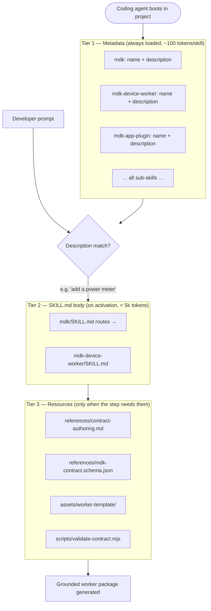
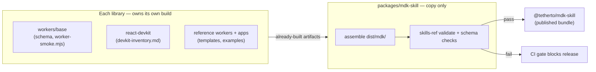
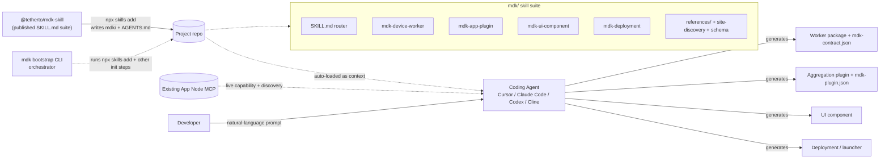

# MDK Developer Skill — High-Level Design

> **Version:** 1.0.0  |  **Date:** 2026-06-13  |  **Status:** Final
>
> The MDK Developer Skill is delivered as a **Skill Suite** shipped via the **universal Agent Skills standard** (`npx skills add`), with explicit install steps for **Cursor** and **Claude Code** (§7). Per-agent native plugin bundles/marketplaces are intentionally **out of scope** (see §10). Site discovery reuses the **existing App Node MCP** (`[hld-agentic-framework.md](./hld-agentic-framework.md)` §3).
>
> Companion to `[hld.md](./hld.md)`, `[hld-agentic-framework.md](./hld-agentic-framework.md)`, `[hld-mdk-app.md](./hld-mdk-app.md)`, and `[hld-app-node-plugins.md](./hld-app-node-plugins.md)`. Indexed against `[mdk-libraries.md](./mdk-libraries.md)`.

---

## 1. Overview

`[hld-agentic-framework.md](./hld-agentic-framework.md)` §2 introduces the **MDK Developer Skill** as one of two AI surfaces on MDK: a *static knowledge bundle* (development-time context) — as opposed to the *Operator Agent* (a runtime agent).

> **The MDK Developer Skill is not an agent.** It is version-controlled *context* injected into whatever coding agent a developer already uses (Cursor / Claude Code / Codex), making that agent instantly fluent in MDK conventions the moment the monorepo is cloned.

### 1.1 Why this needs its own HLD

The agentic-framework HLD describes the skill as a small, flat bundle (`SKILL.md` + a few examples). That framing is correct for a single integration. But MDK does not ship as a single library — it is a **large monorepo of many independently-published packages** (see `[mdk-libraries.md](./mdk-libraries.md)`) spanning the kernel, transport SDK, gateway, worker base, multiple device-worker families, and a three-tier frontend toolkit.

A developer working on top of MDK is doing one of a small set of distinct jobs (integrate a device, ship a cross-worker aggregation plugin, build a UI component, deploy the stack — see §3). Loading the union of all that knowledge into the agent's context for every task would defeat the entire purpose of skills (context bloat) and degrade output quality.

**The core design decision:** the MDK Developer Skill is delivered not as one monolithic skill but as a **Skill Suite** — a router entry-point plus narrowly-scoped, composable sub-skills, each mapped to a coherent unit of work and loaded on demand via **progressive disclosure**.

### 1.2 Design principles

These follow the open source Agent Skills ([agentskills.io](https://agentskills.io/)) and MDK's own "make the common case easy" rationale (`[hld.md](./hld.md)` §1.1).


| Principle                      | Implication for the suite                                                                                            |
| ------------------------------ | -------------------------------------------------------------------------------------------------------------------- |
| **Progressive disclosure**     | Three tiers: metadata (always) → `SKILL.md` body (on activation) → `references/`, `assets/`, `scripts/` (on demand). |
| **Coherent units**             | One skill per *job to be done*, not one per package.                                                                 |
| **Ground in real artifacts**   | Skills derive from the monorepo's source — never from LLM generic training knowledge.                                |
| **Single source of truth**     | Skill artifacts are copied from the monorepo; never separately maintained copies that drift.                         |
| **Portable & client-agnostic** | Plain Markdown + JSON + code; works in any skills-compatible agent. No agent platform fork.                          |


---

## 2. Background — Agent Skills primer

> *This section is intentionally educational — a shared mental model for reviewers new to Agent Skills. Distilled from `https://www.youtube.com/watch/4mnP1lRdUm8` and `https://www.youtube.com/watch/Lg-meK5IU8Q`.*

### 2.1 What an Agent Skill actually is

A modern LLM is a strong **reasoner** and already knows a vast number of *facts*. What it lacks is **procedural knowledge**: the specific, often non-obvious way that *your* work gets done.

A skill closes that gap, and its format is simple:

- **A skill is just a `SKILL.md` file in a folder.** YAML frontmatter on top (`name` + `description` are the only mandatory fields), plain-Markdown instructions below, and optional `scripts/`, `references/`, and `assets/` folders alongside.
- **The `description` is the trigger.** It's the condition the agent reasons over to decide whether to pull the skill in — a sharp description ("use when integrating a new miner/power-meter/sensor worker") matters more than almost anything else in the file.
- **Progressive disclosure keeps it cheap.** At startup only each skill's *name + description* (~100 tokens each) loads. Only when a task matches does the full `SKILL.md` body load; only when a step needs them do the `references/` or `assets/` load.

Skills are **procedural memory for agents** — version-controlled, diffable, collocated with the code they describe, shareable with a team, and portable across any tool that supports the open standard.

### 2.2 Skills vs. other ways to give an agent knowledge


| Mechanism                        | Kind of knowledge                                                         | In MDK                                                                                                                    |
| -------------------------------- | ------------------------------------------------------------------------- | ------------------------------------------------------------------------------------------------------------------------- |
| **MCP** (Model Context Protocol) | **Capability** — what the agent can *reach* (external tools/APIs)         | The Operator Agent's runtime tools, mounted in the App Node (`[hld-agentic-framework.md](./hld-agentic-framework.md)` §3) |
| **RAG** (retrieval)              | **Facts** — relevant chunks looked up at runtime                          | Not the focus here, may be for the docs by Harrie should expose this                                                      |
| **Fine-tuning**                  | Knowledge baked into model weights — permanent, expensive                 | Not used, May be AI developer can build a use case using this                                                             |
| **Skills**                       | **Procedure + judgment** — how to do a job, in what order, with what care | **The MDK Developer Skill ** **(this document)**                                                                          |


**What it means for us?**

> **MCP gives an agent the *capability* to do something; a skill gives it the *judgment* for when and how.**

### 2.3 The three open standards MDK ships to coding agents


| Layer                           | Standard                                                             | What it carries                                   | Lifetime                        | Where defined                                                                        |
| ------------------------------- | -------------------------------------------------------------------- | ------------------------------------------------- | ------------------------------- | ------------------------------------------------------------------------------------ |
| **Skills**                      | Agent Skills ([agentskills.io](https://agentskills.io)) — `SKILL.md` | *Judgment* — the procedures for the four MDK jobs | On demand (when a task matches) | **This document**                                                                    |
| **Project rules**               | `AGENTS.md` ([agents.md](https://agents.md))                         | Always-on project setup, commands, invariants     | Every run                       | §8                                                                                   |
| **Capability + live discovery** | **MCP** — the existing App Node MCP                                  | Runtime tools and the *live* site capability map  | Runtime / on call               | `[hld-agentic-framework.md](./hld-agentic-framework.md)` §3 + Future HLD for details |


> **Key design decisions:**
>
> 1. **Distribution is universal.** One set of `SKILL.md` folders, installed via `npx skills add`. Every major coding agent reads the *same* files. See §7.
> 2. **No per-agent native plugins.** We do not ship `.claude-plugin/`, `.cursor-plugin/`, or `marketplace.json`. Rationale in §10.
> 3. **The MCP already exists.** Site Capability Discovery (§5.1) reuses the App Node MCP — no new discovery surface.

---

## 3. What developers build on top of MDK

These are the **only four jobs** a developer asks the agent to do on MDK. Each maps to one sub-skill in §5 and is grounded in packages from `[mdk-libraries.md](./mdk-libraries.md)`.


| #   | Use case                                                          | Sub-skill           | Primary packages                                                                     | Output artifacts                                                     |
| --- | ----------------------------------------------------------------- | ------------------- | ------------------------------------------------------------------------------------ | -------------------------------------------------------------------- |
| 1   | **New Device Worker integration** (miner, power meter, sensor, …) | `mdk-device-worker` | `@tetherto/mdk-worker-base`, `mdk-contract.schema.json`, device libs                 | Worker package: `mdk-contract.json`, `hardware`, `mapping`, subclass |
| 2   | **New App Node Plugin** for cross-worker aggregation              | `mdk-app-plugin`    | `@tetherto/mdk-app-node` plugin loader, `@tetherto/mdk-client`                       | `mdk-plugin.json` manifest + plain-JS controllers                    |
| 3   | **UI component** to render data from a selected Worker / Plugin   | `mdk-ui-component`  | `@tetherto/mdk-ui-core`, `@tetherto/mdk-react-adapter`, `@tetherto/mdk-react-devkit` | React component bound to a worker/plugin response                    |
| 4   | **Deployment** of a working MDK stack                             | `mdk-deployment`    | `apps/single-process-mode`, `apps/multi-process-mode`, env config                    | Run config / launcher + env                                          |


### 3.1 The Notes that drive the design

Each use case carries a constraint that the skill must encode — these are the reason the suite is shaped the way it is.


| #   | Key design concern                                                                                                                                                        | How the suite addresses it                                                                                                                                                                                       |
| --- | ------------------------------------------------------------------------------------------------------------------------------------------------------------------------- | ---------------------------------------------------------------------------------------------------------------------------------------------------------------------------------------------------------------- |
| 1   | A worker is **site-agnostic** — it knows nothing about which site it runs in. But the developer **must be able to test it locally** before it ever joins an ORK.          | `mdk-device-worker` ships a **local test loop**: validate the contract, boot the worker standalone, and exercise `telemetry.pull` / `command.request` with a bundled smoke harness — no live site required.      |
| 2   | Aggregation logic must be built **against the workers and plugins actually installed in the target site**, and their `mdk-contract.json` schemas — which differ per site. | Both plugin and UI skills depend on a shared **Site Capability Discovery** step (§5.1): the agent fetches the site's live capability manifest via the **existing App Node MCP** and grounds the code against it. |
| 3   | The UI must render data from a **selected worker or plugin installed in the site**, shaping itself to **that endpoint's response**.                                       | `mdk-ui-component` first runs Site Capability Discovery, then derives the component from the **response shape** (worker telemetry schema or plugin OpenAPI response), picking devkit components to match.        |
| 4   | Deployment is conceptually simple but the developer **needs a concrete, runnable example**.                                                                               | `mdk-deployment` is example-first: ready-to-run launcher configs (single-process and multi-process) with the exact env and start order.                                                                          |


> Use case #1 is self-contained (only local testing). Use cases #2 and #3 pivot on **Site Capability Discovery** (§5.1). #4 is configuration-and-example.

---

## 4. Skill Suite Architecture

### 4.1 Where the suite lives in the MDK monorepo

The Developer Skill is a **publishable package** — it copies already-built artifacts from the sibling library packages into a versioned bundle (`@tetherto/mdk-skill`) at assembly time (§6).

```text
mdk/                                    # workspace root (per mdk-libraries.md)
├── apps/                               # 🚀 deployables  → ground mdk-deployment
├── packages/
│   ├── core/
│   ├── ui-client/
│   ├── workers/
│   └── mdk-skill/                      # 📚 THIS suite (publishable as @tetherto/mdk-skill)
│       ├── src/assemble.mjs            #   copy-assembler: reads sources.map.json, copies into dist/
│       ├── src/sources.map.json        #   source-of-truth → bundle artifact mapping
│       └── dist/mdk/                   #   the assembled suite (laid out in §4.2)
```


| Sub-skill           | Grounding packages                                                                                                                                                  | Addresses Note                         |
| ------------------- | ------------------------------------------------------------------------------------------------------------------------------------------------------------------- | -------------------------------------- |
| `mdk-device-worker` | `workers/base` (schema + base API), `workers/miners/`*, `workers/containers/antspace`, `workers/temperature/generic-temp`, `workers/power-meter/seneca` (templates) | #1 local testing                       |
| `mdk-app-plugin`    | `core/app-node` (plugin loader + MCP), `core/client`                                                                                                                | #2 site discovery                      |
| `mdk-ui-component`  | `ui-client/ui-core`, `ui-client/react-adapter`, `ui-client/react-devkit`, `ui-client/fonts`; `core/app-node` (discovery)                                            | #3 site discovery + response-shaped UI |
| `mdk-deployment`    | `apps/single-process-mode`, `apps/multi-process-mode`, `core/ork`                                                                                                   | #4 runnable example                    |


### 4.2 Bundle layout

The install step (§7) writes `packages/mdk-skill/dist/mdk/` into the consumer's project repo under the client's skills directory. The suite ships the **same content regardless of client** — only the install location differs.

```text
mdk/                                  # suite root (one folder per skill)
├── SKILL.md                          # Router / entry-point skill — "Building on MDK"
├── references/                       #   Suite-wide shared context (loaded on demand)
│   ├── architecture.md               #   5-layer model, distilled from hld.md
│   ├── package-index.md              #   Canonical package ↔ folder map
│   ├── protocol.md                   #   MDK Protocol envelope + action set
│   ├── glossary.md                   #   Terminology legend
│   ├── site-discovery.md             #   ★ How to enumerate installed workers + plugins (via App Node MCP)
│   ├── site-profile.schema.json      #   ★ JSON Schema for site-profile.json
│   └── mdk-contract.schema.json      #   Authoritative contract JSON Schema (copied from source)
│
├── mdk-device-worker/                # Use case 1
│   ├── SKILL.md
│   ├── references/
│   │   ├── contract-authoring.md
│   │   ├── worker-base-api.md
│   │   ├── device-families.md
│   │   └── local-testing.md          #   ★ Note #1: test locally without a site
│   ├── assets/{worker-template/, mdk-contract.template.json}
│   └── scripts/
│       ├── validate-contract.mjs
│       └── worker-smoke.mjs          #   ★ In-process worker test harness
│
├── mdk-app-plugin/                   # Use case 2
│   ├── SKILL.md                      #   ★ Note #2: discover installed workers/plugins first
│   ├── references/{manifest-schema.md, aggregation-patterns.md}
│   └── assets/{mdk-plugin.template.json, controller.template.js}
│
├── mdk-ui-component/                 # Use case 3
│   ├── SKILL.md                      #   ★ Note #3: discover, then shape UI to the response
│   ├── references/
│   │   ├── devkit-inventory.md       #   Every component, props, CSS variables (generated by react-devkit)
│   │   ├── ui-core-hooks.md
│   │   └── css-customization.md
│   └── assets/component-template/
│
└── mdk-deployment/                   # Use case 4
    ├── SKILL.md                      #   ★ Note #4: example-first
    ├── references/{topologies.md, env-reference.md}
    └── assets/{single-process.example.mjs, multi-process.example/}
```

> Each `SKILL.md` stays under ~500 lines / 5,000 tokens. Anything longer moves into `references/` with an explicit *"load this when…"* trigger.

### 4.3 The router skill (`mdk/SKILL.md`)

The entry-point skill is deliberately thin — its job is routing. It teaches the agent what MDK is in two paragraphs, then dispatches to the correct sub-skill. Sub-skill descriptions are narrow so they activate precisely.

```markdown
---
name: mdk
description: >
  Build on the MDK (Mining Development Kit) platform. Use whenever a task mentions
  MDK, ORK, a worker, mdk-contract.json, an mdk-plugin, @tetherto/mdk-* packages, a
  miner / power meter / sensor integration, a cross-worker aggregation endpoint, a UI
  component for worker/plugin data, or deploying an MDK stack.
metadata:
  suite: mdk-developer-skill
  mdk_version: "0.4.0"
license: Apache-2.0
---

# Building on MDK

MDK is a 5-layer platform: Consumers → App Node (gateway) → ORK (kernel) →
Workers → Devices. You never talk to ORK directly; the App Node is the boundary.

## Route to the right skill

| If the task is… | Use skill | Read first |
| --- | --- | --- |
| Integrate a new device (miner, power meter, sensor, container) | `mdk-device-worker` | `references/protocol.md` |
| Add a cross-worker aggregation endpoint | `mdk-app-plugin` | `references/site-discovery.md` |
| Build a UI component for a worker's/plugin's data | `mdk-ui-component` | `references/site-discovery.md` |
| Deploy / run an MDK stack | `mdk-deployment` | — |

## Site awareness
A worker integration is site-agnostic. Aggregation and UI work must be built against
workers and plugins ACTUALLY installed in the site. Run Site Capability Discovery
(call App Node MCP capability tools, write site-profile.json) before writing either.

## Non-negotiable invariants
- Workers never call ORK. ORK pulls (unidirectional).
- `mdk-contract.json` is the single source of truth. Validate against the bundled schema.
- All access goes through the App Node's JWT/RBAC. No back channels to ORK.
- Use canonical `@tetherto/mdk-`* names only.
```

### 4.4 Progressive disclosure across the suite




---

## 5. Sub-skill catalogue

Each sub-skill: **trigger** (what the `description` keys on), **grounding** (which monorepo artifacts), and the **workflow** it teaches. §5.1 covers the shared mechanism that use cases #2 and #3 depend on; §5.2–§5.5 are the four skills.

### 5.1 Shared concept — Site Capability Discovery

> **This is the central design idea of the suite.** A worker integration is the *only* job that is fully self-contained. Building an aggregation (#2) or UI component (#3) requires knowing which workers and plugins are actually installed in the target site and the exact shape of their data. The skill teaches the agent how to discover this, then ground generated code against it.

**The discovery surface already exists — it is the App Node MCP.** `[hld-agentic-framework.md](./hld-agentic-framework.md)` §3 already mounts an MCP module on the App Node that builds its tool/capability list from each worker's `mdk-contract.json` (via ORK) and refreshes on worker registration. Site Capability Discovery consumes that existing MCP — no new service needed.


| Source of truth         | What it lists                                                                           | How the agent reads it                                                                    |
| ----------------------- | --------------------------------------------------------------------------------------- | ----------------------------------------------------------------------------------------- |
| **Worker capabilities** | Every installed worker, its `siteId`/`workerType`, and full `mdk-contract.json`         | **App Node MCP** — already exposes this, refreshed on worker registration.                |
| **Installed plugins**   | Every registered MDK-App Plugin and its `mdk-plugin.json` (routes, schemas, AI context) | **App Node MCP** — plugin registry surfaced as MCP-discoverable tools. See §9 open items. |


`site-profile.json` — the snapshot the agent grounds against. No bundled script produces it. The suite ships `references/site-profile.schema.json` (the expected shape) and instructs the agent to produce it via:

```jsonc
// site-profile.json
{
  "appNode": "http://127.0.0.1:3847",
  "workers": [
    { "workerType": "miner-worker", "siteId": "texas", "deviceCount": 10,
      "telemetry": ["hashrate_rt","power_draw","temperature_out"],
      "commands":  ["reboot","setPowerLimit"] },
    { "workerType": "powermeter-worker", "siteId": "texas", "deviceCount": 10,
      "telemetry": ["voltage_v","current_a","power_kw","power_factor"],
      "commands":  ["setCircuitBreaker","setAlertThreshold"] }
  ],
  "plugins": [
    { "name": "@org/mdk-plugin-site-summary",
      "routes": [{ "method": "GET", "path": "/api/site/summary", "responseSchema": "…" }] }
  ]
}
```

**How to produce `site-profile.json`:**

- **Via the App Node MCP (primary).** Agent calls capability MCP tools, formats result, writes `site-profile.json`. The MCP is the single access surface for live site data.
- **Static fallback (no running stack).** Read installed packages: each `@*/mdk-worker-*` ships its `mdk-contract.json`, each `@*/mdk-plugin-*` ships its `mdk-plugin.json`. Less accurate but sufficient for writing code.

> *Never assume the fleet.* Use only telemetry/command/route names that appear in `site-profile.json` — a `temperature_out` field exists on miners but not on power meters.

### 5.2 `mdk-device-worker` — integrate a new device  *(Note #1: site-agnostic + test locally)*

- **Trigger:** "new device / miner / power meter / sensor / container", "build a worker", "integrate hardware", "wraps device protocol (Modbus/CGMiner/HTTP)".
- **Grounding:** `@tetherto/mdk-worker-base` API, `mdk-contract.schema.json`, reference workers (whatsminer, seneca, generic-temp, antspace) as templates.
- **Workflow (plan → validate → execute):**
  1. Pick the closest reference worker family (`references/device-families.md`).
  2. Author `mdk-contract.json` — telemetry, commands (with `min`/`max` bounds), `health`, `troubleshooting`. Weave AI context into `description`/`constraints`.
  3. Validate: `scripts/validate-contract.mjs` against the bundled schema. Fix and re-run until clean.
  4. Implement device layer (`hardware.*`) and telemetry mapping (`mapping.*`).
  5. Subclass `@tetherto/mdk-worker-base`, implement `onInit`, `onTelemetryPull`, `onCommand`.
  6. Boot: worker joins the DHT topic; ORK pulls identity + capabilities. No ORK changes needed.
- **★ Local testing loop (addresses Note #1):**
  1. **Contract validation** — `scripts/validate-contract.mjs` (no runtime).
  2. **In-process smoke test** — `scripts/worker-smoke.mjs` boots the worker class directly; asserts `onTelemetryPull` returns every declared telemetry field and `onCommand` respects `min`/`max` bounds. No ORK, no network.
  3. **Standalone protocol check** — run worker standalone (`--port 3850`), POST MDK envelopes to `/mdk`.
  4. **Single-process integration** — drop into the single-process launcher; a local ORK confirms registration end-to-end.
- **Gotchas:** unidirectional protocol (never call ORK); `deviceId` ownership is exclusive per worker; `description` fields are simultaneously machine + AI context; safety thresholds belong in the contract, not in code comments.

### 5.3 `mdk-app-plugin` — cross-worker aggregation plugin  *(Note #2: discover what's installed)*

- **Trigger:** "aggregate", "combine workers", "site summary / rollup", "plugin", "mdk-plugin.json", "cross-worker endpoint".
- **Grounding:** `[hld-app-node-plugins.md](./hld-app-node-plugins.md)`, `[mdk-plugin.example.json](./mdk-plugin.example.json)`, **Site Capability Discovery (§5.1)**.
- **★ Workflow (discovery-first — addresses Note #2):**
  1. **Discover the site** — produce or read `site-profile.json` via App Node MCP (§5.1). This tells the agent which workers/plugins exist; without it, an aggregation is a guess.
  2. **Design aggregation against real fields** — e.g. efficiency = `hashrate_rt ÷ power_kw` only because both appear in the profile. If a needed worker is absent, report it rather than invent it.
  3. **Author `mdk-plugin.json`** — method/path + OpenAPI schema + AI context (`description`, `safety`, `confirmationRequired`, `constraints`, `examples`, `errors`).
  4. **Write the controller(s)** — plain-JS `MdkPluginRequest ⇒ MdkPluginResult`; query workers through `@tetherto/mdk-client`; merge and return.
  5. The loader registers the plugin at boot; the new plugin becomes discoverable to the next agent via §5.1.
- **Gotchas:** never reference a worker/channel not in `site-profile.json`; `safety: "physical-impact"` + `confirmationRequired` for hardware-affecting routes; cross-site aggregation merges responses from parallel ORKs.

### 5.4 `mdk-ui-component` — render data from a selected worker/plugin  *(Note #3: discover, then shape to the response)*

- **Trigger:** "UI / component / widget / dashboard", "show telemetry", "chart/tile/heatmap", "render data from worker/plugin".
- **Grounding:** `@tetherto/mdk-ui-core`, `@tetherto/mdk-react-adapter`, `@tetherto/mdk-react-devkit` + `references/devkit-inventory.md`, and **Site Capability Discovery (§5.1)**.
- **★ Workflow (discover → bind to response shape — addresses Note #3):**
  1. **Discover the site** — produce or read `site-profile.json` (§5.1). Confirm the selected worker/plugin exists.
  2. **Resolve the response shape** — for a worker: contract telemetry channels; for a plugin: route's OpenAPI response schema. In live mode, sample a real payload.
  3. **Generate the component** — pick devkit components for each field (gauge for bounded metric, sparkline for history, badge for `healthStatus`, table for arrays); bind via adapter hooks using **exact field names from discovery**.
  4. **Style** via 3-tier CSS override model (CSS variables → component props → full copy-paste).
- **Gotchas:** never invent component props or field names — props from `devkit-inventory.md`, field names from `site-profile.json`; if source isn't in profile, stop and ask.

### 5.5 `mdk-deployment` — run a working stack  *(Note #4: example-first)*

- **Trigger:** "deploy", "run the stack", "single/multi process", "start ORK + workers + app node", env vars.
- **Grounding:** `apps/single-process-mode` & `apps/multi-process-mode`, `[hld.md](./hld.md)` §7, `[hld-agentic-framework.md](./hld-agentic-framework.md)` §3.7.
- **★ Workflow (example-first — addresses Note #4):** leads with a concrete, runnable example. Ships `assets/single-process.example.mjs` (correct start order: ORK first, workers announce, App Node last) and `assets/multi-process.example/`, plus `references/env-reference.md` for canonical env vars. Agent copies, adjusts, runs.
- **Gotchas:** enforce start order; set LLM provider by config only; multi-site fans out over parallel site ORKs via the HRPC mesh.

---

## 6. Skill assembly & source-of-truth sync

The single biggest failure mode for a skill bundle is **drift** — the skill references a package renamed months ago.

**Design principle for `packages/mdk-skill`:** it is a **curator and packager only** — copies already-built artifacts from their owning libraries into `dist/mdk/`. It runs no generators that belong to other packages. Each library is responsible for producing its own derived artifacts as part of its own build; the skill copies the results.

### 6.1 Authoritative sources → artifacts in the bundle

All mechanisms are **copy-based**. The owning library builds; `mdk-skill` copies.


| Bundle artifact                                               | Owned and built by                                                              | Copy source path                                    |
| ------------------------------------------------------------- | ------------------------------------------------------------------------------- | --------------------------------------------------- |
| `references/mdk-contract.schema.json`                         | `packages/workers/base`                                                         | `packages/workers/base/mdk-contract.schema.json`    |
| `references/package-index.md`, `glossary.md`                  | `mdk-libraries.md` (hand-maintained)                                            | `docs/mdk-libraries.md`                             |
| `references/devkit-inventory.md`                              | `packages/ui-client/react-devkit` — generated from its own TS types + CSS vars  | `packages/ui-client/react-devkit/dist/inventory.md` |
| `references/protocol.md`, `architecture.md`                   | Hand-curated from `hld.md` — owned here                                         | `docs/hld.md` (curated slice)                       |
| `references/site-discovery.md`                                | Hand-curated from `hld-app-node-plugins.md` + App Node MCP surface — owned here | `docs/hld-app-node-plugins.md` (curated slice)      |
| `references/site-profile.schema.json`                         | Authored and owned here                                                         | `packages/mdk-skill/src/`                           |
| `assets/worker-template/`                                     | `packages/workers/miners/whatsminer` — stripped copy                            | `packages/workers/miners/whatsminer/`               |
| `assets/component-template/`                                  | `packages/ui-client/react-devkit` examples                                      | `packages/ui-client/react-devkit/examples/`         |
| `assets/multi-process.example/`, `single-process.example.mjs` | `apps/multi-process-mode`, `apps/single-process-mode`                           | `apps/*/`                                           |
| `mdk-device-worker/scripts/worker-smoke.mjs`                  | `packages/workers/base` — ships as part of its own dist                         | `packages/workers/base/dist/worker-smoke.mjs`       |
| `assets/mdk-plugin.template.json`                             | `mdk-plugin.example.json` (maintained in docs)                                  | `docs/mdk-plugin.example.json`                      |
| Frontmatter `metadata.mdk_version`                            | Monorepo root `package.json`                                                    | Injected at copy time                               |





### 6.2 Validation gates (run in CI on every monorepo change)

1. **Frontmatter spec** — `skills-ref validate ./mdk/` (name regex, description length, parent-dir match).
2. **Copy freshness** — bundled artifacts byte-equal their source in the owning library's `dist/`; fail if stale. Template validity follows by transitivity — the library's CI already validates its contract; a fresh copy is a valid copy.
3. **Package-name lint** — no `@tetherto/mdk-`* string in any `SKILL.md` that isn't in `package-index.md`.
4. **Size budget** — each `SKILL.md` ≤ 500 lines / 5k tokens; over-budget content must move to `references/`.

### 6.3 Authoring conventions (for `SKILL.md` files owned here)

Ground in real expertise; **add what the agent lacks, omit what it knows**; **gotchas sections** for environment-specific facts; **defaults not menus**; **procedures over declarations**.

---

## 7. Distribution & consumption

> **Stance:** universal distribution via standard `SKILL.md` folders, installed with `npx skills add`. No per-agent native plugins (see §10). The App Node MCP already exists and is configured separately (§7.5).

### 7.1 Packaging & versioning

The suite is published as `@tetherto/mdk-skill`, versioned to track the MDK release line (`metadata.mdk_version`). Consumers pin skill context to the exact MDK version they build against. No client-specific packaging is added to the artifact.

### 7.2 Universal install via the `npx skills` CLI

One command installs the full MDK agent setup:

```bash
npx skills add @tetherto/mdk-skill
```

This does two things:

1. **Writes the `mdk/` skill suite** into the detected client's skills directory (`.cursor/skills/`, `.claude/skills/`, etc.).
2. **Writes `AGENTS.md`** at the repo root. If one already exists, the MDK block is merged in rather than overwriting.

### 7.3 Install on Cursor

```bash
npx skills add @tetherto/mdk-skill --client cursor
# writes to <project>/.cursor/skills/mdk/  (commit to share) or ~/.cursor/skills/mdk/ (user-scoped)
```

Manual fallback: copy the `mdk/` folder into `.cursor/skills/`. Verify by prompting *"add a power-meter worker"* — the router skill should activate.

### 7.4 Install on Claude Code

```bash
npx skills add @tetherto/mdk-skill --client claude-code
# writes to <project>/.claude/skills/mdk/  (commit to share) or ~/.claude/skills/mdk/ (personal)
```

Manual fallback: copy the `mdk/` folder into `.claude/skills/`. Verify with `/skills` — `mdk` and sub-skills should appear.

### 7.5 Relationship to the existing App Node MCP

The skill suite is **build-time judgment only** — it does not bundle or replace the runtime MCP. The App Node MCP from `[hld-agentic-framework.md](./hld-agentic-framework.md)` §3 already exists and exposes site-level configs; it is what Site Capability Discovery (§5.1) reads.

To let the agent query live site capabilities, register the existing MCP endpoint with the client — a one-time step, separate from the skill install:

```jsonc
// Cursor: .cursor/mcp.json  |  Claude Code: .mcp.json (or via `claude mcp add`)
{
  "mcpServers": {
    "mdk-app-node": {
      "url": "http://127.0.0.1:3847/mcp"
    }
  }
}
```

### 7.6 MDK Bootstrap CLI

The `mdk bootstrap` CLI (`[hld-agentic-framework.md](./hld-agentic-framework.md)` §2.3) orchestrates first-time project scaffolding — it runs `npx skills add @tetherto/mdk-skill` as one step in its broader flow (workspace init, env config, MCP registration, etc.). It is a convenience orchestrator, not an alternative distribution mechanism.

> **A dedicated HLD for the MDK Bootstrap CLI should be prepared** to cover its full scope. That is out of scope here.




---

## 8. AGENTS.md

`AGENTS.md` is the **persistent, always-on context** — "a README for agents" in the open [agents.md](https://agents.md) format (see `[agent-skill-hld/docs-agents.md/](./agent-skill-hld/docs-agents.md/)`). Where a skill loads on demand, `AGENTS.md` is read up front on every run, carrying project-wide setup, commands, and invariants.

`npx skills add @tetherto/mdk-skill` (§7.2) writes both the skill suite and an `AGENTS.md` at the repo root.

**What to include for an MDK project:**

- **Dev environment tips** — Node ≥ 20, how to run the stack, where the package map lives (`mdk-libraries.md`).
- **Testing instructions** — lint/test commands that must pass before merge.
- **PR instructions** — branch/title conventions, target branch.
- **MDK invariants** — unidirectional protocol; `mdk-contract.json` is the single source of truth; App Node is the only trust boundary; canonical `@tetherto/mdk-`* names only; ORK stays generic.
- **Pointer to the suite** — route by job when generating MDK code; run Site Capability Discovery before aggregation/UI work.

```markdown
# AGENTS.md

## Dev environment tips
- Node >= 20, npm. Run the full stack with `node poc/start.mjs`.
- Package/folder map: docs/mdk-libraries.md. Architecture: docs/hld.md.

## Testing instructions
- `npm run lint` (StandardJS) and `npm test` must pass before merge. Fix until green.

## PR instructions
- Branch from `develop`; title `{type}({scope}): {desc}` (e.g. `feat(miner): add S21`).

## MDK invariants (never violate)
- Workers never call ORK (ORK pulls; unidirectional).
- `mdk-contract.json` is the single source of truth; validate against mdk-contract.schema.json.
- App Node is the only trust boundary — no direct ORK access.
- Use canonical `@tetherto/mdk-*` names; ORK stays generic.

## Building on MDK
- Follow the MDK Developer Skill suite (route by job).
- For aggregation/UI work, run Site Capability Discovery first (App Node MCP / site-profile.json).
```

> **Precedence:** `AGENTS.md` files merge from the repo root downward — a `packages/<x>/AGENTS.md` can add package-specific rules without repeating the root. Keep each file under 32 KiB; split into nested files rather than one giant file.

---

## 9. Open questions & future work


| #   | Question                                                                                  | Action needed                                                                                                                                                                                         |
| --- | ----------------------------------------------------------------------------------------- | ----------------------------------------------------------------------------------------------------------------------------------------------------------------------------------------------------- |
| 1   | **Skill evals.** No mechanism yet to measure whether the skill produces correct MDK code. | Design `evals/` — test prompts + graders — and wire into CI. Needs a separate design pass and owner. [https://developers.openai.com/blog/eval-skills](https://developers.openai.com/blog/eval-skills) |


---

## 10. Reference — AWS Agent Toolkit

> Source: [github.com/aws/agent-toolkit-for-aws](https://github.com/aws/agent-toolkit-for-aws) — "Official, AWS-supported MCP servers, skills, and plugins to help AI agents build on AWS."

AWS's toolkit is the closest production reference for shipping a skill suite for a large, multi-package platform. Its structure:

```text
agent-toolkit-for-aws/
├── skills/
│   ├── core-skills/        # broad foundational skills (aws-cdk, aws-iam, aws-serverless, …)
│   └── specialized-skills/ # domain-grouped (database, ec2, networking, security, storage, …)
├── rules/aws-agent-rules.md     # always-on agent rules (≈ AGENTS.md)
├── tools/validate.py            # CI validation gate for the skill set
├── plugins/                     # per-agent plugin bundles
├── .claude-plugin/              # Claude Code native packaging
├── .cursor-plugin/              # Cursor native packaging
└── .agents/plugins/marketplace.json  # one-click marketplace install
```

**What MDK adopts:**


| AWS element                                   | MDK equivalent                                                                     |
| --------------------------------------------- | ---------------------------------------------------------------------------------- |
| `skills/core-skills/` + `specialized-skills/` | Router `mdk/SKILL.md` + 4 job sub-skills — same structure, smaller set             |
| `rules/aws-agent-rules.md`                    | `AGENTS.md` (§8), written by `npx skills add`                                      |
| `tools/validate.py`                           | Copy-freshness + frontmatter + package-name CI gates (§6.2) as part of CI Pipeline |
| MCP servers in the toolkit                    | Existing App Node MCP — reused, not re-shipped (§7.5)                              |


**What MDK skips — and why:** the per-agent native plugin layer (`.claude-plugin/`, `.cursor-plugin/`, `marketplace.json`).

- **Portability is already solved.** ~50 agents read the same `SKILL.md` — no per-agent packaging needed.
- **The bundled-MCP convenience doesn't apply.** AWS ships per-agent plugins primarily to bundle its own MCP servers into a single one-click install. MDK's MCP already exists independently on the App Node and is registered separately (§7.5) — no bundling needed.
- **Maintenance cost.** Each native manifest is another artifact to sync and CI-gate — not worth it until there's a concrete client we can only reach via its plugin format.

> **Future trigger:** if we need a one-click "skills + App Node MCP" marketplace entry for a specific client, add that client's plugin manifest as an extra generated output from CI/CD on top of the same `SKILL.md` sources.

---

## 11. Summary

Four jobs. Four sub-skills. One router. Installed with `npx skills add @tetherto/mdk-skill` (writes skill suite + `AGENTS.md`). `mdk-skill` is a copy-only assembler — each library owns its artifacts, the skill bundles them. 