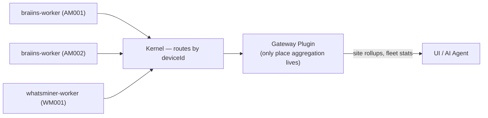
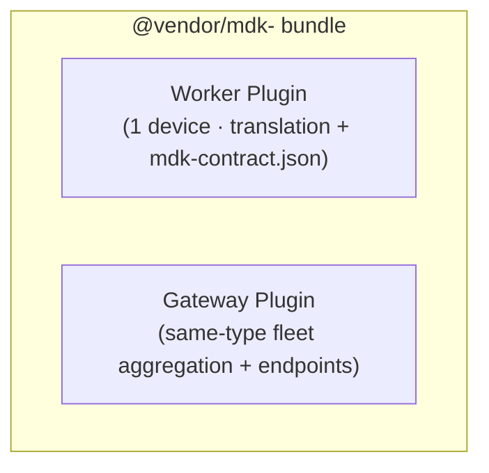

# MDK Worker — Handler & Translation Layer (HLD)

> **Version:** 0.2.0  |  **Date:** 2026-07-02  |  **Status:** Draft
>
> The Worker-side mirror of `[hld-app-node-plugins.md](./hld-app-node-plugins.md)`: a manifest + plain-JS handlers, no framework or business logic.

## 1. The model

1. **A worker is a thin translation of the device's public API** — no business logic, no stats, no state beyond an open connection.
2. **One worker instance controls one device** — one connection matching the vendor API 1:1 (gRPC channel, Modbus session, or HTTP client to a single IP:port).
3. **Capabilities are handler-style, like Gateway Plugins** — `mdk-contract.json` declares each action/query and points at a plain JS file. No `onCommand` switch, no protocol code in the handler.
4. **Aggregation always lives in the Gateway Plugin, never the worker** — fleet rollups and cross-device/cross-worker stats live in exactly one place.

The result: worker code is dumb by construction. A handler that only sees one device *cannot* aggregate — a structural constraint, not a convention.

---


## 2. Symmetry with Gateway Plugins

`[hld-app-node-plugins.md](./hld-app-node-plugins.md)` replaced a hardcoded route table with a manifest + one handler per route. Workers still use the older pattern — one `onCommand` switch per worker. This applies the same fix on the other side of the Kernel:


|                     | Gateway Plugin           | Worker (this proposal)               |
| ------------------- | ------------------------ | ------------------------------------ |
| Manifest            | `mdk-plugin.json`        | `mdk-contract.json`                  |
| Unit of work        | one route                | one command or telemetry entry       |
| Handler             | `(req) => result`        | `(req) => result`                    |
| Sanctioned I/O      | `mdk-client` → Kernel    | device client → device               |
| Framework knowledge | none (Adapter owns HTTP) | none (Worker base owns MDK Protocol) |
| Aggregates?         | **Yes — its job**        | **No — one device per instance**     |


---


## 3. Manifest

`mdk-contract.json` already carries the vocabulary (`commands`, `telemetry`, `description`, `constraints`, `examples`, `errors`). This adds one field — `**handler**` — pointing at the file that implements that action, exactly like `mdk-plugin.json`.

```jsonc
// mdk-contract.json (excerpt) — one worker instance = one device
{
  "metadata": {
    "provider": "braiins", "deviceFamily": "miner", "brand": "AntMiner",
    "overview": "Controls a single Braiins OS+ miner over its public gRPC API."
  },
  "capabilities": {
    "telemetry": [
      { "name": "hashrate_rt", "unit": "TH/s", "type": "number",
        "handler": "src/telemetry/hashrate.js",
        "description": "Real-time hashrate. 0 implies offline or booting." }
    ],
    "commands": [
      { "name": "reboot", "handler": "src/commands/reboot.js",
        "constraints": "Do not call more than once in a 15-minute window." },
      { "name": "setPowerLimit", "handler": "src/commands/setPowerLimit.js",
        "params": [{ "name": "limit_watts", "type": "number", "min": 2000, "max": 4000 }] }
    ]
  }
}
```

At boot the Worker base reads the manifest, eagerly `require()`s every `handler`, and aborts on a missing module or non-function export.

---


## 4. Handler contract

A plain async function: takes a `WorkerActionRequest`, returns a `WorkerActionResult`.


| Type                  | Shape                  | Notes                                                                                             |
| --------------------- | ---------------------- | ------------------------------------------------------------------------------------------------- |
| `WorkerActionRequest` | `{ device, params }`   | `device` is the connected single-device client, wired once at boot. `params` is schema-validated. |
| `WorkerActionResult`  | any serializable value | Worker base wraps it into the MDK Protocol envelope.                                              |


```js
// src/commands/setPowerLimit.js

module.exports = async ({ device, params }) => {
  await device.advancedSettings.setPowerTarget({ watts: params.limit_watts })
  return { watts: params.limit_watts, ok: true }
}
```

No `deviceId` routing (one device per instance) and no protocol import — that stays in the Worker base, as HTTP stays in the Gateway's Adapter.

---


## 5. Where aggregation goes instead




Already the documented path — `hld-app-node-plugins.md` [§5.2](./hld-app-node-plugins.md#52-cross-worker-aggregation) has the Gateway Plugin fan out via `mdk-client` across `deviceIds`. The only change: it becomes the *sole* place aggregation happens. No worker-level Manager rolls up a device pool; a fleet stat is computed by a Gateway Plugin after fanning out to individual single-device workers — the same path as cross-site aggregation (§5.3).

---

## 6. Vendor bundle: Worker Plugin + Gateway Plugin

Because the worker is deliberately dumb, "device support in MDK" is not one package — it is a **pair**, and a vendor ships both together:

- **Worker Plugin** (`@vendor/mdk-worker-<device>`) — the single-device translation layer + `mdk-contract.json`.
- **Gateway Plugin** (`@vendor/mdk-plugin-<device>`) — optional; cross-instance aggregated rollups over the vendor's own fleet of same-type devices (e.g. total hashrate, average outlet temperature, count offline), plus any convenience endpoints for that fleet of device class. 

A vendor onboarding their hardware ships both as one distributable bundle so an operator installs support in a single step.




The worker stays single-device and logic-free — while giving vendors a natural home for the "must-have" aggregation their device needs.

---

## References

- `[hld-app-node-plugins.md](./hld-app-node-plugins.md)` — the mirrored pattern.
- `"Workers in MDK: a simpler model.md"` — the "contract + thin translation" premise.
- `[mdk-contract.json](./mdk-contract.json)` / `[mdk-contract.schema.json](./mdk-contract.schema.json)` — manifest, extended with `handler`.
- `[hld.md](./hld.md)` §4.4.2 — the `onCommand` model being replaced.

