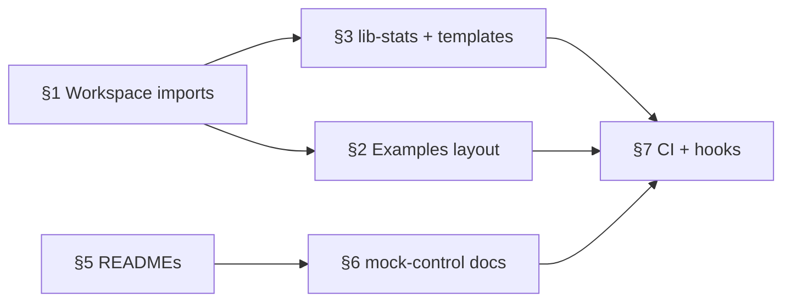

# MDK Private Monorepo (`mdk-prv`) — Architecture Review & Action Plan

> **Version:** 0.1.0  |  **Date:** 2026-05-27  |  **Status:** Action items for engineering  
> **Audience:** Developers working in `mdk-prv`

---

## 1. Use npm workspaces + package names (not `../../../`)

### Problem

Today, many packages import siblings or cousins via relative filesystem paths, for example:

```js
// packages/workers/miners/whatsminer/lib/templates/stats.js
const { getVal } = require('../../../../../core/lib-stats/utils')

// packages/workers/miners/whatsminer/mock/mock-control-agent.js
const MockControlAgent = require('../../../../core/mock-control-service/mock-control-agent')

// packages/core/ork/examples/telemetry-flow.js
const { WM_M56S } = require('../../../workers/miners/whatsminer')
```

This works in a monorepo checkout but:

- Breaks the mental model of “each folder is a real NPM package.”
- Makes refactors painful (path depth changes when folders move).
- Does not match how published consumers import (`require('@tetherto/mdk-worker-base')`).

### Target state

1. Every publishable unit has its own `package.json` with a scoped name (`@tetherto/...`).
2. Cross-package imports use **only** those names:
  ```js
   const { getVal } = require('@tetherto/mdk-lib-stats/utils')
   const { WM_M56S } = require('@tetherto/mdk-worker-whatsminer')
   const MockControlAgent = require('@tetherto/mdk-mock-control-service')
  ```
3. Root `package.json` `workspaces` includes every package path (already partially done).
4. Each package lists workspace deps in `dependencies` with `"*"` or `"workspace:*"` (npm 7+).

### Reference implementation (proven in `mdk-prv`)

> **PR:** [tetherto/mdk-prv#156 — feat(workspace): npm workspaces — named package imports PoC (§1)](https://github.com/tetherto/mdk-prv/pull/156)

The pattern was implemented end-to-end for `@tetherto/mdk-core` (`backend/core/mdk`) and the `site-single-process` example. The three moving parts are:

**1. The package has a proper `name` in its own `package.json`**

```json
// backend/core/mdk/package.json
{ "name": "@tetherto/mdk-core", "version": "0.3.0" }
```

**2. Both the library and its consumers are declared as workspaces in the root `package.json`**

```json
// package.json (root)
{
  "workspaces": [
    "backend/core/mdk",
    "examples/backend/site-single-process"
  ]
}
```

**3. The consumer declares a normal semver dependency — no `file:` path**

```json
// examples/backend/site-single-process/package.json
{
  "dependencies": {
    "@tetherto/mdk-core": "^0.3.0"
  }
}
```

```js
// examples/backend/site-single-process/index.js
const { initialize, getOrk, startAppNode } = require('@tetherto/mdk-core')
```

One `npm install` at the repo root wires everything up. No per-package installs, no `file:` references anywhere.

#### Adding a new consumer package

1. Add the consumer's directory to `"workspaces"` in the root `package.json`.
2. Add the named dep to that package's `dependencies` with a semver range matching the library's current version.
3. Run `npm install` at root.
4. Replace relative cross-package `require` calls with the scoped name.

#### Publish behaviour

Each package publishes independently to npm. The semver range (`"^0.3.0"`) is already a valid registry spec — no substitution step needed. After publish, consumers outside the repo install the real npm package transparently.

#### Version drift rule

npm uses the semver range to decide whether to use the local workspace or fall back to the registry. If `@tetherto/mdk-core` is bumped to `1.0.0` but a consumer still declares `^0.3.0`, npm will try the registry instead of the local copy. Always update the dep range when the library version crosses a major boundary. `npm version` can help:

```bash
# bump all workspace packages together
npm version minor --workspaces
```

> **Note on `workspace:` syntax** — pnpm and Yarn Berry support `"@tetherto/mdk-core": "workspace:^0.3.0"` which hard-enforces local resolution and auto-substitutes the version on publish. npm does not support this prefix; the plain semver range above is the npm equivalent.

### Action items

- [ ] Audit all `require('..')` chains that escape the current package directory (exclude intra-package `../../lib/...` within tests).
- [ ] Add missing packages to `workspaces` in root `package.json` (e.g. future `packages/lib/stats`).
- [ ] Add explicit `dependencies` in each consumer `package.json`.
- [ ] Replace relative cross-package imports with scoped names (mechanical PR, can be split by vertical: miners, containers, power-meter, core).
- [ ] Document the rule in `CONTRIBUTING.md`: *“No `require` path may cross package boundaries without a `@tetherto/` name.”*

### Acceptance criteria

- `rg "require\(['\"]\.\./\.\./\.\./(core|workers)" packages/` returns zero matches for production code (tests may use local paths within the same package).
- `npm test` / `npm run lint` pass at root and per workspace.
- A fresh clone + `npm install` + running one ORK example works without path hacks.

---

## 2. Reorganize examples (two tiers)

### 2.1 Tier A — Top-level runnable apps (`examples/` or `apps/`)

**Purpose:** Cross-package, “show the whole system” demos that intentionally wire ORK + multiple workers + mocks.

**Target:**

```text
mdk-prv/
├── examples/                        # or apps/ — pick one convention and stick to it
│   ├── e2e/                         # from packages/core/examples/mdk-e2e/
│   ├── site/                        # from packages/core/examples/mdk-site/ + examples/core/site
│   └── README.md                    # index: ports, prerequisites, how to run
```

**Rules:**

- Each example is its own workspace package with `package.json` declaring deps on `@tetherto/mdk-ork`, `@tetherto/mdk`, worker packages, etc.
- No `../../../workers` — only scoped imports.

### 2.2 Tier B — Per-package `examples/` (copy-paste snippets)

**Purpose:** Minimal scripts that exercise **one** publishable package; linked from that package’s `README.md`.

**Target:**

```text
packages/core/ork/examples/          # ORK-only: telemetry-flow, ork-shell (no worker imports OR worker via @tetherto/...)
packages/core/client/examples/       # client-only connection samples
packages/core/app-node/examples/     # optional: local gateway smoke test
packages/workers/miners/whatsminer/examples/   # single-worker + mock server
... (every reference worker package)
```

**Rules:**

- Each file should be runnable with `node examples/foo.js` from the package root (or documented from repo root with `-C`).
- Imports only from that package’s public API (`main` / documented exports) plus declared workspace deps.
- Prefer **no** mock hardware on ports that collide — document ports in package README.

### Acceptance criteria

- Clear distinction in docs: **Tier A = full stack**, **Tier B = one package**.
- `packages/core/examples/` no longer contains long-lived cross-package demos (only redirect or removed).
- CI runs at least one Tier A and one Tier B example in smoke job.

---

## 3. Extract `lib-stats` and consolidate worker templates into one shared package

> **Both `lib-stats` and worker templates are merged into one package** — they share the same consumers, the same dependency constraints, and solve the same `../../../` problem.

### Problem

`packages/core/lib-stats/` is shared infrastructure:

- Used by `packages/workers/base` (`thing.manager.js`, `stats.service.js`).
- Used by many worker `lib/templates/stats.js` files via deep relative paths.
- **Not** used by `app-node` today, but **should** be available to App Node aggregation plugins (`[hld-app-node-plugins.md](../../mdk-be/docs/hld-app-node-plugins.md)`).

It is not a standalone NPM package (no `package.json`), which forces `../../../core/lib-stats` imports and couples stats logic to “core” in name only.

At the same time, alert and stats **template specs** are spread across every worker vertical:

- `packages/workers/base/lib/templates/`
- `packages/workers/miners/base/lib/templates/`
- `packages/workers/containers/*/lib/templates/`
- `packages/workers/power-meter/*/lib/templates/`
- `packages/workers/temperature/*/lib/templates/`

Device packages often re-export or thin-wrap the same patterns:

```js
const libStats = require('../../../base/lib/templates/stats')
const { groupBy } = require('../../../../../core/lib-stats/utils')
```

This duplicates structure and encourages more `../../../` chains. Both concerns are solved together by extracting them into **one shared package**.

### Target state

```text
packages/lib/stats/                  # @tetherto/mdk-lib-stats (name TBD — align with mdk-libraries.md)
├── package.json
├── README.md
├── index.js                         # applyStats, tallyStats, defaults
├── utils.js                         # getVal, groupBy, ...
├── ops/                             # stat operation implementations
└── templates/
    ├── stats/
    │   ├── default.js
    │   └── index.js
    └── alerts/
        ├── default.js
        └── index.js
```

**Dependency direction:**

```text
@tetherto/mdk-lib-stats  ←  @tetherto/mdk-worker-base
                         ←  device workers (templates)
                         ←  @tetherto/mdk-app-node (plugins / aggregators)
```

`mdk-lib-stats` must **not** depend on ORK, App Node, or workers.

Per-device workers **override or extend** specs in their own package only when the device truly differs; otherwise they import from `@tetherto/mdk-lib-stats/templates`.

### Acceptance criteria

- `packages/core/lib-stats/` removed.
- No worker imports another vertical’s `base/lib/templates` via filesystem `../../../`.
- Workers and base tests pass.
- App Node can add a devDependency on `@tetherto/mdk-lib-stats` without pulling ORK.
- Single README explains how to add a new device stats/alerts spec.

---

## 5. Add a `README.md` to every publishable package

### Problem

Only `packages/core/examples/README.md` exists under `packages/`. New contributors cannot tell what each folder owns, how to test it, or how it publishes.

### Target state

Every workspace package includes at minimum:

```markdown
# @tetherto/mdk-…

## What this package does
(one paragraph)

## Install / workspace
npm install from monorepo root

## API surface
main exports or link to index.js

## Examples
link to examples/ scripts

## Tests
npm test

## Related packages
bulleted list of @tetherto deps
```

### Acceptance criteria

- Every path listed in root `workspaces` has a `README.md` at its root.
- `mdk-libraries.md` links to each README (optional follow-up).

---

## 6. Clarify `mock-control-service`

### What it is today

`packages/core/mock-control-service/` (`@tetherto/mdk-mock-control-service`) provides a **Fastify-based mock control plane** used in development and tests so workers can exercise write/command paths without real hardware. Worker packages import `mock-control-agent.js` via long relative paths in their `mock/` folders.

### Recommendation

- Treat it as a **dev/test utility package**, not part of the production App Node/ORK runtime.
- After §1: workers use `require('@tetherto/mdk-mock-control-service')` only from `mock/` and tests.
- Document in package README: when to run it, ports, relationship to worker mock servers (e.g. Whatsminer `mock/server.js`).

### Action items

- [ ] Write `packages/core/mock-control-service/README.md` (purpose, API, example).
- [ ] Consider moving under `packages/lib/mock-control-service/` or `packages/tools/` if it should not sit beside ORK — **decision needed**.
- [ ] Ensure it is not bundled into production worker releases (`files` field already limits publish surface).

---

## 7. Use trunk based branching only, no need to create seperate branch for each version. Just run by the tag. Benefit? find from internet

## 7. Supporting hygiene (from broader review)

These items were noted alongside the structural work above:


| Item                                       | Intent                                                                                                         |
| ------------------------------------------ | -------------------------------------------------------------------------------------------------------------- |
| **Sync `mdk-libraries.md` with `mdk-prv`** | Package index in `mdk-be` must match real folders and NPM names after moves.                                   |
| **Review `.github/` CI**                   | Workflows likely reference old paths (`packages/core/examples`, `core.yaml`, `ui.yaml`); update after renames. |
| **Lint in every package**                  | Root has `standard`; ensure each workspace defines `npm run lint` and CI runs `npm run lint --workspaces`.     |
| **Pre-commit hooks**                       | Husky + lint-staged (or similar) to block broken Standard/style before push.                                   |


---

## Suggested execution order




1. **§1** — workspace imports (unblocks everything else).
2. **§3** — extract `mdk-lib-stats` (lib-stats + templates, merged).
3. **§2** — move examples (Tier A + Tier B).
4. **§5 / §6** — documentation pass.
5. **§7** — CI, lint, pre-commit, sync `mdk-libraries.md`.

---

## Open decisions (need owner sign-off)


| #   | Question                                       | Options                                                                     |
| --- | ---------------------------------------------- | --------------------------------------------------------------------------- |
| 1   | Top-level demos folder name                    | `examples/` vs `apps/` (HLD uses `apps/` for shell; avoid two meanings)     |
| 2   | Unified package name for lib-stats + templates | `@tetherto/mdk-lib-stats` vs `@tetherto/mdk-stats`                          |
| 3   | Keep `packages/core/mdk` name                  | Bootstrap package — document clearly vs rename to `@tetherto/mdk-bootstrap` |


---

## References

- `[mdk-be/docs/mdk-libraries.md](../../mdk-be/docs/mdk-libraries.md)` — package index & monorepo map (keep in sync).
- `[mdk-be/docs/hld-app-node-plugins.md](../../mdk-be/docs/hld-app-node-plugins.md)` — future App Node plugins consuming `mdk-lib-stats`.
- `[packages/core/examples/README.md](../packages/core/examples/README.md)` — current example runbook (migrate with §2).
- Root `[package.json](../package.json)` — workspace definitions.

---

## Tracking

When starting a PR, reference the section number (e.g. `mdk-prv: §1 workspace imports — miners vertical`) so review threads map back to this doc.